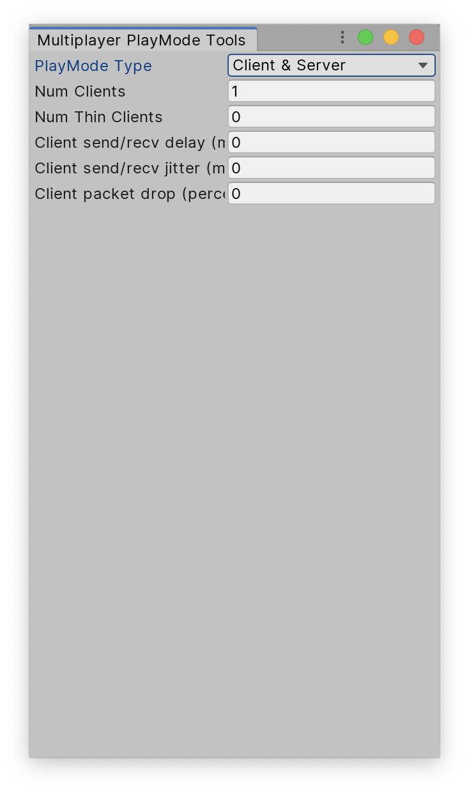

# Client server Worlds

NetCode has a separation of client and server logic, and both the client and server logic are in separate Worlds (the client World, and the server World), based on the [hierarchical update system](https://docs.unity3d.com/Packages/com.unity.entities@latest/index.html?subfolder=/manual/system_update_order.html) of Unity’s Entity Component System (ECS).

By default, NetCode places systems in both client and server Worlds, but not in the default World.
> [!NOTE]
> Systems that update in the `PresentationSystemGroup` are only added to the client World.

To override this default behavior, use the [UpdateInWorld](https://docs.unity3d.com/Packages/com.unity.netcode@latest/index.html?subfolder=/api/Unity.NetCode.UpdateInWorld.html) attribute, or the `UpdateInGroup` attribute with an explicit client or server system group. The available explicit client server groups are as follows:

* [ClientInitializationSystemGroup](https://docs.unity3d.com/Packages/com.unity.netcode@latest/index.html?subfolder=/api/Unity.NetCode.ClientInitializationSystemGroup.html)
* [ServerInitializationSystemGroup](https://docs.unity3d.com/Packages/com.unity.netcode@latest/index.html?subfolder=/api/Unity.NetCode.ServerInitializationSystemGroup.html)
* [ClientAndServerInitializationSystemGroup](https://docs.unity3d.com/Packages/com.unity.netcode@latest/index.html?subfolder=/api/Unity.NetCode.ClientAndServerInitializationSystemGroup.html)
* [ClientSimulationSystemGroup](https://docs.unity3d.com/Packages/com.unity.netcode@latest/index.html?subfolder=/api/Unity.NetCode.ClientSimulationSystemGroup.html)
* [ServerSimulationSystemGroup](https://docs.unity3d.com/Packages/com.unity.netcode@latest/index.html?subfolder=/api/Unity.NetCode.ServerSimulationSystemGroup.html)
* [ClientAndServerSimulationSystemGroup ](https://docs.unity3d.com/Packages/com.unity.netcode@latest/index.html?subfolder=/api/Unity.NetCode.ClientAndServerSimulationSystemGroup.html)
* [ClientPresentationSystemGroup](https://docs.unity3d.com/Packages/com.unity.netcode@latest/index.html?subfolder=/api/Unity.NetCode.ClientPresentationSystemGroup.html)

> [!NOTE]
> There is no server presentation system group.

As well as the attributes listed above, you can use the __PlayMode Tools__ window in the Unity Editor to select what happens when you enter Play Mode. To access __PlayMode Tools__, go to menu: __Multiplayer &gt; PlayMode Tools__.

<br/>_PlayMode Tools_

|**Property**|**Description**|
|:---|:---|
|__PlayMode Type__|Choose to make Play Mode either __Client__ only, __Server__ only, or __Client & Server__.|
|__Num Thin Clients__|Set the number of thin clients. Thin clients cannot be presented, and never spawn any entities it receives from the server. However, they can generate fake input to send to the server to simulate a realistic load.|
|__Client send/recv delay__|Use this property to emulate high ping. Specify a time (in ms) to delay each outgoing and incoming network packet by. |
|__Client send/recv jitter__|Use this property to add a random value to the delay, which makes the delay a value between the delay you have set plus or minus the jitter value. For example, if you set __Client send/recv delay__ to 45 and __Client send/recv jitter__ to 5, you will get a random value between 40 and 50.|
|__Client package drop__|Use this property to simulate bad connections where not all packets arrive. Specify a value (as a percentage) and NetCode discards that percentage of packets from the total it receives. For example, set the value to 5 and NetCode discards 5% of all incoming and outgoing packets.|
|__Client auto connect address (Client only)__|Specify which server a client should connect to. This field only appears if you set __PlayMode Type__ to __Client__. The user code needs to read this value and connect because the connection flows are in user code. |

When you enter Play Mode, from this window you can also disconnect clients and choose which client Unity should present if there are multiple. When you change a client that Unity is presenting, it stops calling the update on the `ClientPresentationSystemGroup` for the Worlds which it should no longer present. As such, your code needs to be able to handle this situation, or your presentation code won’t run and all rendering objects you’ve created still exist.

## Bootstrap

The default bootstrap creates client server Worlds automatically at startup. It populates them with the systems defined in the attributes you have set. This is useful when you are working in the Editor, but in a standalone game, you might want to delay the World creation so you can use the same executable as both a client and server.

To do this, you can create a class that extends `ClientServerBootstrap` to override the default bootstrap. Implement `Initialize` and create the default World. To create the client and server worlds manually, call `ClientServerBootstrap.CreateClientWorld(defaultWorld, "WorldName");` or `ClientServerBootstrap.CreateServerWorld(defaultWorld, "WorldName");`.

The following code example shows how to override the default bootstrap to prevent automatic creation of the client server worlds:

```c#
public class ExampleBootstrap : ClientServerBootstrap
{
    public override bool Initialize(string defaultWorldName)
    {
        var systems = DefaultWorldInitialization.GetAllSystems(WorldSystemFilterFlags.Default);
        GenerateSystemLists(systems);

        var world = new World(defaultWorldName);
        World.DefaultGameObjectInjectionWorld = world;

        DefaultWorldInitialization.AddSystemsToRootLevelSystemGroups(world, ExplicitDefaultWorldSystems);
        ScriptBehaviourUpdateOrder.UpdatePlayerLoop(world);
        return true;
    }

}
```

## Fixed and dynamic timestep

When you use NetCode, the server always updates at a fixed timestep. NetCode limits the maximum number of iterations to make sure that the server does not end up in a state where it takes several seconds to simulate a single frame.

The fixed update does not use the [standard Unity update frequency](https://docs.unity3d.com/Manual/class-TimeManager.html). A singleton entity in the server World controls the update with a [ClientServerTickRate](https://docs.unity3d.com/Packages/com.unity.netcode@latest/index.html?subfolder=/api/Unity.NetCode.ClientServerTickRate.html) component. The `ClientServerTickRate` controls `SimulationTickRate` which sets the number of simulation ticks per second.

> [!NOTE]
> `SimulationTickRate` must be divisible by `NetworkTickRate`.

The default number of simulation ticks is 60. The component also has values for MaxSimulationStepsPerFrame which controls how many simulations the server can run in a single frame, and TargetFrameRateMode which controls how the server should keep the tick rate. Available values are:

* `BusyWait` to run at maximum speed
* `Sleep` for `Application.TargetFrameRate` to reduce CPU load
* `Auto` to use `Sleep` on headless servers and `BusyWait` otherwise

The client updates at a dynamic time step, with the exception of prediction code which always runs at a fixed time step to match the server. The prediction runs in the [GhostPredictionSystemGroup](https://docs.unity3d.com/Packages/com.unity.netcode@latest/index.html?subfolder=/api/Unity.NetCode.GhostPredictionSystemGroup.html) and applies its own fixed time step for prediction.

## Standalone builds

When you build a standalone game, NetCode uses the __Server Build__ property in the __Build Settings__ window to decide what to build. If the property is enabled, NetCode sets the ```UNITY_SERVER``` define and you get a server-only build. If the property is disabled you get a combined client and server build. You can use a combined client and server build to decide if a game should be client, server or both at runtime.

To build a client-only game, add the ```UNITY_CLIENT``` define to the __Scripting Define Symbols__ in the __Player Settings__ (menu: __Edit &gt; Project Settings &gt; Player &gt; Configuration__). You can have the ```UNITY_CLIENT``` define set when you build a server, but the ```UNITY_SERVER``` define takes precedence and you get a server-only build.
