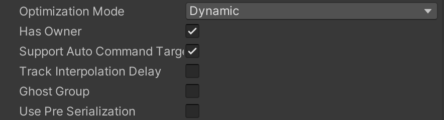

# Use the command stream to handle user inputs

Each client sends a continuous command stream to the server when [`NetworkStreamConnection`](https://docs.unity3d.com/Packages/com.unity.netcode@latest?subfolder=/api/Unity.NetCode.NetworkStreamConnection.html) is tagged as in-game. This stream includes all user inputs and acknowledgements of the last received snapshot, and is typically one packet per `NetworkTime.ServerTick`.

The connection is always kept alive, even if the client doesn't control any entities or generate any inputs that need to be transmitted to the server. The command packet is sent regularly on the timescale described in [Collecting and sending input from the client](#collecting-and-sending-input-from-the-client), automatically acknowledging received snapshots and reporting other important information to the server.

## Ownership in Netcode for Entities

Netcode for Entities defines an owner as the connection that has input authority over a ghost. If a given client owns a ghost, it can affect that ghost with its inputs. Other clients can predict the ghost, but don't have the local inputs required to precisely predict it and rely on other heuristics (such as current velocity and acceleration).

For example, if a client predicted spawns a missile, then, although that client doesn't continue to send inputs to the missile ghost directly, its inputs still caused the missile to exist. So that client has input authority over (in other words: ghost ownership over) the missile.

> [!NOTE]
> Note that input authority is a distinct concept to simulation authority. The simulation authority is the machine (or role) that has the authority to simulate the authoritative outcome for a ghost driven by inputs, which is given to the server role in Netcode for Entities, by default.
> Example: The input authority for a FPS character controller will be one of the players (denoted by `GhostOwner`), but the client is only allowed to predict the outcome of this character controller -- the actual simulation authority of this character controller remains with the server. The server role is also allowed to destroy, respawn, and modify the character controller entity in any other way.
> Similarly, because clients are not the simulation authority over other ghosts (like missiles), clients are only permitted to predict the spawn of ghosts.

## Automatic input handling

> [!NOTE]
> You must use (and implement) the `GhostOwner` functionality for the following method to work properly. For example, by checking the 'Has Owner' checkbox in the `GhostAuthoringComponent`.

The recommended method for handling user inputs is to create an input component data struct that inherits the [`IInputComponentData`](https://docs.unity3d.com/Packages/com.unity.netcode@latest?subfolder=/api/Unity.NetCode.IInputComponentData.html) interface. Then you can add command data to the buffer and retrieve it when processing. Unity handles inputs automatically through code-generated systems, as long as you set up the input gathering and input processing systems separately.

Because the input struct implementing `IInputComponentData` is baked by `ICommandData`, [the 1024 bytes limit for the payload](#ICommandData-serialization-and-payload-limit) also applies.

> [!NOTE]
> Per prefab overrides done in the ghost authoring component inspector are disabled for input components and their companion buffer. You can add a ghost component attribute on the input component in code and it will apply to the buffer as well.

### Input events

Use the [`InputEvent`](https://docs.unity3d.com/Packages/com.unity.netcode@latest?subfolder=/api/Unity.NetCode.InputEvent.html) type within `IInputComponentData` inputs to make sure that one-off events (such as those gathered by `UnityEngine.Input.GetKeyDown`) are synchronized properly with the server and registered exactly once, even when the exact input tick where the input event was first registered is dropped on its way to the server.

### How it works

In a standard input component data struct, you'll have these systems set up:

- Gather input system (client loop)
  - Take input events and save them in the input component data. This happens in [`GhostInputSystemGroup`](https://docs.unity3d.com/Packages/com.unity.netcode@latest?subfolder=/api/Unity.NetCode.GhostInputSystemGroup.html).
- Process input system (server or prediction loop)
  - Take current input component and process the values. This usually happens in [`PredictedSimulationSystemGroup`](https://docs.unity3d.com/Packages/com.unity.netcode@latest?subfolder=/api/Unity.NetCode.PredictedSimulationSystemGroup.html).

With `IInputComponentData` handling it looks like this with code-generated systems:

- Gather input system (client loop)
  - Take input events and save them in the input component data. This happens in `GhostInputSystemGroup`.
- Copy input to command buffer (client loop)
  - Take current input data component and add to command buffer, also recording current tick.
- Apply inputs for current tick to input component data (server or prediction loop)
  - Retrieve inputs from the command buffer for the current tick, and apply them to the input component. With prediction, multiple input values can be applied as prediction rolls back (refer to [Prediction](intro-to-prediction.md)).
- Process input system (server or prediction loop)
  - Take current input component and process the values. This usually happens in `PredictedSimulationSystemGroup`.

The first and last steps are the same (as with the single-player input handling), and these are the only systems you need to write/manage. An important difference - with Netcode-enabled input - is that the processing system can be called multiple times per tick, as previous ticks (rollbacks) are handled.

### Example code

Simple input values for character movement (with jumping):

```c#
using Unity.Entities;
using Unity.NetCode;

[GenerateAuthoringComponent]
public struct PlayerInput : IInputComponentData
{
    public int Horizontal;
    public int Vertical;
    public InputEvent Jump;
}
```

The input gathering system, which takes current inputs and applies them to the input component data on the local player's entity.

```c#
[UpdateInGroup(typeof(GhostInputSystemGroup))]
[AlwaysSynchronizeSystem]
public partial class GatherInputs : SystemBase
{
    protected override void OnCreate()
    {
        RequireForUpdate<PlayerInput>();
    }

    protected override void OnUpdate()
    {
        bool jump = UnityEngine.Input.GetKeyDown("space");
        bool left = UnityEngine.Input.GetKey("left");
        //...

        var networkId = GetSingleton<NetworkId>().Value;
        Entities.WithName("GatherInput").WithAll<GhostOwnerIsLocal>().ForEach((ref PlayerInput inputData) =>
            {
                inputData = default;

                if (jump)
                    inputData.Jump.Set();
                if (left)
                    inputData.Horizontal -= 1;
                //...
            }).ScheduleParallel();
    }
}
```

The processing input system, which takes the current input values stored on the player's input component and applies the equivalent movement actions.

```c#
    [UpdateInGroup(typeof(PredictedSimulationSystemGroup))]
    public partial class ProcessInputs : SystemBase
    {
        protected override void OnCreate()
        {
            RequireForUpdate<PlayerInput>();
        }
        protected override void OnUpdate()
        {
            var movementSpeed = Time.DeltaTime * 3;
            Entities.WithAll<Simulate>().WithName("ProcessInputForTick").ForEach(
                (ref PlayerInput input, ref Translation trans, ref PlayerMovement movement) =>
                {
                    if (input.Jump.IsSet)
                        movement.JumpVelocity = 10; // start jump routine

                    // handle jump event logic, movement logic etc
                }).ScheduleParallel();
        }
    }
```

## Creating commands

The recommended method for handling user inputs is to [create an input component data struct that inherits the [`IInputComponentData`](https://docs.unity3d.com/Packages/com.unity.netcode@latest?subfolder=/api/Unity.NetCode.IInputComponentData.html) interface](#automatic-input-handling), but if you need finer control of the command stream then you can create your own commands. To create a new command type, create a struct that implements the [`ICommandData`](https://docs.unity3d.com/Packages/com.unity.netcode@latest?subfolder=/api/Unity.NetCode.ICommandData.html) interface. To implement the interface, you need to provide a property for accessing the `Tick`.

The serialization and registration code for the `ICommandData` is generated automatically, but you can also disable that and write the serialization [manually](#manual-serialization).

The `ICommandData` buffer can be added to the entity controlled by the player either at baking time (using an authoring component) or at runtime. When adding the buffer at runtime, make sure that the dynamic buffer is present on both server and client.

### Collecting and sending input from the client

The client is responsible for polling the input source and adding `ICommand` to the buffer for the entities it controls. The systems responsible for writing to the command buffers must all run inside the [`GhostInputSystemGroup`](https://docs.unity3d.com/Packages/com.unity.netcode@latest?subfolder=/api/Unity.NetCode.GhostInputSystemGroup.html).

 The `CommandSendPacketSystem` automatically sends the queued commands on completion of the client's first [partial tick](intro-to-pediction.md#partial-ticks) per full tick, along with commands from the previous `n` ticks (where `n` is defined by [`ClientTickRate.TargetCommandSlack`](https://docs.unity3d.com/Packages/com.unity.netcode@latest?subfolder=/api/Unity.NetCode.ClientTickRate.html#Unity_NetCode_ClientTickRate_TargetCommandSlack) plus [`ClientTickRate.NumAdditionalCommandsToSend`](https://docs.unity3d.com/Packages/com.unity.netcode@latest?subfolder=/api/Unity.NetCode.ClientTickRate.html#Unity_NetCode_ClientTickRate_NumAdditionalCommandsToSend)) as a buffer against packet loss.

 For example: in tick 10.3, input is gathered and sent to the server as input for tick 10. In tick 10.7, the input has changed but is not sent to the server. In tick 11.2, the input for the full previous tick 10 is sent (refer to [ICommandData serialization and payload limit](#icommanddata-serialization-and-payload-limit)). The server updates the inputs for tick 10 to use in its simulation, if it hasn't already simulated tick 10.

### `ICommandData` serialization and payload limit

When using `ICommand`, Netcode for Entities automatically generates command serialization code in the [`CommandSendSystemGroup`](https://docs.unity3d.com/Packages/com.unity.netcode@latest?subfolder=/api/Unity.NetCode.CommandSendSystemGroup.html). Each individual command is serialized and queued in the [`OutgoingCommandDataStreamBuffer`](https://docs.unity3d.com/Packages/com.unity.netcode@latest?subfolder=/api/Unity.NetCode.OutgoingCommandDataStreamBuffer.html) (present on the network connection) by its own code-generated system. The `CommandSendPacketSystem` is then responsible for flushing the outgoing buffer on the timescale described in [Collecting and sending input from the client](#collecting-and-sending-input-from-the-client).

In addition to the most recent input, inputs from the previous `n` ticks are also included to provide redundancy in the case of packet loss (where `n` is defined by [`ClientTickRate.TargetCommandSlack`](https://docs.unity3d.com/Packages/com.unity.netcode@latest?subfolder=/api/Unity.NetCode.ClientTickRate.html#Unity_NetCode_ClientTickRate_TargetCommandSlack) plus [`ClientTickRate.NumAdditionalCommandsToSend`](https://docs.unity3d.com/Packages/com.unity.netcode@latest?subfolder=/api/Unity.NetCode.ClientTickRate.html#Unity_NetCode_ClientTickRate_NumAdditionalCommandsToSend), with a default value of 4). Each redundant command is delta compressed against the command for the current tick. The final serialized data looks something like the following:

```
| Tick, Command | CommandDelta(Tick-1, Tick) | CommandDelta(Tick-2, Tick) | CommandDelta(Tick-3, Tick)|
```

A size limit of 1024 bytes is enforced on the command payload and checked when the command is serialized into the outgoing buffer. An error is reported to the application if the encoded payload is greater than 1024 bytes.

### Receiving commands on the server

The [`NetworkStreamReceiveSystem`](https://docs.unity3d.com/Packages/com.unity.netcode@latest?subfolder=/api/Unity.NetCode.NetworkStreamReceiveSystem.html) automatically receives `ICommandData` on the server and adds it to the [`IncomingCommandDataStreamBuffer`](https://docs.unity3d.com/Packages/com.unity.netcode@latest?subfolder=/api/Unity.NetCode.IncomingCommandDataStreamBuffer.html) buffer. The `CommandReceiveSystem` then dispatches the command data to the entity that the command belongs to.

> [!NOTE]
> The server should only receive commands from the clients. It should never overwrite or change the input received by the client.

## Automatically handling commands (`AutoCommandTarget`)

You can automatically send commands to the server if you add your `ICommandData` component to a ghost and set the following **GhostAuthoring** options:

1. `Has Owner` set
2. `Support Auto Command Target`



For automatic command targeting to work, the following must also be true of your ghost:

- The ghost must be owned by your client (requiring the server to set the [`GhostOwner`](https://docs.unity3d.com/Packages/com.unity.netcode@latest?subfolder=/api/Unity.NetCode.GhostOwner.html) to your [`NetworkId.Value`](https://docs.unity3d.com/Packages/com.unity.netcode@latest?subfolder=/api/Unity.NetCode.NetworkId.html#Unity_NetCode_NetworkId_Value)).
- The ghost is `Predicted` or `OwnerPredicted` (you can't use an `ICommandData` to control interpolated ghosts).
- The [`AutoCommandTarget.Enabled`](https://docs.unity3d.com/Packages/com.unity.netcode@latest?subfolder=/api/Unity.NetCode.AutoCommandTarget.html) flag must be set to true.

If you're not using `AutoCommandTarget`, your game code must set the [`CommandTarget`](https://docs.unity3d.com/Packages/com.unity.netcode@latest/index.html?subfolder=/api/Unity.NetCode.CommandTarget.html) on the connection entity to reference the entity that the `ICommandData` component has been attached to. You can have multiple `ICommandData`s in your game, and Netcode for Entities will only send the `ICommandData` for the entity that `CommandTarget` points to.

When you need to access inputs from the buffer, you can use an extension method for `DynamicBuffer<ICommandData>` called `GetDataAtTick`, which gets the matching tick for a specific frame. You can also use the `AddCommandData` utility method (which adds more commands to the ring-buffer for you).

> [!NOTE]
> When you update the state of your simulation inside the prediction loop, you must rely only on the commands present in the `ICommandData` buffer (for a given input type). Polling input directly using `UnityEngine.Input` or relying on input information not present in the struct implementing the `ICommandData` interface can cause client mis-prediction.

## Checking ghost ownership on the client

> [!NOTE]
> You must use (and implement) the `GhostOwner` functionality for the following commands to work properly. For example, by checking the 'Has Owner' checkbox in the `GhostAuthoringComponent`.

Ghosts often share the same `CommandBuffer`, making it necessary to check which entities are owned by the local player before adding new inputs to the buffer, to avoid overwriting inputs from other players.

You can check ghost ownership in the following ways:
* Use the [`GhostOwnerIsLocal` component (recommended)](https://docs.unity3d.com/Packages/com.unity.netcode@latest?subfolder=/api/Unity.NetCode.GhostOwnerIsLocal.html).
* Use the [`GhostOwner` component](https://docs.unity3d.com/Packages/com.unity.netcode@latest?subfolder=/api/Unity.NetCode.GhostOwner.html).

### Use the `GhostOwnerIsLocal` component (recommended)

All ghosts have a `GhostOwnerIsLocal` component that you can enable to filter out ghosts not owned by the local player.

For example:
```c#
Entities
    .WithAll<GhostOwnerIsLocal>()
    .ForEach((ref MyComponent myComponent)=>
    {
        // your logic here will be applied only to the entities owned by the local player.
    }).Run();
```

`GhostOwnerIsLocal` should be used for client-side operations, such as processing inputs for the local player or matching a camera position to your local player's position. `GhostOwnerIsLocal`'s behaviour is undefined server-side.

### Use the `GhostOwner` component

You can filter entities manually by checking that the `GhostOwner.NetworkId` of the entity equals the `NetworkId` of the player.

```c#
var localPlayerId = GetSingleton<NetworkId>().Value;
Entities
    .ForEach((ref MyComponent myComponent, in GhostOwner owner)=>
    {
        if(owner.NetworkId == localPlayerId)
        {
            // your logic here will be applied only to the entities owned by the local player.
        }
    }).Run();
```

## Manual serialization

To manually serialize commands:
1. Add the [`[NetCodeDisableCommandCodeGen]`](https://docs.unity3d.com/Packages/com.unity.netcode@latest?subfolder=/api/Unity.NetCode.NetCodeDisableCommandCodeGenAttribute.html) attribute to the struct that impliments the `ICommandData` interface.
2. Create a struct that implements [`ICommandDataSerializer<T>`](https://docs.unity3d.com/Packages/com.unity.netcode@latest?subfolder=/api/Unity.NetCode.ICommandDataSerializer-1.html), where `<T>` is your `ICommandData` struct.

[`ICommandDataSerializer`](https://docs.unity3d.com/Packages/com.unity.netcode@latest?subfolder=/api/Unity.NetCode.ICommandDataSerializer-1.html) has two `Serialize` and two `Deserialize` methods: one pair for raw values, and one pair for delta compressed values. The system sends multiple inputs in each command packet. The first packet contains raw data but the rest are compressed using delta compression. Delta compression compresses inputs well because the rate of change is low.

As well as creating a struct, you also need to create specific instances of the generic systems `CommandSendSystem` and `CommandReceiveSystem`. To do this, extend the base system, for example with:

```c#
[UpdateInGroup(typeof(CommandSendSystemGroup))]
[BurstCompile]
public partial struct MyCommandSendCommandSystem : ISystem
{
    CommandSendSystem<MyCommandSerializer, MyCommand> m_CommandSend;
    [BurstCompile]
    struct SendJob : IJobChunk
    {
        public CommandSendSystem<MyCommandSerializer, MyCommand>.SendJobData data;
        public void Execute(in ArchetypeChunk chunk, int unfilteredChunkIndex,
            bool useEnabledMask, in v128 chunkEnabledMask)
        {
            data.Execute(chunk, unfilteredChunkIndex);
        }
    }
    [BurstCompile]
    public void OnCreate(ref SystemState state)
    {
        m_CommandSend.OnCreate(ref state);
    }
    [BurstCompile]
    public void OnUpdate(ref SystemState state)
    {
        if (!m_CommandSend.ShouldRunCommandJob(ref state))
            return;
        var sendJob = new SendJob{data = m_CommandSend.InitJobData(ref state)};
        state.Dependency = sendJob.Schedule(m_CommandSend.Query, state.Dependency);
    }
}
[UpdateInGroup(typeof(CommandReceiveSystemGroup))]
[BurstCompile]
public partial struct MyCommandReceiveCommandSystem : ISystem
{
    CommandReceiveSystem<MyCommandSerializer, MyCommand> m_CommandRecv;
    [BurstCompile]
    struct ReceiveJob : IJobChunk
    {
        public CommandReceiveSystem<MyCommandSerializer, MyCommand>.ReceiveJobData data;
        public void Execute(in ArchetypeChunk chunk, int unfilteredChunkIndex,
            bool useEnabledMask, in v128 chunkEnabledMask)
        {
            data.Execute(chunk, unfilteredChunkIndex);
        }
    }
    [BurstCompile]
    public void OnCreate(ref SystemState state)
    {
        m_CommandRecv.OnCreate(ref state);
    }
    [BurstCompile]
    public void OnUpdate(ref SystemState state)
    {
        var recvJob = new ReceiveJob{data = m_CommandRecv.InitJobData(ref state)};
        state.Dependency = recvJob.Schedule(m_CommandRecv.Query, state.Dependency);
    }
}
```
