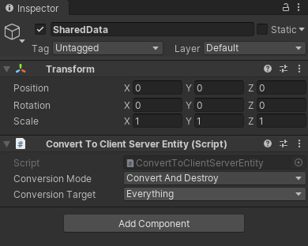
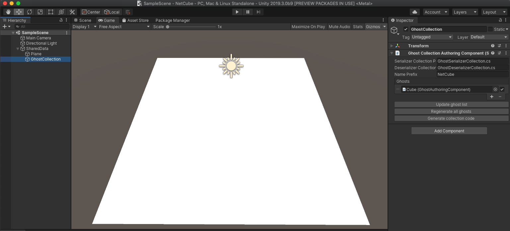

# Getting started with NetCode
This documentation provides a walkthrough of how to create a very simple client server based simulation. This walkthrough describes how to spawn and control a simple Prefab.

## Set up the Project
Open the __Unity Hub__ and create a new Project. **Note:** To use Unity NetCode you must have at least Unity 2019.3.b11 installed.

Open the Package Manager (menu: __Window &gt; Package Manager__). At the top of the window, under __Advanced__, select __Show preview packages__. Add the Entities, Hybrid Renderer, NetCode, and Transport packages.

## Create an initial Scene

To begin, you need to set up a way to share data between the client and the server. To achieve this separation in NetCode, you need to create a different World for each client and the server. To share data between the server and the client, create an empty GameObject (called __SharedData__ in the example), and add the __ConvertToClientServerEntity__ component.

<br/>_Empty SharedData GameObject_

<br/>_ConvertToClientServerEntity component_

Once you set this up you can, for example, spawn a plane in both the client and the server world. To do this, right click the __SharedData__ Prefab and select __3D Object &gt; Plane__ which then creates a plane that is nested under __SharedData__.

<br/>_Scene with a plane_

## Create a ghost Prefab

To make your Scene run with a client / server setup you need to create a definition of the networked object, which is called a **ghost**.

To create a ghost Prefab, create a cube in the Scene (right click on the Scene and select __3D Object &gt; Cube__). Then select the Cube GameObject under the Scene and drag it into the Project’s __Asset__ folder. This creates a Prefab of the Cube.

<br/>_Create a Cube Prefab_

In NetCode you identify the player with its PlayerId. To identify the Cube Prefab, create a simple component with the following code:

```c#
using Unity.Entities;
using Unity.NetCode;

[GenerateAuthoringComponent]
public struct MovableCubeComponent : IComponentData
{
    [GhostDefaultField]
    public int PlayerId;
}
```

Once you create this component, add it to the Cube Prefab. Then, in the Inspector, add the __Ghost Authoring Component__ to the Prefab. In this component, select __Update Component List__ to update the list of components.


When you do this, Unity automatically adds default values to the Translation and Rotation components. 

Start by changing the __Default Client Instantiation__ to __Owner Predicted__. This makes sure that you predict your own movement. Then, add the `MovableCubeComponent.PlayerId` to the
__Predicting player network id__ field. 

Now, expand the components in the list to select where they should be present. In this example, disable `PerInstanceCullingTag`, `RenderBounds` and `RenderMesh` on the server. The server doesn't render anything and interpolated objects on the client don't simulate anything, so these settings aren't required.

<br/>_The Ghost Authoring component_

After you set up the component, select the __Generate Code__ button.

## Hook up the collections
To tell NetCode which Ghosts to use, set up a GhostCollection. Because both the client and the server need to know about these Ghosts, add it to the __SharedData__ Scene. Right click on SharedData and select __Create Empty__. Rename it to __GhostCollection__ and then add a __GhostCollectionAuthoringComponent__.

In the Inspector select the __Update ghost list__ button and then the __Generate collection code__ button.

<br/>_Ghost Collection settings_

## Establish a connection
Next, you need to make sure the server starts listening for connections, the client connects, and all connections are marked as "in game" so NetCode can start sending snapshots. You don’t need a full flow in this case, write the minimal amount of code to set it up. Create a file called *Game.cs* under __Assets__ and the following code to the file:

```c#
using System;
using Unity.Entities;
using Unity.NetCode;
using Unity.Networking.Transport;
using Unity.Burst;

// Control system updating in the default world
[UpdateInWorld(UpdateInWorld.TargetWorld.Default)]
public class Game : ComponentSystem
{
    // Singleton component to trigger connections once from a control system
    struct InitGameComponent : IComponentData
    {
    }
    protected override void OnCreate()
    {
        RequireSingletonForUpdate<InitGameComponent>();
        // Create singleton, require singleton for update so system runs once
        EntityManager.CreateEntity(typeof(InitGameComponent));
    }

    protected override void OnUpdate()
    {
        // Destroy singleton to prevent system from running again
        EntityManager.DestroyEntity(GetSingletonEntity<InitGameComponent>());
        foreach (var world in World.AllWorlds)
        {
            var network = world.GetExistingSystem<NetworkStreamReceiveSystem>();
            if (world.GetExistingSystem<ClientSimulationSystemGroup>() != null)
            {
                // Client worlds automatically connect to localhost
                NetworkEndPoint ep = NetworkEndPoint.LoopbackIpv4;
                ep.Port = 7979;
                network.Connect(ep);
            }
            #if UNITY_EDITOR
            else if (world.GetExistingSystem<ServerSimulationSystemGroup>() != null)
            {
                // Server world automatically listens for connections from any host
                NetworkEndPoint ep = NetworkEndPoint.AnyIpv4;
                ep.Port = 7979;
                network.Listen(ep);
            }
            #endif
        }
    }
}
```

Next you need to tell the server you are ready to start playing. To do this, use the `Rpc` calls that are available in the NetCode package.

In *Game.cs*, create the following [RpcCommand](https://docs.unity3d.com/Packages/com.unity.netcode@latest/index.html?subfolder=/api/Unity.NetCode.IRpcCommand.html) that tells the server you are ready to start playing now:

```c#
[BurstCompile]
public struct GoInGameRequest : IRpcCommand
{
    public void Deserialize(ref DataStreamReader reader)
    {
    }

    public void Serialize(ref DataStreamWriter writer)
    {
    }
    [BurstCompile]
    private static void InvokeExecute(ref RpcExecutor.Parameters parameters)
    {
        RpcExecutor.ExecuteCreateRequestComponent<GoInGameRequest>(ref parameters);
    }

    static PortableFunctionPointer<RpcExecutor.ExecuteDelegate> InvokeExecuteFunctionPointer =
        new PortableFunctionPointer<RpcExecutor.ExecuteDelegate>(InvokeExecute);
    public PortableFunctionPointer<RpcExecutor.ExecuteDelegate> CompileExecute()
    {
        return InvokeExecuteFunctionPointer;
    }
}
```

**Note:** Don’t forget the `BurstCompile` attribute on `InvokeExecute`.

To make sure NetCode handles the command, you need to create a [RpcCommandRequestSystem](https://docs.unity3d.com/Packages/com.unity.netcode@latest/index.html?subfolder=/api/Unity.NetCode.RpcCommandRequestSystem-1.html) as follows:

```c#
// The system that makes the RPC request component transfer
public class GoInGameRequestSystem : RpcCommandRequestSystem<GoInGameRequest>
{
}
```

Next, you need to create an `ICommandData` struct to make sure you can send input from the client to the server. This struct is responsible for serializing and deserializing the input data. Create a script called *CubeInput.cs* and write the `CubeInput CommandData` as follows:

```c#
public struct CubeInput : ICommandData<CubeInput>
{
    public uint Tick => tick;
    public uint tick;
    public int horizontal;
    public int vertical;

    public void Deserialize(uint tick, ref DataStreamReader reader)
    {
        this.tick = tick;
        horizontal = reader.ReadInt();
        vertical = reader.ReadInt();
    }

    public void Serialize(ref DataStreamWriter writer)
    {
        writer.WriteInt(horizontal);
        writer.WriteInt(vertical);
    }

    public void Deserialize(uint tick, ref DataStreamReader reader, CubeInput baseline,
        NetworkCompressionModel compressionModel)
    {
        Deserialize(tick, ref reader);
    }

    public void Serialize(ref DataStreamWriter writer, CubeInput baseline, NetworkCompressionModel compressionModel)
    {
        Serialize(ref writer);
    }
}
```

The command stream consists of the current tick and the horizontal and vertical movements. In the same fashion as `Rpc`, you need to set up `ICommandData` with some systems to handle the command as follows:

```c#
public class NetCubeSendCommandSystem : CommandSendSystem<CubeInput>
{
}
public class NetCubeReceiveCommandSystem : CommandReceiveSystem<CubeInput>
{
}
```

To sample the input, send it over the wire. To do this, create a System for it as follows:

```c#
[UpdateInGroup(typeof(ClientSimulationSystemGroup))]
public class SampleCubeInput : ComponentSystem
{
    protected override void OnCreate()
    {
        RequireSingletonForUpdate<NetworkIdComponent>();
        RequireSingletonForUpdate<EnableNetCubeGhostReceiveSystemComponent>();
    }

    protected override void OnUpdate()
    {
        var localInput = GetSingleton<CommandTargetComponent>().targetEntity;
        if (localInput == Entity.Null)
        {
            var localPlayerId = GetSingleton<NetworkIdComponent>().Value;
            Entities.WithNone<CubeInput>().ForEach((Entity ent, ref MovableCubeComponent cube) =>
            {
                if (cube.PlayerId == localPlayerId)
                {
                    PostUpdateCommands.AddBuffer<CubeInput>(ent);
                    PostUpdateCommands.SetComponent(GetSingletonEntity<CommandTargetComponent>(), new CommandTargetComponent {targetEntity = ent});
                }
            });
            return;
        }
        var input = default(CubeInput);
        input.tick = World.GetExistingSystem<ClientSimulationSystemGroup>().ServerTick;
        if (Input.GetKey("a"))
            input.horizontal -= 1;
        if (Input.GetKey("d"))
            input.horizontal += 1;
        if (Input.GetKey("s"))
            input.vertical -= 1;
        if (Input.GetKey("w"))
            input.vertical += 1;
        var inputBuffer = EntityManager.GetBuffer<CubeInput>(localInput);
        inputBuffer.AddCommandData(input);
    }
}
```

Finally, create a system that can read the `CommandData` and move the player.

```c#
[UpdateInGroup(typeof(GhostPredictionSystemGroup))]
public class MoveCubeSystem : ComponentSystem
{
    protected override void OnUpdate()
    {
        var group = World.GetExistingSystem<GhostPredictionSystemGroup>();
        var tick = group.PredictingTick;
        var deltaTime = Time.DeltaTime;
        Entities.ForEach((DynamicBuffer<CubeInput> inputBuffer, ref Translation trans, ref PredictedGhostComponent prediction) =>
        {
            if (!GhostPredictionSystemGroup.ShouldPredict(tick, prediction))
                return;
            CubeInput input;
            inputBuffer.GetDataAtTick(tick, out input);
            if (input.horizontal > 0)
                trans.Value.x += deltaTime;
            if (input.horizontal < 0)
                trans.Value.x -= deltaTime;
            if (input.vertical > 0)
                trans.Value.z += deltaTime;
            if (input.vertical < 0)
                trans.Value.z -= deltaTime;
        });
    }
}
```

## Tie it together

The final step you need to do is to create the systems that handle when you go in-game on the client and what to do when a client connects on the server. You need to be able to send an `Rpc` to the server when you connect that tells it you are ready to start playing.

```c#
// When client has a connection with network id, go in game and tell server to also go in game
[UpdateInGroup(typeof(ClientSimulationSystemGroup))]
public class GoInGameClientSystem : ComponentSystem
{
    protected override void OnCreate()
    {
    }

    protected override void OnUpdate()
    {
        Entities.WithNone<NetworkStreamInGame>().ForEach((Entity ent, ref NetworkIdComponent id) =>
        {
            PostUpdateCommands.AddComponent<NetworkStreamInGame>(ent);
            var req = PostUpdateCommands.CreateEntity();
            PostUpdateCommands.AddComponent<GoInGameRequest>(req);
            PostUpdateCommands.AddComponent(req, new SendRpcCommandRequestComponent { TargetConnection = ent });
        });
    }
}
```

On the server you need to make sure that when you receive a `GoInGameRequest`, you create and spawn a Cube for that player.

```c#
// When server receives go in game request, go in game and delete request
[UpdateInGroup(typeof(ServerSimulationSystemGroup))]
public class GoInGameServerSystem : ComponentSystem
{
    protected override void OnUpdate()
    {
        Entities.WithNone<SendRpcCommandRequestComponent>().ForEach((Entity reqEnt, ref GoInGameRequest req, ref ReceiveRpcCommandRequestComponent reqSrc) =>
        {
            PostUpdateCommands.AddComponent<NetworkStreamInGame>(reqSrc.SourceConnection);
            UnityEngine.Debug.Log(String.Format("Server setting connection {0} to in game", EntityManager.GetComponentData<NetworkIdComponent>(reqSrc.SourceConnection).Value));
            var ghostCollection = GetSingleton<GhostPrefabCollectionComponent>();
            var ghostId = NetCubeGhostSerializerCollection.FindGhostType<CubeSnapshotData>();
            var prefab = EntityManager.GetBuffer<GhostPrefabBuffer>(ghostCollection.serverPrefabs)[ghostId].Value;
            var player = EntityManager.Instantiate(prefab);

            EntityManager.SetComponentData(player, new MovableCubeComponent { PlayerId = EntityManager.GetComponentData<NetworkIdComponent>(reqSrc.SourceConnection).Value});
            PostUpdateCommands.AddBuffer<CubeInput>(player);

            PostUpdateCommands.SetComponent(reqSrc.SourceConnection, new CommandTargetComponent {targetEntity = player});

            PostUpdateCommands.DestroyEntity(reqEnt);
        });
    }
}
```

## Testing it

Now you have set up your code, open __Multiplayer &gt; PlayMode Tools__ and set the __PlayMode Type__ to __Client & Server__. Enter Play Mode, and the Cube spawns. Press the __A,S,D,__ and __W__ keys to move the Cube around.

To recap on this workflow:

1. Created a GameObject and added the __ConvertToClientServerEntity__ component to hold __SharedData__ between the client and the server.
1. Created a Prefab out of a simple 3D Cube and added a __GhostAuthoringComponent__ to it as well as the __MovableCubeComponent__.
1. Updated and generated code for the Ghost through the __GhostAuthoringComponent__ Inspector view.
1. Added the __GhostCollectionAuthoringComponent__ to an empty GameObject to create a GhostCollection. Updated the ghost list and generated collection code.
1. Established a connection between the client and the server.
1. Wrote an `Rpc` to tell the server you are ready to play.
1. Wrote an `ICommandData` to serialize game input.
1. Wrote a client system to send an `Rpc`
1. Wrote a server system to handle the incoming `Rpc`.