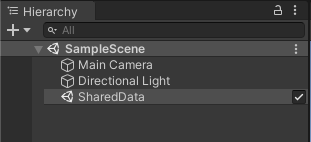
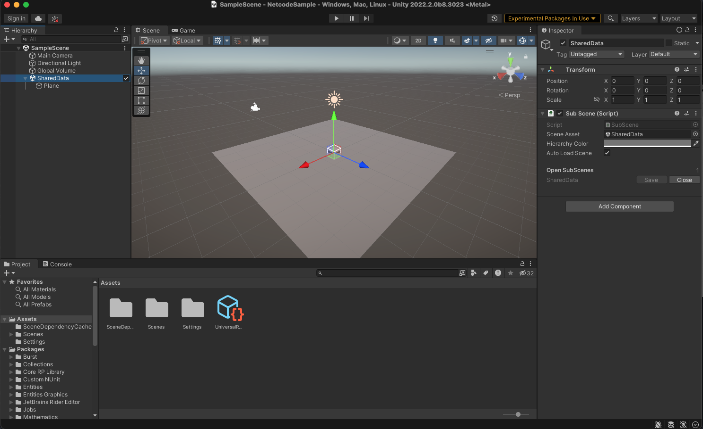
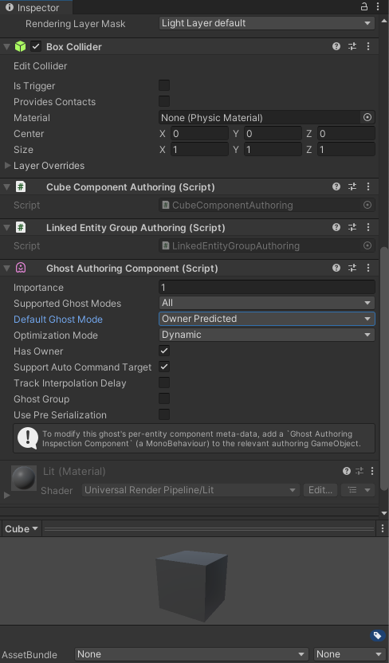
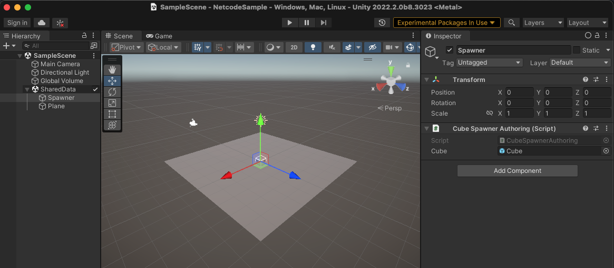

# Getting started with NetCode
This documentation provides a walkthrough of how to create a very simple client server based simulation. This walkthrough describes how to spawn and control a simple Prefab.

## Set up the Project
Open the __Unity Hub__ and create a new Project.

>[!NOTE]
> To use Unity NetCode you must have at least Unity 2020.1.2 installed.

Open the Package Manager (menu: __Window &gt; Package Manager__). At the top of the window, under __Advanced__, select __Show preview packages__. Add the Entities, Entities Graphics, NetCode, and Transport packages.

>[!WARNING]
> As of Unity version 2020.1, in-preview packages no longer appear in the Package Manager. To use preview packages, either manually edit your [project manifest](https://docs.unity3d.com/2020.1/Documentation/Manual/upm-concepts.html?_ga=2.181752096.669754589.1597830146-1414726221.1582037216#Manifests) or search for the package in the **Add package from Git URL** field in the Package Manager. For more information, see the [announcement blog for these changes to the Package Manager.](https://blogs.unity3d.com/2020/06/24/package-manager-updates-in-unity-2020-1/?_ga=2.84647326.669754589.1597830146-1414726221.1582037216)

The NetCode package requires the Entities, Entities Graphics, and Transport packages to work. Entities and the Transport packages are installed automatically through dependencies when installing NetCode, but the Entities Graphics is not. The minimum set of packages you need to manually install are NetCode (com.unity.netcode) and the Entities Graphics (com.unity.entities.graphics). To install these packages while they are still in preview, either edit your project manifest to include the target package name, or type the name of the package you want to install into the **Add package from git URL** menu in the Package Manager.

For example, to install the Transport package using the Package Manager, go to **Window** > **Package Manager**, click on the plus icon to open the **Add package from...** sub-menu and click on **Add package from git url...**, then type "com.unity.transport" into the text field and press **Enter**. To install the same package through your package.json manifest file, add "com.unity.transport": "0.4.0-preview.1" to your dependencies list. Version 0.4.0-preview.1 is used here as an example and is not a specific version dependency.

## Create an initial Scene

To begin, you need to set up a way to share data between the client and the server. To achieve this separation in NetCode, you need to create a different World for each client and the server. To share data between the server and the client, create a new empty Sub Scene via the "New Sub Scene" menu in the Hierarchy context menu (called __SharedData__ in the example).

<br/>_Empty SharedData Sub Scene_

Once you set this up you can, for example, spawn a plane in both the client and the server world. To do this, right click the __SharedData__ Sub Scene and select __3D Object &gt; Plane__ which then creates a plane that is nested under __SharedData__.

<br/>_Scene with a plane_

## Create a ghost Prefab

To make your Scene run with a client / server setup you need to create a definition of the networked object, which is called a **ghost**.

To create a ghost Prefab, create a cube in the Scene (right click on the Scene and select __3D Object &gt; Cube__). Then select the Cube GameObject under the Scene and drag it into the Project’s __Asset__ folder. This creates a Prefab of the Cube. Once the prefab is created you can delete the cube from the scene - but do not delete the prefab.

<br/>_Create a Cube Prefab_

To identify the Cube Prefab, create a simple component with the following code:

```c#
using Unity.Entities;
using Unity.NetCode;

[GenerateAuthoringComponent]
public struct MovableCubeComponent : IComponentData
{
}
```

If you want to add a serialized value to the component, use the __GhostField Attribute__:
```c#
using Unity.Entities;
using Unity.NetCode;

[GenerateAuthoringComponent]
public struct MovableCubeComponent : IComponentData
{
    [GhostField]
    public int ExampleValue;
}
```

Once you create this component, add it to the Cube Prefab. Then, in the Inspector, add the __Ghost Authoring Component__ to the Prefab.

When you do this, Unity will automatically serialize the Translation and Rotation components.

Start by adding a __Ghost Owner Component__ and changing the __Default Ghost Mode__ to __Owner Predicted__. The __NetworkId__ member of the __Ghost Owner Component__ needs to be set by your code, more on this later. This makes sure that you predict your own movement.

<br/>_The Ghost Authoring component_

## Create a spawner
To tell NetCode which Ghosts to use, you need to reference the prefabs from the sub scene. First we need to create a new component for the spawner with the following code:
```c#
using Unity.Entities;

[GenerateAuthoringComponent]
public struct CubeSpawner : IComponentData
{
    public Entity Cube;
}
```

Right click on SharedData and select __Create Empty__. Rename it to __Spawner__ and then add a __CubeSpawner__. Because both the client and the server need to know about these Ghosts, add it to the __SharedData__ Sub Scene.

In the Inspector, drag the Cube prefab to the Cube field of the spawner.

<br/>_Ghost Spawner settings_

## Establish a connection
Next, you need to make sure that the server starts listening for connections, the client connects, and all connections are marked as "in game" so NetCode can start sending snapshots. You don’t need a full flow in this case, so write the minimal amount of code to set it up.

Create a file called *Game.cs* in your __Assets__ folder and add the following code to the file:

```c#
using System;
using Unity.Entities;
using Unity.NetCode;

// Create a custom bootstrap, which enables auto-connect.
// The bootstrap can also be used to configure other settings as well as to
// manually decide which worlds (client and server) to create based on user input
[UnityEngine.Scripting.Preserve]
public class GameBootstrap : ClientServerBootstrap
{
    public override bool Initialize(string defaultWorldName)
    {
        AutoConnectPort = 7979; // Enabled auto connect
        return base.Initialize(defaultWorldName); // Use the regular bootstrap
    }
}
```

Next you need to tell the server you are ready to start playing. To do this, use the `Rpc` calls that are available in the NetCode package.

In *Game.cs*, create the following [RpcCommand](https://docs.unity3d.com/Packages/com.unity.netcode@latest/index.html?subfolder=/api/Unity.NetCode.IRpcCommand.html). This code tells the server that you are ready to start playing.

```c#
public struct GoInGameRequest : IRpcCommand
{
}
```

To make sure you can send input from the client to the server, you need to create an `ICommandData` struct. This struct is responsible for serializing and deserializing the input data. Create a script called *CubeInput.cs* and write the `CubeInput CommandData` as follows:

```c#
public struct CubeInput : ICommandData
{
    public NetworkTick Tick {get; set;}
    public int horizontal;
    public int vertical;
}
```

The command stream consists of the current tick and the horizontal and vertical movements. The serialization code for the data will be automatically generated.

To sample the input, send it over the wire. To do this, create a System for it as follows:

```c#
[WorldSystemFilter(WorldSystemFilterFlags.ClientSimulation)]
public class SampleCubeInput : SystemBase
{
    protected override void OnCreate()
    {
        RequireForUpdate<NetworkIdComponent>();
    }

    protected override void OnUpdate()
    {
        var localInput = GetSingleton<CommandTargetComponent>().targetEntity;
        if (localInput == Entity.Null)
        {
            var commandBuffer = new EntityCommandBuffer(Allocator.Temp);
            var localPlayerId = GetSingleton<NetworkIdComponent>().Value;
            var commandTargetEntity = GetSingletonEntity<CommandTargetComponent>();
            Entities.WithAll<MovableCubeComponent>().WithNone<CubeInput>().ForEach((Entity ent, in GhostOwnerComponent ghostOwner) =>
            {
                if (ghostOwner.NetworkId == localPlayerId)
                {
                    commandBuffer.AddBuffer<CubeInput>(ent);
                    commandBuffer.SetComponent(commandTargetEntity, new CommandTargetComponent {targetEntity = ent});
                }
            }).Run();
            commandBuffer.Playback(EntityManager);
            return;
        }
        var input = default(CubeInput);
        input.Tick = GetSingleton<NetworkTime>().ServerTick;
        if (Input.GetKey("a"))
            input.horizontal -= 1;
        if (Input.GetKey("d"))
            input.horizontal += 1;
        if (Input.GetKey("s"))
            input.vertical -= 1;
        if (Input.GetKey("w"))
            input.vertical += 1;
        var inputBuffer = EntityManager.GetBuffer<CubeInput>(localInput);
        inputBuffer.AddCommandData(input);
    }
}
```

Finally, create a system that can read the `CommandData` and move the player.

```c#
[UpdateInGroup(typeof(PredictedSimulationSystemGroup))]
public class MoveCubeSystem : SystemBase
{
    protected override void OnUpdate()
    {
        var tick = GetSingleton<NetworkTime>().ServerTick;
        var deltaTime = Time.DeltaTime;
        Entities.WithAll<Simulate>().ForEach((DynamicBuffer<CubeInput> inputBuffer, ref Translation trans) =>
        {
            CubeInput input;
            inputBuffer.GetDataAtTick(tick, out input);
            if (input.horizontal > 0)
                trans.Value.x += deltaTime;
            if (input.horizontal < 0)
                trans.Value.x -= deltaTime;
            if (input.vertical > 0)
                trans.Value.z += deltaTime;
            if (input.vertical < 0)
                trans.Value.z -= deltaTime;
        }).ScheduleParallel();
    }
}
```

## Tie it together

The final step is to create the systems that handle when you enter a game on the client and what to do when a client connects on the server. You need to be able to send an `Rpc` to the server when you connect that tells it you are ready to start playing.

```c#
// When client has a connection with network id, go in game and tell server to also go in game
[WorldSystemFilter(WorldSystemFilterFlags.ClientSimulation)]
public class GoInGameClientSystem : SystemBase
{
    protected override void OnCreate()
    {
        // Make sure we wait with the sub scene containing the prefabs to load before going in-game
        RequireForUpdate<CubeSpawner>();
        RequireForUpdate(GetEntityQuery(ComponentType.ReadOnly<NetworkIdComponent>(), ComponentType.Exclude<NetworkStreamInGame>()));
    }
    protected override void OnUpdate()
    {
        var commandBuffer = new EntityCommandBuffer(Allocator.Temp);
        Entities.WithNone<NetworkStreamInGame>().ForEach((Entity ent, in NetworkIdComponent id) =>
        {
            commandBuffer.AddComponent<NetworkStreamInGame>(ent);
            var req = commandBuffer.CreateEntity();
            commandBuffer.AddComponent<GoInGameRequest>(req);
            commandBuffer.AddComponent(req, new SendRpcCommandRequestComponent { TargetConnection = ent });
        }).Run();
        commandBuffer.Playback(EntityManager);
    }
}
```

On the server you need to make sure that when you receive a `GoInGameRequest`, you create and spawn a Cube for that player.

```c#
// When server receives go in game request, go in game and delete request
[WorldSystemFilter(WorldSystemFilterFlags.ServerSimulation)]
public class GoInGameServerSystem : SystemBase
{
    protected override void OnCreate()
    {
        RequireForUpdate<CubeSpawner>();
        RequireForUpdate(GetEntityQuery(ComponentType.ReadOnly<GoInGameRequest>(), ComponentType.ReadOnly<ReceiveRpcCommandRequestComponent>()));
    }
    protected override void OnUpdate()
    {
        var prefab = GetSingleton<CubeSpawner>().Cube;
        var networkIdLookup = GetComponentLookup<NetworkIdComponent>(true);
        var commandBuffer = new EntityCommandBuffer(Allocator.Temp);
        Entities.WithNone<SendRpcCommandRequestComponent>().ForEach((Entity reqEnt, in GoInGameRequest req, in ReceiveRpcCommandRequestComponent reqSrc) =>
        {
            commandBuffer.AddComponent<NetworkStreamInGame>(reqSrc.SourceConnection);
            UnityEngine.Debug.Log(String.Format("Server setting connection {0} to in game", networkIdLookup[reqSrc.SourceConnection].Value));
            var player = commandBuffer.Instantiate(prefab);
            commandBuffer.SetComponent(player, new GhostOwnerComponent { NetworkId = networkIdLookup[reqSrc.SourceConnection].Value});
            commandBuffer.AddBuffer<CubeInput>(player);

            commandBuffer.SetComponent(reqSrc.SourceConnection, new CommandTargetComponent {targetEntity = player});

            commandBuffer.DestroyEntity(reqEnt);
        }).Run();
        commandBuffer.Playback(EntityManager);
    }
}
```

## Test the code

Now you have set up your code, open __Multiplayer &gt; PlayMode Tools__ and set the __PlayMode Type__ to __Client & Server__. Enter Play Mode, and the Cube spawns. Press the __A,S,D,__ and __W__ keys to move the Cube around.

If you want to build a standalone player for the project you must create a `BuildConfiguration` - the regular build menu in Unity will not work.

To recap this workflow:

1. Create a Sub Scene to hold __SharedData__ between the client and the server.
1. Create a Prefab out of a simple 3D Cube and add a __GhostAuthoringComponent__, a __MovableCubeComponent__ and a __GhostOwnerComponent__.
1. Create a __CubeSpawner__ component and add it to an empty GameObject to create a Spawner. Make sure it is referencing the correct prefab.
1. Establish a connection between the client and the server.
1. Write an `Rpc` to tell the server you are ready to play.
1. Write an `ICommandData` to serialize game input.
1. Write a client system to send an `Rpc`.
1. Write a server system to handle the incoming `Rpc`.
