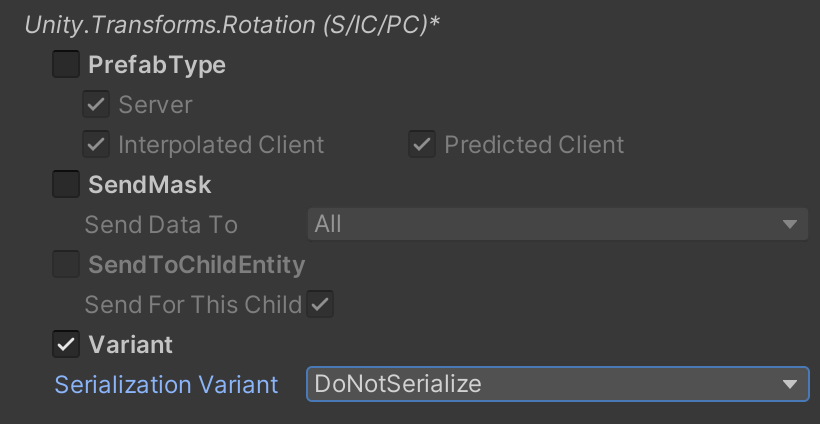

# Ghost snapshots

A ghost is a networked object that the server simulates. During every frame, the server sends a snapshot of the current state of all ghosts to the client. The client presents them, but cannot directly control or affect them because the server owns them.

The ghost snapshot system synchronizes entities which exist on the server to all clients. To make it perform properly, the server processes per ECS chunk rather than per entity. On the receiving side the processing is done per entity. This is because it is not possible to process per chunk on both sides, and the server has more connections than clients.

## Authoring Ghosts
Ghost can be authored in the editor by creating a Prefab with a [GhostAuthoringComponent](https://docs.unity3d.com/Packages/com.unity.netcode@latest/index.html?subfolder=/api/Unity.NetCode.GhostAuthoringComponent.html).


The __GhostAuthoringComponent__ has a small editor which you can use to configure how Netcode synchronizes the Prefab. <br/>
You must set the __Name__, __Importance__, __Supported Ghost Mode__, __Default Ghost Mode__ and __Optimization Mode__ property on each ghost. <br/>
Netcode for Entities uses the __Importance__ property to control which entities are sent when there is not enough bandwidth to send all. A higher value makes it more likely that the ghost will be sent.

You can select from three different __Supported Ghost Mode__ types:

* __All__ - this ghost supports both being interpolated and predicted.
* __Interpolated__ - this ghost only supports being interpolated, it cannot be spawned as a predicted ghost.
* __Predicted__ - this ghost only supports being predicted, it cannot be spawned as a interpolated ghost.

You can select from three different __Default Ghost Mode__ types:

* __Interpolated__ - all ghosts Unity receives from the server are treated as interpolated.
* __Predicted__ - all ghosts Unity receives from the server are treated as predicted.
* __Owner predicted__ - the ghost is predicted for the client that owns it, and interpolated for all other clients. When you select this property, you must also add a __GhostOwnerComponent__ and set its __NetworkId__ field in your code. Unity compares this field to each clients’ network ID to find the correct owner.

You can select from two different __Optimization Mode__ types:

* __Dynamic__ - the ghost will be optimized for having small snapshot size both when changing and when not changing.
* __Static__ - the ghost will not be optimized for having small snapshot size when changing, but it will not be sent at all when it is not changing.

## Replicating Components and Buffers
Netcode for Entities uses C# attributes to configure which components and fields are synchronized as part of a ghost. There are two fundamental attributes you can use:
- The [GhostFieldAttribute](https://docs.unity3d.com/Packages/com.unity.netcode@latest/index.html?subfolder=/api/Unity.NetCode.GhostFieldAttribute.html)
- The [GhostComponentAttribute](https://docs.unity3d.com/Packages/com.unity.netcode@latest/index.html?subfolder=/api/Unity.NetCode.GhostComponentAttribute.html)

The `GhostFieldAttribute` should be used to mark which component (or buffer) fields should be serialised. The attribute can be added to struct fields and properties. Once a component
has at least one field marked with `GhostField`, it become replicated and and transmitted as part of the ghost data. 

The `GhostComponentAttribute` should be used to:
- Declare for which version of the Prefab the component should be present.
- Declare if the component should be serialised also for child entities.
- Declare to which subset of clients a component should be replicated.

## Authoring component serialization
To signal the Netcode for Entities that a component should be serialised you need to add a `GhostField` attribute to the values you want to send. 

```csharp
public struct MySerialisedComponent : IComponentData
{
    [GhostField]public int MyIntField;
    [GhostField(Quantization=1000)]public float MyFloatField;
    [GhostField(Quantization=1000, Smoothing=SmoothingAction.Interpolate)]public float2 Position;
    public float2 NonSerialisedField;
    ...
}
```

The following conditions apply in general for a component to support serialization:
* The component must be declared as public.
* Only public members are considered. Adding a `[GhostField]` to a private member has no effect.
* The __GhostField__ can specify `Quantization` for floating point numbers. The floating point number will be multiplied by this number and converted to an integer in order to save bandwidth. Specifying a `Quantization` is mandatory for floating point numbers and not supported for integer numbers. To send a floating point number unquantized you have to explicitly specify `[GhostField(Quantization=0)]`.
* The __GhostField__ `Composite` flag controls how the delta compression computes the change fields bitmask for non primitive fields (struct). When set to `true` the delta compression will generate only 1 bit to indicate if the struct values are changed or not.
* The __GhostField__ `SendData` flag can be used to instruct code-generation to not include the field in the serialization data if is set to false. This is particularly useful for non primitive members (like structs), which will have all fields serialized by default.
* The __GhostField__ also has a `Smoothing` property which controls if the field will be interpolated or not on clients which are not predicting the ghost. Possible values are:
  * __Clamp__ - use the latest snapshot value
  * __Interpolate__ - interpolate the data between the two snapshot values and if no data is available for the next tick, clamp to the latest value.
  * __InterpolateAndExtrapolate__ - interpolate the GhostField value between snapshot values, and if no data is available for the next tick, the next value is linearly extrapolated using the previous two snapshot values. Extrapolation is limited (i.e. clamped) via `ClientTickRate.MaxExtrapolationTimeSimTicks`.
* __GhostField__ `MaxSmoothingDistance` allows you to disable interpolation when the values change more than the specified limit between two snapshots. This is useful for dealing with teleportation for example.
* Finally the __GhostField__ has a `SubType` property which can be set to an integer value to use special serialization rules supplied for that specific field.

## Authoring dynamic buffer serialization
Dynamic buffers serialization is natively supported. Unlike components, to replicate a buffer **all public fields** MUST be marked with at `[GhostField]` attribute.
>![NOTE] This restriction has been added to guarantee that in case an element is added to the buffer, when it is replicated the element have meaningful values. That restriction may be
> removed in the future.

```csharp
public struct SerialisedBuffer : IBufferElementData
{
    [GhostField]public int Field0;
    [GhostField(Quantization=1000)]public float Field1;
    [GhostField(Quantization=1000)]public float2 Position;
    public float2 NonSerialisedField; //<---- This is an error!
    private float2 NonSerialisedField; // private field, because are not replicated, are not set to default and their values are undefined at runtime.
    [GhostField(SendData=false)]public int NotSentAndUninitialised; // field that aren't replicated via SendData=false are never set to default and can have any possible value.
    ...
}
```

Furthermore, in line with the `IComponentData`:
* The buffer must be declared as public.
* Only public members are considered. Adding a `[GhostField]` to a private member has no effect.
* By using the `GhostField.SendData` you can instrument the serialisation code to skip certain field. In such a case:
  - the value of the fields that aren't replicated are never altered
  - for new buffer elements, their content is not set to default and the content is undefined (can be any value).

Dynamic buffers fields don't support interpolation. The __GhostField__ `Smoothing` and `MaxSmoothingDistance` properties will be ignored.

## ICommandData and IInputComponentData serialization

__ICommandData__, being a subclass of __IBufferElementData__, can also be serialized from server to clients. As such, the same rules for buffers apply: if the command buffer must be serialized, then all fields must be annotated.

```c#
    [GhostComponent()]
    public struct MyCommand : ICommandData
    {
        [GhostField] public NetworkTick Tick {get; set;}
        [GhostField] public int Value;
    }
```

The same applies when using automated input synchronization with __IInputComponentData__

```c#
    public struct MyCommand : IInputComponentData
    {
        [GhostField] public int Value;
    }
```

The command data serialization is particularly useful for implementing [RemotePlayerPrediction](prediction.md#remote-players-prediction).

### Ghost Field Inheritance
If a `[GhostField]` is specified for a non primitive field, the attribute and
some of its properties are automatically inherited by all the sub-fields witch does not present a `[GhostField]` attribute.

```c#

public struct Vector2
{
    public float x;
    [GhostField(Quantization=100)] public float y;
}

public struct MyComponent : IComponentData
{
    //Value.x will inherit the quantization value specified by the parent class
    //Value.y will maintains its original quantization value
    [GhostField(Quantized=1000)] public Vector Value;
}
```

The following properties are not inherited:
* __SubType__ - the subtype is always reset to the default

## Using the GhostComponentAttribute
The `GhostComponentAttribue` **does not indicates or signal** that a component is replicated. Instead, it should be used to instrument the runtime how to handle the component when it comes to:
- Removing the component from a prefab when not necessary
- Optimise sending the component data
- Specify how the component should be handled for child entities.

```csharp
[GhostComponent(PrefabType=GhostPrefabType.All, SendTypeOptimization=GhostSendType.OnlyInterpolatedClients, SendDataForChildEntity=false)]
public struct MyComponent : IComponentData
{  
    [GhostField(Quantized=1000)] public float3 Value;
}
```

To change which versions of a Prefab a component is available on you use __PrefabType__ in a __GhostComponentAttribute__ on the component. __PrefabType__ can be on of the these types:
* __InterpolatedClient__ - the component is only available on clients where the ghost is interpolated.
* __PredictedClient__ - the component is only available on clients where the ghost is predicted.
* __Client__ - the component is only available on the clients, both when the ghost is predicted and interpolated.
* __Server__ - the component is only available on the server.
* __AllPredicted__ - the component is only available on the server and on clients where the ghost is predicted.
* __All__ - the component is available on the server and all clients.

For example, if you add `[GhostComponent(PrefabType=GhostPrefabType.Client)]` to RenderMesh, the ghost won’t have a RenderMesh when it is instantiated on the server, but it will have it when instantiated on the client.

A component can set __SendTypeOptimization__ in the __GhostComponentAttribute__ to control which clients the component is sent to whenever a ghost type is known at compile time. The available modes are:
* __None__ - the component is never sent to any clients. Netcode will not modify the component on the clients which do not receive it.
* __Interpolated__ - the component is only sent to clients which are interpolating the ghost.
* __Predicted__ - the component is only sent to clients which are predicting the ghost.
* __All__ - the component is sent to all clients.

A component can also set __SendDataForChildEntity__ to true in order to change the default (of not serializing children), allowing this component to be serialized when on a child.

A component can also set __SendToOwner__ in the __GhostComponentAttribute__ to specify if the component should be sent to client who owns the entity. The available values are:
* __SendToOwner__ - the component is only sent to the client who own the ghost
* __SendToNonOwner__ - the component is sent to all clients except the one who owns the ghost
* __All__ - the component is sent to all clients.

>![NOTE] By setting either the SendTypeOptimisation and/or SendToOwner, to specify to which client the component should be sent will not
> affect the presence of the component on the prefab or modify the component on the client which did not receive it.

## How to add serialization support for custom types 
The types you can serialize via `GhostFieldAttribute` are specified via templates. You can see the default supported types [here](ghost-types-templates.md#Supported Types) <br/>  
In addition to the default out-of-the-box types you can also:
- add your own templates for new types.
- provide a custom serialization templates for a types and target by using the _SubTypes_ property of the `GhostFieldAttribute`.

Please check how to [use and write templates](ghost-types-templates.md#Defining additional templates) for more information on the topic.  

## Ghost Component Variants
The [GhostComponentVariationAttribute](https://docs.unity3d.com/Packages/com.unity.netcode@latest/index.html?subfolder=/api/Unity.NetCode.GhostComponentVariationAttribute.html) is special attribute tha can be used to declare at compile time
a "replication schema" for a type, without the need to markup the fields in the original type, or the original type itself. <br/>
>![NOTE]This new declared type act as proxy from a code-generation perspective. Instead of using the original type, the code-generation system use the declared "variant" to generate a specific
> version of the serialization code.
> ![NOTE] **Ghost components variants for `IBufferElementData` are not fully supported.**

The `GhostComponentVariationAttribute` has some specific use case in mind:
- Permit to declare 3rd party component for which you don't have direct access (es: in another assembly or dll that does not have Netcode reference)
- Generate multiple serialization version for a type (i.e: encode the position with small and large precision)
- Strip components (i.e: RenderMesh) from certain prefab types (from the Server for example) by overriding or adding a `GhostComponentAttribute` to the type without changing the original declaration.

```c#
    [GhostComponentVariation(typeof(MyComponent))]
    [GhostComponent(PrefabType=GhostPrefabType.All, SendTypeOptimization=GhostSendType.All)]
    struct MyComponentVariant
    {
        [GhostField(Quantization=100, Smoothing=SmoothingAction.Interpolate)] float3 Value;
    }
```

In the example above, the `MyComponentVariant` will generate serialization code for `MyComponent`, using the properties and the attribute present in the variant declaration.

The attribute constructor take as argument the type of component you want to specify the variant for (ex: `MyComponent`). Then for each field in the original struct you would like to serialize you
should add a `GhostField` attribute like you usually do.
>~[NOTE] Only members that are present in the component type are allowed. Validation and exceptions are thrown at compile time in case the rule is not respected.

An optional `GhostComponentAttribute` attribute can be added to the variant to further specify the component serialization properties.

It is possible to declare multiple serialization variant for a component (ex: a 2D rotation that just serialize the angle instead of a full quaternion).

### Preventing a component to support variations
There are cases when you to prevent a component for supporting variation. (i.e builtin components that have carefully designed to work that way).

It is possible to prevent a component from supporting variation by using the [DontSupportPrefabOverridesAttribute](https://docs.unity3d.com/Packages/com.unity.netcode@latest/index.html?subfolder=/api/Unity.NetCode.DontSupportPrefabOverridesAttribute.html) attribute.
An error will be reported at compile time if a `GhostComponentVariation` is defined for that type.

### Specify which variant to use on a Ghost Prefab.
Using `GhostAuthoringInspectionComponent` it is then possible to select for each prefab what serialization variants to for each individual components.


All variants for that specific component type present in the project will be show in a dropbox selection. <br/>
You can assign and use different variant for the GameObject (and so baked entity) in you hierarchy.

### Assign default variant to use for a type.
In cases where multiple variants are present for a type that does not have a "default" serialization (that it, the type we are specifying the variation for does not have any ghost fields)
is considered a conflict. We use some built-in rule to retrieve a deterministic variant to use but, in general, __it is the users responsibility__ to indicate in this case what type should be the default.

To setup which variant to use as the `default` for a given type you need to create a system that inherit from
[DefaultVariantSystemBase](https://docs.unity3d.com/Packages/com.unity.netcode@latest/index.html?subfolder=/api/Unity.NetCode.DefaultVariantSystemBase.html) class,
and implements the `RegisterDefaultVariants` method.

```c#
using System.Collections.Generic;
using Unity.Entities;
using Unity.Transforms;

namespace Unity.NetCode.Samples
{
    sealed class DefaultVariantSystem : DefaultVariantSystemBase
    {
        protected override void RegisterDefaultVariants(Dictionary<ComponentType, Rule> defaultVariants)
        {
            defaultVariants.Add(typeof(LocalTransform), Rule.OnlyParents(typeof(TransformDefaultVariant)));
        }
    }
}
```

This class would make sure the default `LocalTransform` variant to us as default is the `TransformDefaultVariant`. For more information, please refer to the
[DefaultVariantSystemBase](https://docs.unity3d.com/Packages/com.unity.netcode@latest/index.html?subfolder=/api/Unity.NetCode.DefaultVariantSystemBase.html) documentation.

## Special variant types

There might be cases where you need the variant to remove functionality instead of doing things differently and there are two cases covered. This saves the typing involved with creating a full variant registration which essentially is just turning it off.

When you want a component to be stripped on clients so you don't see it at all there you can use the `ClientOnlyVariant` type when registering the default variant for a particular type.

When you don't want any synchronization to be done with a variant type, so no serialization happens, you can use the `DontSerializeVariant` type when registering.

```C#
using System.Collections.Generic;
using Unity.Entities;
using Unity.Transforms;

namespace Unity.NetCode.Samples
{
    sealed class DefaultVariantSystem : DefaultVariantSystemBase
    {
        protected override void RegisterDefaultVariants(Dictionary<ComponentType, Rule> defaultVariants)
        {
            defaultVariants.Add(typeof(SomeClientOnlyThing), Rule.OnlyParents(typeof(ClientOnlyVariant)));
            defaultVariants.Add(typeof(NoNeedToSyncThis), Rule.ForAll(typeof(DontSerializeVariant)));
        }
    }
}
```

You can also pick the `DontSerializeVariant` in the ghost component on prefabs.

## Assign variants and override GhostComponentAttribute settings on ghost prefabs
It is possible to override the following meta-data on per-prefab basis, 
by using the [GhostAuthoringInspectionComponent](https://docs.unity3d.com/Packages/com.unity.netcode@latest/index.html?subfolder=/api/Unity.NetCode.AutoCommandTarget.html) editor.


The `GhostAuthoringInspectionComponent` should be added to the `GameObject` you would like to customise. Once added, the editor will show which components present in the runtime entity are replicated. <br/>
The editor allow you to: change the following properties:

* Change the __PrefabType__ in which the component should be present/replicated.
* Change the __SendToOptimization__ for this component (if applicable)
* Assign the serialization __Variant__ to use for that component.

It is possible to prevent a component from supporting per-prefab overrides by using the [DontSupportPrefabOverrides](https://docs.unity3d.com/Packages/com.unity.netcode@latest/index.html?subfolder=/api/Unity.NetCode.DontSupportPrefabOverridesAttribute.html)
attribute. <br/>
When present, the component can't be customized in the inspector, nor can a programmer add custom or default variants for this type (as that will trigger errors during ghost validation).

For example: The Netcode for Entities package requires the [GhostOwnerComponent](https://docs.unity3d.com/Packages/com.unity.netcode@latest/index.html?subfolder=/api/Unity.NetCode.GhostOwnerComponent.html)
to be added to all ghost types, sent for all ghost types, and serialized using the default variant. Thus, we add the `[DontSupportPrefabOverride]` attribute to it.

>![NOTE] Components on child entities are not serialised by default, thus by default when you look to `GhostAuthoringInspectionComponent` on a child GameObject you will
> see that the selected variant for the type is the `DontSerializeVariant`.



## Snapshot visualization tool

To understand what is being put on the wire in the Netcode, you can use the snapshot visualization tool, __NetDbg__ tool. 


To open the tool, go to menu: __Multiplayer &gt; Open NetDbg__, and the tool opens in a browser window. It displays a vertical bar for each received snapshot, with a breakdown of the snapshot’s ghost types, size etc. 

To see more detailed information about the snapshot, click on one of the bars.
> [!NOTE]
> This tool is a prototype. In future versions of the package it will integrate with the Unity Profiler so you can easily correlate network traffic with memory usage and CPU performance.

## Ghosts vs. RPCs

RPCs are mostly meant for game flow events, like making everyone do a certain thing like load a level. Opposed to that ghost snapshot synchronization is meant to make sure certain data is always replicated and kept in sync with everyone with certain parameters. Some differences are:

* RPCs are sent as reliable packets, while ghosts snapshots are unreliable.
* RPC data is sent and received as it is, while ghost data goes through optimizations like diff compression and can go through value smoothing when received.
* RPCs are not tied to any particular tick or other snapshot data (just processed when received). Ghost snapshot data can work with interpolation and prediction (with snapshot history) resulting in getting applied at particular ticks.
