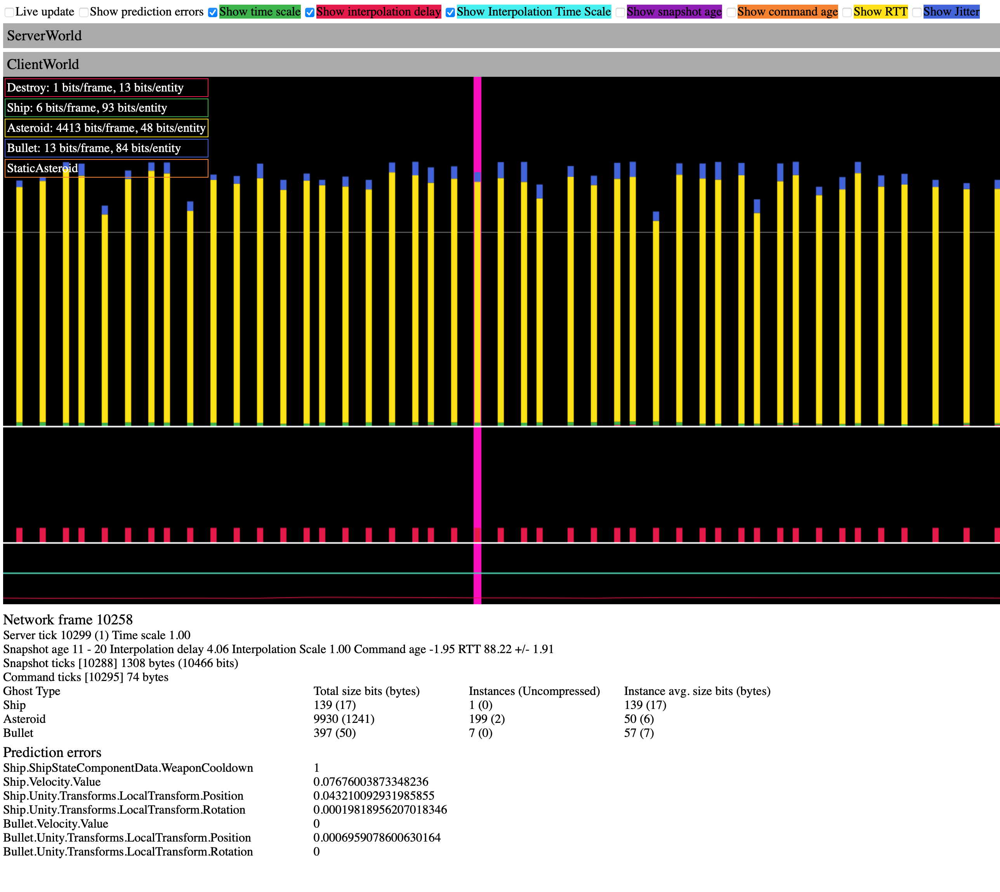

# Ghosts and snapshots

Understand [ghosts](#ghosts) and [snapshots](#snapshots) in Netcode for Entities and how to use them to synchronize states in your multiplayer project.

Netcode for Entities also supports a limited form of [remote procedure call-like operations (RPCs)](rpcs.md) to handle events. For more information about when to use ghosts or RPCs, refer to the [comparison on the RPC page](rpcs.md#comparing-ghosts-and-rpcs).

## Ghosts

A ghost is a networked object in a multiplayer game.
* A ghost is owned by (and simulated by) the server. In other words; the server has final authority over all ghosts. The server may therefore spawn, destroy, and update ghost entities.
* Each client connected to the server has a copy of each relevant server ghost, and the client updates this representation by receiving [snapshots](#snapshots) sent by the server - once per network tick - which contains the current state of a subset of these ghosts. The client then presents the updated state of the ghosts to the rest of the game simulation on one of two timelines (see [interpolation](#interpolation.md) and [client prediction](#intro-to-prediction.md)), allowing ghosts to be smoothly rendered etc.
_Note, then; the client cannot directly control or affect ghosts, because the server has authority over the entire game simulation. Therefore, any modification the client makes to a ghost is considered a client prediction, and can (and will) be reverted when new, server authoritative snapshot data arrives._

When you create a ghost, you need to define how it's [synchronized between client and server](#synchronizing-ghost-components-and-fields). For more information about how to spawn ghosts after defining them, refer to the [Ghost spawning page](#ghost-spawning.md).

### Create a ghost

Create ghosts in the Unity Editor by [creating a prefab](https://docs.unity3d.com/Manual/CreatingPrefabs.html) with a [`GhostAuthoringComponent`](https://docs.unity3d.com/Packages/com.unity.netcode@latest/index.html?subfolder=/api/Unity.NetCode.GhostAuthoringComponent.html).

The `GhostAuthoringComponent` in the Editor has a small editor that you can use to configure how Netcode for Entities synchronizes the prefab. You must set the __Name__, __Importance__, __Supported Ghost Mode__, __Default Ghost Mode__ and __Optimization Mode__ property on each ghost, and we also suggest you set the __MaxSendRate__ value to reduce absolute bandwidth consumption. _Netcode for Entities uses the __Importance__ property to control which entities it sends when there's not enough bandwidth to send all entities within a single snapshot (the size of each snapshot packet can be customized). A higher value makes it more likely that the ghost is sent._

The (optional) __MaxSendRate__ property denotes the absolute maximum send frequency (in Hz) for ghost chunks of this ghost prefab type (excluding a few nuanced exceptions).
__Important Note:__ `MaxSendRate` only denotes the maximum *possible* replication frequency, and cannot be enforced in all cases. I.e. Other factors (like `ClientServerTickRate.NetworkTickRate`, ghost instance count, __Importance__, Importance-Scaling, `GhostSendSystemData.DefaultSnapshotPacketSize`, and structural changes etc.) will determine the final send rate.

Examples:
* A ghost with a `MaxSendRate` of 100Hz will still be rate limited by the `NetworkTickRate` itself, which is 60Hz by default.
* Similarly, a ghost with a `MaxSendRate` of 60Hz instantiated in a project with a `NetworkTickRate` of 30Hz will be sent at a maximum of 30Hz.
* As this calculation can only be performed on integer/whole `ticksSinceLastSent` ticks, a ghost with a `MaxSendRate` in-between multiples of the `NetworkTickRate` will be rounded down to the next multiple.
E.g. `NetworkTickRate:30Hz`, `MaxSendRate:45` means 30Hz is the actual maximum send rate.

### __Supported Ghost Mode__ options

* __All__: This ghost supports both [interpolation](interpolation.md) and [prediction](intro-to-prediction.md).
* __Interpolated__: This ghost only supports interpolation. It can't be spawned as a predicted ghost.
* __Predicted__: This ghost only supports prediction. It can't be spawned as an interpolated ghost.

### __Default Ghost Mode__ options

* __Interpolated__: Unity treats all ghosts that it receives from the server as interpolated.
* __Predicted__: Unity treats all ghosts that it receives from the server are treated predicted.
* __Owner predicted__: The ghost is predicted for the client that owns it, and interpolated for all other clients. When you select this property, you must also add a __GhostOwner__ and set its __NetworkId__ field in your code. Unity compares this field to each clients' network ID to find the correct owner.

### __Optimization Mode__ options

* __Dynamic__: This is the default setting. Use this when you expect the ghost to change often. The ghost is optimized for a small snapshot size when both changing and not changing.
* __Static__: Use this when you expect the ghost to change infrequently. The ghost isn't optimized for a small snapshot size when changing, but isn't sent at all when it's not changing.

## Structural changes on instantiated ghosts

You can make some structural changes to already instantiated ghost prefabs, such as [adding or removing components](#add-or-remove-components-on-an-instantiated-prefab) or [adding, removing, or destroying child entities](#add-remove-or-destroy-child-entities-on-an-instantiated-prefab), although there are limitations.

| Action                                         | Supported  | Limitations                                                                |
|------------------------------------------------|------------|----------------------------------------------------------------------------|
| Add or remove components or buffers            | Yes        | None                                                                       |                                                  |
| Add or remove replicated components or buffers | Yes        | Refer to [adding or removing components](#add-or-remove-components-on-an-instantiated-prefab)                        |
| Add, remove, or destroy child entities                   | Yes        | Refer to [adding, removing, or destroying child entities](#add-remove-or-destroy-child-entities-on-an-instantiated-prefab)   |

> [!NOTE]
> Adding, removing, or destroying child entities is not technically a structural change, but has implications for replication.

### Add or remove components on an instantiated prefab

You can add or remove any user-side components from both the root and child entities of an instantiated prefab and serialization and deserialization of the ghost, as well as delta compression, will continue to work.

However, adding a component to an instantiated ghost (even if it has a `[GhostField]`), will not replicate the component to other instances of the same ghost prefab. For a component to be replicated, it must be part of the prefab at authoring time.

### Add, remove, or destroy child entities on an instantiated prefab

You can't remove or change the index of any replicated child entity within the `LinkedEntityGroup` buffer, since doing so can cause serialization and deserialization errors. You can, however, do the following:

* Destroy any child entity in the `LinkedEntityGroup`, with or without replicated components, as long as you don't re-order or remove the associated entry in the `LinkedEntityGroup`.
* Remove entities from the `LinkedEntityGroup` buffer, as long as doing so doesn't cause a re-ordering of the original replicated child entities.
* Append entities to the `LinkedEntityGroup`.
    * In general, avoid prepending or inserting entities in between the original entries of the `LinkedEntityGroup` buffer. However, you can insert an entity in the `LinkedEntityGroup` after the last children that has replicated components.

Refer to the following examples of valid and invalid configurations for more details:

```
// This is a valid configuration, where (*) denotes a destroyed entity.
root
  child 1 (*) <-- Replicated
  child 2
  child 3     <-- Replicated
  child 4 (*)

// This is a valid configuration, where entities have been appended.
root
  child 1   <-- Replicated
  child 2   <-- Replicated
  =-----=  Append / Remove after here
  child 3
  user entity 1
  user entity 2

// This is an invalid configuration because entities have been prepended, changing the index.
root
  new user entity 1 <--- INVALID, break replicated entity indexes
  child 1  <-- Replicated
  child 2  <-- Replicated
  child 3

// This is an invalid configuration, because entities have been added in between original entries, changing the index.
root
  child 1  <-- Replicated
  new user entity 1 <--- INVALID, break replicated entity indexes
  child 2  <-- Replicated
  child 3
```

## Synchronize ghost components and fields

Netcode for Entities uses C# attributes to configure which components and fields to synchronize as part of a ghost.

You can use the following fundamental attributes:

| Attribute | Usage | More information |
|---|---|---|
| [`GhostFieldAttribute`](https://docs.unity3d.com/Packages/com.unity.netcode@latest/index.html?subfolder=/api/Unity.NetCode.GhostFieldAttribute.html)           | Use the `GhostFieldAttribute` on a struct field or property to specify which component (or buffer) fields to serialize. Once a component has at least one field marked with `[GhostField]`, it becomes replicated and is transmitted as part of the ghost data.   | [Serializing and synchronization with GhostFieldAttribute](ghostfield-synchronize.md) |
| [`GhostEnabledBitAttribute`](https://docs.unity3d.com/Packages/com.unity.netcode@latest/index.html?subfolder=/api/Unity.NetCode.GhostEnabledBitAttribute.html) | Use the `GhostEnabledBitAttribute` on an `IEnableableComponent` struct definition to specify that the enabled bit for this component should be serialized. Once a component is flagged with `[GhostEnabledBit]`, its enabled bit becomes replicated, and is transmitted as part of the ghost data. | [GhostComponentAttribute](ghostcomponentattribute.md) |
| [`GhostComponentAttribute`](https://docs.unity3d.com/Packages/com.unity.netcode@latest/index.html?subfolder=/api/Unity.NetCode.GhostComponentAttribute.html)   | Use the `GhostComponentAttribute` on a `ComponentType` struct definition to:<br/>- Declare for which version of the prefab the component should be present.<br/>- Declare if the component should be serialized for child entities.<br/>- Declare to which subset of clients a component should be replicated. <br/>Important: Adding a `GhostComponentAttribute` won't make your component fields replicate. You must mark each field with a `GhostFieldAttribute` individually.  | [GhostComponentAttribute](ghostcomponentattribute.md) |

## Snapshots

A snapshot is a representation of the state of all ghosts on the server for a given network tick. Netcode for Entities sends one snapshot to each connected client once per tick, at a rate defined by [`NetworkTickRate`](https://docs.unity3d.com/Packages/com.unity.netcode@latest?subfolder=/api/Unity.NetCode.ClientServerTickRate.html#Unity_NetCode_ClientServerTickRate_NetworkTickRate) (which can differ from the [`SimulationTickRate`](https://docs.unity3d.com/Packages/com.unity.netcode@latest?subfolder=/api/Unity.NetCode.ClientServerTickRate.html#Unity_NetCode_ClientServerTickRate_SimulationTickRate)). If the `NetworkTickRate` is lower than the `SimulationTickRate`, then Netcode for Entities creates a subset group of connections, and sends one snapshot to each connection in the subset. Then, on the next tick, it sends a snapshot to the next subset, and so on. This is referred to as a round robin approach because it distributes the `GhostSendSystem` load across multiple `SimulationTickRate` ticks.

### Snapshot processing

The ghost snapshot system synchronizes entities, which exist on the server, to all clients. To improve performance, the server processes ghosts per [chunk](https://docs.unity3d.com/Packages/com.unity.entities@1.3/manual/components-chunk.html), rather than per entity. On the receiving client side, however, processing is done per entity. It's not possible to process per chunk on both sides because one set of entities in one chunk on the server may not correspond with the same set of entities in one chunk on the client. There are also multiple clients, each with their own entity-in-chunk layout.

### Partial snapshots

When replicating a lot of ghosts (or ghost data), the per-tick snapshot data size is clamped to the upper Maximum Transmission Unit (MTU) limit. As a result, it's common and expected for a snapshot to only contain a subset of all ghosts. These snapshots are referred to as partial snapshots. Ghosts in chunks with the highest importance values are added first, and Netcode for Entities streams your large world a few ghost chunks at a time, instead of sending all of them at once in a huge packet. This is effectively an importance priority queue.

_You can also use `MaxSendRate` to reduce the number of ghost chunks which are even considered as part of each snapshot's importance priority queue, which can also reduce total bandwidth consumption._

You can change the maximum size of snapshots. Reducing the maximum size saves bandwidth at the cost of a higher relative header overhead and less usable data, while increasing it may cause multiple UDP packets to have to be sent per snapshot, which can increase the probability of packet loss.

Refer to the documentation on [importance scaling](optimizations.md#importance-scaling) for more details.

### Snapshot visualization tool

To understand what's being sent over the network, you can use the Network Debugger snapshot visualization tool.

To open the tool, go to __Multiplayer__ > __Open NetDbg__, and the tool opens in a browser window. It displays a vertical bar for each received snapshot, with a breakdown of key information about each snapshot.

For more information about a particular snapshot, select one of the bars.



> [!NOTE]
> This tool is a prototype.

## Additional resources

- [Communicating with RPCs](rpcs.md)
- [`NetworkTickRate` API documentation](https://docs.unity3d.com/Packages/com.unity.netcode@latest?subfolder=/api/Unity.NetCode.ClientServerTickRate.html#Unity_NetCode_ClientServerTickRate_NetworkTickRate)
- [`SimulationTickRate` API documentation](https://docs.unity3d.com/Packages/com.unity.netcode@latest?subfolder=/api/Unity.NetCode.ClientServerTickRate.html#Unity_NetCode_ClientServerTickRate_SimulationTickRate)
- [Serializing and synchronizing with GhostField](ghostfield-synchronize.md)
- [Customizing replication with `GhostComponentAttribute`](ghostcomponentattribute.md)
- [Creating replication schemas with `GhostComponentVariationAttribute`](ghost-variants.md)
- [Spawning ghosts](ghost-spawning.md)
- [Ghost type templates](ghost-types-templates.md)
