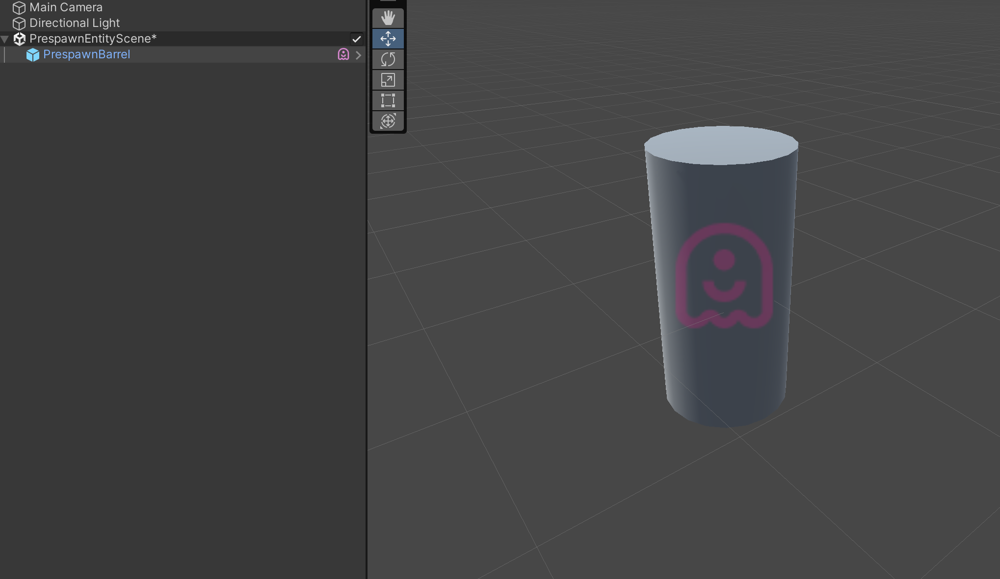

# Spawning ghost entities

A ghost is spawned by instantiating it on the server, as all ghosts on the server are replicated to all clients automatically.

Ghosts that are instantiated inside subscenes (named "pre-spawns") are a special case, and are activated by said scene being loaded on both the client and server worlds. This flow uses the following optimization: If a pre-spawned ghost has not changed on the server (from the values it had when originally baked into the subscene), we do not need to perform any snapshot updates (as in, we don't need to replicate anything related to this ghost) to activate it on the client. And, even if there are a few changes, said changes will be delta-compressed against the subscene baseline. We expect these to be the common cases.

In client worlds, ghosts can be spawned predictively (named a "client predicted spawn" or "predicted spawn" for short), and those predicted spawns will later be matched with a server spawn, as soon as a snapshot update arrives containing it. This process (of matching predicted spawned ghosts to their server authoritative counterparts) is called "classification". If classification fails, the locally predicted spawn will be deleted after a grace period. It is not valid to instantiate non-predicted ghosts on clients, as the server is authoritative, and is the true authority of what ghosts exist in the world.

## Ghosts entities on the client

Netcode for Entities doesn't have or require a specific spawn message to be raised (nor handled) by user-code. When the client receives an unknown/new ghost ID, it treats it as an implicit spawn.

When the client receives a new ghost, the ghost is assigned a spawn type based on a set of classification systems.

Once the spawn type has been set, the [GhostSpawnSystem](https://docs.unity3d.com/Packages/com.unity.netcode@latest/index.html?subfolder=/api/Unity.NetCode.GhostSpawnSystem.html) takes care of instantiating the new entity.

### Spawn types

Spawning is split into three main types:

* __Delayed or interpolated spawning__: Because the client interpolates snapshot data, non-predicted ghosts can't be immediately spawned. Otherwise, the object would appear when the snapshot first arrives, even if its ghost data is only applicable for a later interpolation tick, and so players would observe newly spawned objects appearing to be idle for a few ticks, until new data is received from the server and interpolation can start.
<br/>This spawn delay is governed by the interpolation delay, which can be configured via [ClientTickRate.InterpolationTimeNetTicks](https://docs.unity3d.com/Packages/com.unity.netcode@latest/index.html?subfolder=/api/Unity.NetCode.ClientTickRate.InterpolationTimeNetTicks.html) (or [ClientTickRate.InterpolationTimeMS](https://docs.unity3d.com/Packages/com.unity.netcode@latest/index.html?subfolder=/api/Unity.NetCode.ClientTickRate.InterpolationTimeMS.html)). The interpolated ghosts spawn when the [NetworkTime.InterpolationTick](https://docs.unity3d.com/Packages/com.unity.netcode@latest/index.html?subfolder=/api/Unity.NetCode.NetworkTime.InterpolationTick.html) is greater or equal to a ghosts [GhostInstance.spawnTick](https://docs.unity3d.com/Packages/com.unity.netcode@latest/index.html?subfolder=/api/Unity.NetCode.GhostInstance.spawnTick.html). See [time synchronization](time-synchronization.md) for more information about interpolation delay and interpolation tick.
* __Predicted spawning for the client predicted player spawns__: The spawned ghost is predicted, and typically instantiated in response to inputs raised on the client. Therefore, there is no round trip spawn delay when predictively spawning ghosts, which reduces perceived latency, improving gameplay quality. If/when the server authoritative snapshot data for this object eventually arrives, the `GhostUpdateSystem` applies the data directly to the already predictively spawned ghost, and then plays back the local inputs which have happened since that time. If this predictive spawn was created by the client in error, this prediction error will be corrected by destroying the predicted ghost.
* __Predicted spawning for player spawned objects__: This usually applies to objects that the player spawns, like in-game bullets or rockets that the player fires.

>[!NOTE]
> Ghost entities can be spawned only if the ghost prefabs are loaded/present in the world. Server and client should agree on the prefabs they have and the server will only report to the client ghosts for which the client has the prefab.

### Implement predicted spawning for player spawned objects

Like other aspects of client prediction, predicted spawns require the same logic be run on both the client and server, which ensures the two are as deterministic as possible. Therefore, by adding your spawn system to the `PredictedSimulationSystemGroup` (which you've likely already done), the client code will call instantiate under the same conditions that the server does (for example, after the player presses the shoot mouse button).

Under the hood, all ghost prefabs configured to be predicted upon spawn have the `PredictedGhostSpawnRequest` component already added to them, and therefore, they are treated as predicted spawns by default.

Therefore, when your system (running in the client world) instantiates this ghost, it is already treated as predicted spawn, automatically, and the only change required to your system (to make it correct) is to add an early out for `networkTime.IsFirstTimeFullyPredictingTick` (see paragraphs below for why). 

When the first snapshot update for this entity arrives, we detect that the received update is for an entity already spawned by client and from that time on, all the updates are applied to it.

In the prediction system code the [NetworkTime.IsFirstTimeFullyPredictingTick](https://docs.unity3d.com/Packages/com.unity.netcode@latest/index.html?subfolder=/api/Unity.NetCode.NetworkTime.html) value needs to be checked in order to prevent the spawned object from being spawned multiple times as data is rolled back and redeployed as part of the prediction loop.

```csharp
public void OnUpdate()
{
    // Other input like movement handled here or in another system...

    var networkTime = SystemAPI.GetSingleton<NetworkTime>();
    if (!networkTime.IsFirstTimeFullyPredictingTick)
        return;
    // Handle the input for instantiating a bullet for example here
    // ...
}
```

These client spawned objects are automatically handled by the [GhostSpawnClassificationSystem](https://docs.unity3d.com/Packages/com.unity.netcode@latest/index.html?subfolder=/api/Unity.NetCode.GhostSpawnClassificationSystem.html) system,
which matches the new received ghosts with any of the client predicted spawned ones, based by their types and spawning tick (should be within five ticks).

You can implement a custom classification with more advanced logic than this to override the default behaviour.

#### Specify specific rollback options for predicted spawned ghosts

When a ghost is predicted by the client (owner-predicted or predicted ghost modes), it is possible to specify how predicted spawned ghost handle [prediction and rollback](intro-to-prediction.md#rollback-and-replay)
until the auhtoritative spawned ghost has been confirmed and received by the client.

By checking the "Rollback Predicted Spawned Ghost State" toggle in the Ghost Authoring component inspector,  
the unclassified spawned ghosts on the client roll back and resimulate its state starting from its spawn tick when a new snapshots (that must contains predicted ghost) 
is received from the server.

This can alleviate some misprediction error due to ghost-ghost interaction (see [prediction error and mitigation](prediction-details.md#predicted-spawn-interactions-with-other-predicted-ghosts))

#### Adding your own classification system

To override the default client classification you can create your own classification system. The system is required to:

- Update in the `GhostSimulationSystemGroup`
- Run after the `GhostSpawnClassificationSystem`

The classification system can inspect the ghosts that need to be spawned by retrieving the
[GhostSpawnBuffer](https://docs.unity3d.com/Packages/com.unity.netcode@latest/index.html?subfolder=/api/Unity.NetCode.GhostSpawnBuffer.html) buffer on the singleton
[GhostSpawnQueueComponent](https://docs.unity3d.com/Packages/com.unity.netcode@latest/index.html?subfolder=/api/Unity.NetCode.GhostSpawnQueue.html) entity and change their __SpawnType__.

Each entry in that list should be compared to the entries in the `PredictedGhostSpawn` buffer on the singleton with a `PredictedGhostSpawnList` component.
If the two entries have the same type and match, the classification system should set the `PredictedSpawnEntity` property in the `GhostSpawnBuffer` element and remove the entry from `PredictedGhostSpawn` buffer.

```csharp
public void Execute(DynamicBuffer<GhostSpawnBuffer> ghosts, DynamicBuffer<SnapshotDataBuffer> data)
{
    var predictedSpawnList = PredictedSpawnListLookup[spawnListEntity];
    for (int i = 0; i < ghosts.Length; ++i)
    {
        var newGhostSpawn = ghosts[i];
        if (newGhostSpawn.SpawnType != GhostSpawnBuffer.Type.Predicted || newGhostSpawn.HasClassifiedPredictedSpawn || newGhostSpawn.PredictedSpawnEntity != Entity.Null)
            continue;

        // Mark all the spawns of this type as classified even if not our own predicted spawns
        // otherwise spawns from other players might be picked up by the default classification system when
        // it runs.
        if (newGhostSpawn.GhostType == ghostType)
            newGhostSpawn.HasClassifiedPredictedSpawn = true;

        // Find new ghost spawns (from ghost snapshot) which match the predict spawned ghost type handled by
        // this classification system. You can use the SnapshotDataBufferLookup to inspect components in the
        // received snapshot in your matching function
        for (int j = 0; j < predictedSpawnList.Length; ++j)
        {
            if (newGhostSpawn.GhostType != predictedSpawnList[j].ghostType)
                continue;

            if (YOUR_FUZZY_MATCH(newGhostSpawn, predictedSpawnList[j]))
            {
                newGhostSpawn.PredictedSpawnEntity = predictedSpawnList[j].entity;
                predictedSpawnList[j] = predictedSpawnList[predictedSpawnList.Length - 1];
                predictedSpawnList.RemoveAt(predictedSpawnList.Length - 1);
                break;
            }
        }
        ghosts[i] = newGhostSpawn;
    }
}
```

Inside your classification system you can use the [SnapshotDataBufferLookup](https://docs.unity3d.com/Packages/com.unity.netcode@latest/index.html?subfolder=/api/Unity.NetCode.GhostSpawnQueue.html) to:

- Check for component presence in the ghost archetype
- Retrieve from the snapshot data associated with the new ghost any replicated component type.

## Pre-spawned ghosts

A ghost instance (an instance of a ghost prefab) can be placed in a subscene in the Unity Editor so that it's treated like a normally spawned ghost when the scene is loaded.

To create a pre-spawned ghost from a normal scene you can do the following:

* Right click on the **Hierarchy** in the inspector and click **New Subscene**.
* Drag an instance of a ghost prefab into the newly created subscene.



There are some restrictions for pre-spawned ghosts:

- Each must be an instance of a ghost prefab.
- Each must be placed in a sub-scene.
- Pre-spawned ghosts in the same scene cannot have the exact same position and rotation.
- Pre-spawned ghosts must always be placed on the main scene section (section 0).
- The ghost authoring component on the pre-spawned ghost cannot be configured differently than the ghost prefab source (that data is handled on a ghost type basis).

### How pre-spawned ghosts work

At baking time, each subscene assigns a `PreSpawnedGhostIndex` to the ghosts it contains, which are just unique IDs for the ghosts within the subscene they are in. The IDs are assigned by sorting the ghost using a deterministic hash, differentiated by the ghost type (or prefab ID) and the SceneGUID of the scene section. If two or more ghosts of the same type are added to the same subscene section (a very common case), we determine uniqueness by adding the entities `Position` and `Rotation` to its ID. Thus the limitation of not supporting two or more ghosts of the same type being pre-spawned at the same scene location. All of this is done because pre-spawned ghosts cannot be given unique, deterministic ghost IDs at bake/build time.

Therefore, each subscene has a resulting, combined hash, that contains all the ghosts' calculated hashes, which is extracted and used to:

- group the pre-spawned ghosts on a per subscene basis by assigning a `SubSceneGhostComponentHash` shared component to all the ghosts in the scene.
- add to the first `SceneSection` in the subscene a `SubSceneWithPrespawnGhosts` component, which is used by the runtime to handle subscenes with pre-spawned ghosts.

At runtime, when a subscene has been loaded, it's processed by both client and server:

- For each pre-spawned ghost, a `Prespawn Baseline` is extracted and used to delta compress the ghost component when it's first sent (bandwidth optimization).
- The server assigns to subscenes a unique `Ghost Id Range` that's used to assign distinct ghost ID to the pre-spawned ghosts based on their `PreSpawnedGhostIndex`.
- The server replicates to the client, using an internal ghost entity, the assigned ID ranges for each subscene (identified by the hash assigned to the `SubSceneWithPrespawnGhosts` component).
- Once the client has loaded the subscene and received the ghost range, it then:
  - Assigns to the pre-spawned ghosts the server authoritative IDs.
  - Reports to the server that it's ready to stream the pre-spawned ghosts (via RPC).

>[!NOTE]
> If pre-spawned ghosts are moved before going in game or in general before the baseline is calculated properly, data may be not replicated correctly (the snapshot delta compression will fail).
> Both server and client calculate a CRC of the baseline and this hash is validated when clients connect. A mismatch will cause a disconnection. This is also the reason why the ghost are `Disabled` when the scene is loaded.

>[!NOTE]
> All the pre-spawn ghost ID setup described here is done automatically, so nothing special needs to be done to keep them in sync between client and server.

For both client and server, when a subscene has been processed (and ghost ID assigned), a `PrespawnsSceneInitialized`
internal component is added to the main `SceneSection`. The client automatically tracks when subscenes with pre-spawned ghosts are loaded or unloaded and reports to the server to stop streaming pre-spawned ghosts associated with them.

### Dynamic loading subscenes with pre-spawned ghosts

You can load a subscene at runtime with pre-spawned ghosts while you are already `in-game` and the pre-spawned ghosts will be automatically handled and synchronized. You can also unload subscenes that contain pre-spawned ghosts on demand. Netcode for Entities handles it automatically, and the server will stop reporting the pre-spawned ghosts for sections the client has unloaded.

>[!NOTE]
> Pre-spawned ghosts when baked become `Disabled` (the `Disable` tag is added to the entity at baking time). The entity is re-enabled after the scene is loaded and the serialization baseline has been calculated.

You can get more information about the pre-spawned ghost synchronization flow by checking the API documentation:
- [ClientPopulatePrespawnedGhostsSystem](https://docs.unity3d.com/Packages/com.unity.netcode@latest/index.html?subfolder=/api/Unity.NetCode.ClientPopulatePrespawnedGhostsSystem.html)
- [ClientTrackLoadedPrespawnSections](https://docs.unity3d.com/Packages/com.unity.netcode@latest/index.html?subfolder=/api/Unity.NetCode.ClientTrackLoadedPrespawnSections.html)
- [ServerPopulatePrespawnedGhostsSystem](https://docs.unity3d.com/Packages/com.unity.netcode@latest/index.html?subfolder=/api/Unity.NetCode.ServerPopulatePrespawnedGhostsSystem.html)
- [ServerTrackLoadedPrespawnSections](https://docs.unity3d.com/Packages/com.unity.netcode@latest/index.html?subfolder=/api/Unity.NetCode.ServerTrackLoadedPrespawnSections.html)
