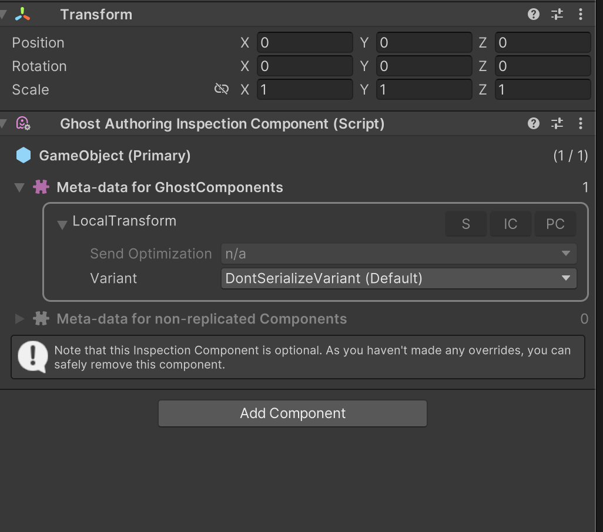

# Ghost component types and variants

Ghost components and ghost field types are all handled a certain way during conversion and code generation to produce the right code when building players. It's possible to define the desired behavior in code and on a per ghost prefab basis.

Inside the package we have default templates for how to generate serializers for a limited set of types:

* bool
* Entity
* FixedString32Bytes
* FixedString64Bytes
* FixedString128Bytes
* FixedString512Bytes
* FixedString4096Bytes
* float
* float2
* float3
* float4
* byte
* sbyte
* short
* ushort
* int
* uint
* enums (only for int/uint underlying type)  
* Quaternion

Each template can also define different ways to serialize (see also ghost-snapshots.md#Authoring-component-serialization)

* Quantized or unquantized. Where quantized means a float value is sent as an int with a certain multiplication factor which sets the precision (12.456789 can be sent as 12345 with a quantization factor of 1000).
* Smoothing method as clamp or interpolate/extrapolate. Meaning the value can be applied from a snapshot as interpolated/extrapolated or unmodified directly (clamped).

Since each of these can change how the source value is serialized and then unserialized and applied on the target these might new templates or a region inside defined to handle certain cases (like how to interpolate the value).

There are two ways for customizing how these are handled. Ghost component *variants* and *subtypes*. Variants can allow you to define another way for example to synchronize a float, define a different way to quantize it for example.

## Defining additional templates

It's possible to register other types which are not supported and the default templates either don't cover at all or need separate handling.

Templates are added to the project by implementing a partial class, **UserDefinedTemplates**, and injecting it into the `Unity.NetCode` package by using
an [AssemblyDefinitionReference](https://docs.unity3d.com/2020.1/Documentation/Manual/class-AssemblyDefinitionReferenceImporter.html). The partial implementation must
define the method `RegisterTemplates` and add new `TypeRegistry` entries.

```c#
namespace Unity.NetCode.Generators
{
    public static partial class UserDefinedTemplates
    {
        static partial void RegisterTemplates(System.Collections.Generic.List<TypeRegistryEntry> templates, string defaultRootPath)
        {
            templates.AddRange(new[]{
                new TypeRegistryEntry
                {
                    Type = "MySpecialType",
                    Quantized = true,
                    Smoothing = SmoothingAction.InterpolateAndExtrapolate,
                    SupportCommand = false,
                    Composite = false,
                    Template = "Assets/Samples/NetCodeGen/Templates/MySpecialTypeTemplate.cs",
                    TemplateOverride = "",
                },
            });
        }
    }
}
```

The template _MySpecialTypeTemplate.cs_ needs to be set up similar to default types, here is the default Float template (where the float is quantized and stored in an int):

```c#
#region __GHOST_IMPORTS__
#endregion
namespace Generated
{
    public struct GhostSnapshotData
    {
        struct Snapshot
        {
            #region __GHOST_FIELD__
            public int __GHOST_FIELD_NAME__;
            #endregion
        }

        public void PredictDelta(uint tick, ref GhostSnapshotData baseline1, ref GhostSnapshotData baseline2)
        {
            var predictor = new GhostDeltaPredictor(tick, this.tick, baseline1.tick, baseline2.tick);
            #region __GHOST_PREDICT__
            snapshot.__GHOST_FIELD_NAME__ = predictor.PredictInt(snapshot.__GHOST_FIELD_NAME__, baseline1.__GHOST_FIELD_NAME__, baseline2.__GHOST_FIELD_NAME__);
            #endregion
        }

        public void Serialize(int networkId, ref GhostSnapshotData baseline, ref DataStreamWriter writer, NetworkCompressionModel compressionModel)
        {
            #region __GHOST_WRITE__
            if ((changeMask__GHOST_MASK_BATCH__ & (1 << __GHOST_MASK_INDEX__)) != 0)
                writer.WritePackedIntDelta(snapshot.__GHOST_FIELD_NAME__, baseline.__GHOST_FIELD_NAME__, compressionModel);
            #endregion
        }

        public void Deserialize(uint tick, ref GhostSnapshotData baseline, ref DataStreamReader reader,
            NetworkCompressionModel compressionModel)
        {
            #region __GHOST_READ__
            if ((changeMask__GHOST_MASK_BATCH__ & (1 << __GHOST_MASK_INDEX__)) != 0)
                snapshot.__GHOST_FIELD_NAME__ = reader.ReadPackedIntDelta(baseline.__GHOST_FIELD_NAME__, compressionModel);
            else
                snapshot.__GHOST_FIELD_NAME__ = baseline.__GHOST_FIELD_NAME__;
            #endregion
        }

        public unsafe void CopyToSnapshot(ref Snapshot snapshot, ref IComponentData component)
        {
            if (true)
            {
                #region __GHOST_COPY_TO_SNAPSHOT__
                snapshot.__GHOST_FIELD_NAME__ = (int) math.round(component.__GHOST_FIELD_REFERENCE__ * __GHOST_QUANTIZE_SCALE__);
                #endregion
            }
        }
        public unsafe void CopyFromSnapshot(ref Snapshot snapshot, ref IComponentData component)
        {
            if (true)
            {
                #region __GHOST_COPY_FROM_SNAPSHOT__
                component.__GHOST_FIELD_REFERENCE__ = snapshotBefore.__GHOST_FIELD_NAME__ * __GHOST_DEQUANTIZE_SCALE__;
                #endregion

                #region __GHOST_COPY_FROM_SNAPSHOT_INTERPOLATE_SETUP__
                var __GHOST_FIELD_NAME___Before = snapshotBefore.__GHOST_FIELD_NAME__ * __GHOST_DEQUANTIZE_SCALE__;
                var __GHOST_FIELD_NAME___After = snapshotAfter.__GHOST_FIELD_NAME__ * __GHOST_DEQUANTIZE_SCALE__;
                #endregion
                #region __GHOST_COPY_FROM_SNAPSHOT_INTERPOLATE_DISTSQ__
                var __GHOST_FIELD_NAME___DistSq = math.distancesq(__GHOST_FIELD_NAME___Before, __GHOST_FIELD_NAME___After);
                #endregion
                #region __GHOST_COPY_FROM_SNAPSHOT_INTERPOLATE__
                component.__GHOST_FIELD_REFERENCE__ = math.lerp(__GHOST_FIELD_NAME___Before, __GHOST_FIELD_NAME___After, snapshotInterpolationFactor);
                #endregion
            }
        }
        public unsafe void RestoreFromBackup(ref IComponentData component, in IComponentData backup)
        {
            #region __GHOST_RESTORE_FROM_BACKUP__
            component.__GHOST_FIELD_REFERENCE__ = backup.__GHOST_FIELD_REFERENCE__;
            #endregion
        }
        public void CalculateChangeMask(ref Snapshot snapshot, ref Snapshot baseline, uint changeMask)
        {
            #region __GHOST_CALCULATE_CHANGE_MASK_ZERO__
            changeMask = (snapshot.__GHOST_FIELD_NAME__ != baseline.__GHOST_FIELD_NAME__) ? 1u : 0;
            #endregion
            #region __GHOST_CALCULATE_CHANGE_MASK__
            changeMask |= (snapshot.__GHOST_FIELD_NAME__ != baseline.__GHOST_FIELD_NAME__) ? (1u<<__GHOST_MASK_INDEX__) : 0;
            #endregion
        }
        #if UNITY_EDITOR || DEVELOPMENT_BUILD
        private static void ReportPredictionErrors(ref IComponentData component, in IComponentData backup, ref UnsafeList<float> errors, ref int errorIndex)
        {
            #region __GHOST_REPORT_PREDICTION_ERROR__
            errors[errorIndex] = math.max(errors[errorIndex], math.abs(component.__GHOST_FIELD_REFERENCE__ - backup.__GHOST_FIELD_REFERENCE__));
            ++errorIndex;
            #endregion
        }
        private static int GetPredictionErrorNames(ref FixedString512Bytes names, ref int nameCount)
        {
            #region __GHOST_GET_PREDICTION_ERROR_NAME__
            if (nameCount != 0)
                names.Append(new FixedString32Bytes(","));
            names.Append(new FixedString64Bytes("__GHOST_FIELD_REFERENCE__"));
            ++nameCount;
            #endregion
        }
        #endif
    }
}
```

When `Quantized` is set to true the *\_\_GHOST_QUANTIZE_SCALE\_\_* variable must be present in the template, and also the quantized scale must be specified when using the type in a `GhostField`

`Smoothing` is also important as it changes how serialization is done in the _CopyFromSnapshot_ function, all sections must be filled in.

`TemplateOverride` is used when you want to re-use an existing template but only override a specific section of it. This works well when using `Composite` types as you'll point `Template` to the basic type (like float template) and the `TemplateOverride` to only the sections which need to be customized. For example float2 only defines _CopyFromSnapshot_, _ReportPredictionErrors_ and _GetPredictionErrorNames_, the rest uses the basic float template as a composite of the 2 values float2 contains.

---
**NOTE**: It's important that the templates (when using .cs extension) are in a folder with an .asmdef effectively disabling compilation on it, since this isn't real code we want compiled. It can be done by adding an invalid conditional define on the .asmdef (we use *NETCODE_CODEGEN_TEMPLATES* define in the samples). It's possible though to just store them with any extension (like .txt) and then the compiler won't consider them.

---
**NOTE**: When making changes to the templates you need to use the _Multiplayer->Force Code Generation_ menu to force a new code compilation which will use the updated templates.

---

## Defining SubTypes and templates

Subtypes are a way to define a different way of serializing a specific type. You use them by specifying them in the `GhostField` attribute.

```c#
using Unity.NetCode;

public struct MyComponent : Unity.Entities.IComponentData
{
    [GhostField(SubType=GhostFieldSubType.MySubType)]
    public float value;
}

```

SubTypes are added to projects by implementing a partial class, **GhostFieldSubTypes**, and injecting it into the `Unity.NetCode` package by using
an [AssemblyDefinitionReference](https://docs.unity3d.com/2020.1/Documentation/Manual/class-AssemblyDefinitionReferenceImporter.html). The implementation should just
need to add new constant literals to that class (at your own discretion) and they will be available to all your packages which already reference the `Unity.NetCode` assembly.

```c#
namespace Unity.NetCode
{
    static public partial class GhostFieldSubType
    {
        public const int MySubType = 1;
    }
}
```

Templates for the subtypes are handled like normal user defined templates but need to set the subtype index. So they are added to the project by implementing the partial class, **UserDefinedTemplates**, and injecting it into the Unity.NetCode package by using
an [AssemblyDefinitionReference](https://docs.unity3d.com/2020.1/Documentation/Manual/class-AssemblyDefinitionReferenceImporter.html). The partial implementation must
define the method `RegisterTemplates` and add new`TypeRegistry` entries.

```c#
namespace Unity.NetCode.Generators
{
    public static partial class UserDefinedTemplates
    {
        static partial void RegisterTemplates(System.Collections.Generic.List<TypeRegistryEntry> templates, string defaultRootPath)
        {
            templates.AddRange(new[]{
                new TypeRegistryEntry
                {
                    Type = "System.Single",
                    SubType = GhostFieldSubType.MySubType,
                    Quantized = false,
                    Smoothing = SmoothingAction.InterpolateAndExtrapolate,
                    SupportCommand = false,
                    Composite = false,
                    Template = "Assets/Samples/NetCodeGen/Templates/MyCustomTemplate.cs",
                    TemplateOverride = "",
                },
            });
        }
    }
}
```

As when using any template registration like this, you need to be careful to specify the correct parameters when defining the `GhostField` to exactly match it. The important properties are `SubType` of course, in addition to `Quantized` and `Smoothing` as these can affect how the serializer code is generated from the template.

---
**IMPORTANT**:
The `Composite` parameter should always be false with subtypes as it is assumed the template given is the one to use for the whole type.

---

## Ghost Component Variants

To add networking serialization capability to a type that does not have ghostfields and for which you don't
have access to (or cannot be modified), you must create a ghost component variant using the `[GhostComponentVariation]` attribute.

The attribute constructor take as argument the type of component you want to specify the variant for (ex: Rotation). Then for each field in the original struct you would like to serialize you should add a __GhostField__ attribute like you usually do. Only members that are present in the component type are allowed. Validation and exceptions are thrown at compile time in case the rule is not respected.
At the moment it is __mandatory to add and annotate all the fields for a variant__.

An example of a variant would be:

```c#
    [GhostComponentVariation(typeof(Transforms.Translation))]
    [GhostComponent(PrefabType=GhostPrefabType.All, OwnerPredictedSendType=GhostSendType.All, SendDataForChildEntity = false)]
    public struct TranslationVariant
    {
        [GhostField(Composite=true, Quantization=100, Interpolate=true)] public float3 Value;
    }
```

In this case the `TranslationVariant` will generate serialization code for `Transforms.Translation`, using the properties and the attribute present in the variant declaration.

A `GhostComponentAttribute` attribute can be added to the variant to further specify the component serialization properties.

It is possible to prevent a component from supporting variation by using the `DontSupportVariation` attribute. When present, if a `GhostComponentVariation` is defined for that type, an exception is triggered.

Ghost components variants for `IBufferElementData` is not fully supported.

### How to specify what variant to use
Using `GhostAuthoringComponentEditor` it is then possible to select for each prefab what serialization variants to for each individual components.


### Handling multiple ghost variants

It is possible to configure different serialization variant for a component which already has a variant (ex: a 2D rotation that just serialize the angle instead of a full quaternion).

In these cases where multiple variant are present for a type that does not have a "default" serialization (that it, the type we are specifying the variation for does not have any ghost fields) is considered a conflict. We can't in fact discern any more what it is the correct serialization to use for that type. To solve the conflicts, netcode use the first serializer in hash order. __It is the users responsibility__ to indicate in this case what type should be the default.

By using a singleton `GhostVariantAssignmentCollection` component you can control what variant to use by default for any type. The singleton must be created for both client and server worlds. Some utility methods are provided to make the assignment easier.

The method of registering which variants are the defaults for each type is by declaring the `RegisterDefaultVariants` function in an implementation of the `DefaultVariantSystemBase` class.

```c#
using System.Collections.Generic;
using Unity.Entities;
using Unity.Transforms;

namespace Unity.NetCode.Samples
{
    sealed class DefaultVariantSystem : DefaultVariantSystemBase
    {
        protected override void RegisterDefaultVariants(Dictionary<ComponentType, System.Type> defaultVariants)
        {
            defaultVariants.Add(new ComponentType(typeof(Rotation)), typeof(RotationDefault));
            defaultVariants.Add(new ComponentType(typeof(Translation)), typeof(TranslationDefault));
        }
    }
}
```

This class would make sure the default `Translation` and `Rotation` variants which come with the package are set as the defaults.

## Special variant types

There might be cases where you need the variant to remove functionality instead of doing things differently and there are two cases covered. This saves the typing involved with creating a full variant registration which essentially is just turning it off.

When you want a component to be stripped on clients so you don't see it at all there you can use the `ClientOnlyVariant` type when registering the default variant for a particular type.

When you don't want any synchronization to be done with a variant type, so no serialization happens, you can use the `DontSerializeVariant` type when registering.

```C#
using System.Collections.Generic;
using Unity.Entities;
using Unity.Transforms;

namespace Unity.NetCode.Samples
{
    sealed class DefaultVariantSystem : DefaultVariantSystemBase
    {
        protected override void RegisterDefaultVariants(Dictionary<ComponentType, System.Type> defaultVariants)
        {
            defaultVariants.Add(new ComponentType(typeof(SomeClientOnlyThing)), typeof(ClientOnlyVariant));
            defaultVariants.Add(new ComponentType(typeof(NoNeedToSyncThis)), typeof(DontSerializeVariant));
        }
    }
}
```

You can also pick the `DontSerializeVariant` in the ghost component on prefabs.


