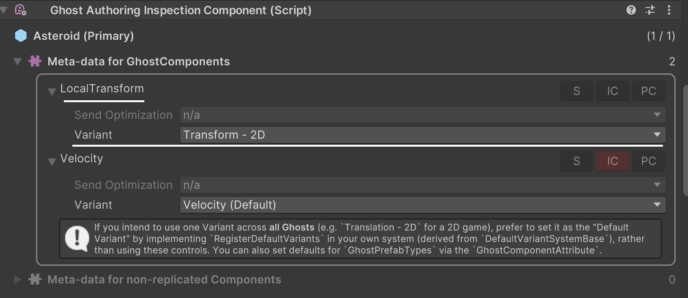

# Creating replication schemas with `GhostComponentVariationAttribute`

Use [`GhostComponentVariationAttribute`](https://docs.unity3d.com/Packages/com.unity.netcode@latest?subfolder=/api/Unity.NetCode.GhostComponentVariationAttribute.html) to declare a replication schema for a type (at compile time) without needing to mark up fields in the original type, or the original type itself. These replication schemas are referred to as variants. The newly declared schema acts as a proxy in terms of code generation: instead of using the original type, the code generation system uses the declared variant to generate a specific version of the serialization code.

Variants rely on [`GhostFieldAttribute`](ghostfield-synchronize.md) and [`GhostComponentAttribute`](ghostcomponentattribute.md), so it's recommended to review those topics before creating a variant. You can also use [ghost types templates](ghost-types-templates.md) to manage custom serialization, but it's more complex to implement and is only recommended for advanced users.

> [!NOTE]
> Ghost component variants for `IBufferElementData` aren't fully supported.

## Variant use cases

`GhostComponentVariationAttribute` is designed for some specific use cases:

* You can use variants to declare serialization rules for a component that you don't have direct write access to, such as components in a package or external assembly. For example, you can use a variant to replicate [`Unity.Entities.LocalTransform`](https://docs.unity3d.com/Packages/com.unity.entities@latest?subfolder=/api/Unity.Transforms.LocalTransform.html).
* You can use variants to generate multiple serialization strategies for a single type, allowing individual ghosts to select their version. For example, replicating only the yaw value of [`Unity.Entities.LocalRotation`](https://docs.unity3d.com/Packages/com.unity.entities@latest?subfolder=/api/Unity.Entities.TransformAuthoring.LocalRotation.html), or the full `quaternion`.
* You can use variants to strip components from certain prefab types by overriding or adding a [`GhostComponentAttribute`](ghostcomponentattribute.md) to the type without changing the original declaration.

### Example

```c#
    [GhostComponentVariation(typeof(LocalTransform), "Transform - 2D")]
    [GhostComponent(PrefabType=GhostPrefabType.All, SendTypeOptimization=GhostSendType.AllClients)]
    public struct PositionRotation2d
    {
        [GhostField(Quantization=1000, Smoothing=SmoothingAction.InterpolateAndExtrapolate, SubType=GhostFieldSubType.Translation2D)]
        public float3 Position;
        [GhostField(Quantization=1000, Smoothing=SmoothingAction.InterpolateAndExtrapolate, SubType=GhostFieldSubType.Rotation2D)]
        public quaternion Rotation;
    }
```

In the previous example, the `PositionRotation2d` variant generates serialization code for `LocalTransform`, using the properties and the attribute present in the variant declaration.

The attribute constructor takes a few arguments:

* The `Type type` of the `ComponentType` you want to specify the variant for (in this case `LocalTransform`).
* The `string variantName`, which allows you to specify a human-readable string for viewing in the [`GhostAuthoringInspectionComponent`](https://docs.unity3d.com/Packages/com.unity.netcode@latest?subfolder=/api/Unity.NetCode.GhostAuthoringInspectionComponent.html) UI.

Then, for each field in the original struct (in this case `LocalTransform`) that you want to replicate, add a [`GhostFieldAttribute`](ghostfield-synchronize.md) and define the field identically to that of the base struct. You can add an optional [`GhostComponentAttribute`](ghostcomponentattribute.md) to the variant to further specify the component serialization properties.

> [!NOTE]
> Only members that are present in the component type are allowed. Validation occurs at compile time and exceptions are thrown if this rule isn't respected.

You can declare multiple serialization variants for a component. For example, having both 2D and 3D variants for `LocalRotation`. If you only define one variant for a given `ComponentType`, it becomes the default serialization strategy for that type automatically.

## Specifying which variant to use on a prefab

You can use [`GhostAuthoringInspectionComponent`](https://docs.unity3d.com/Packages/com.unity.netcode@latest?subfolder=/api/Unity.NetCode.GhostAuthoringInspectionComponent.html) to specify which variant to use on a per-prefab basis. You can choose a variant for each individual component (including the special case variant: `DontSerializeVariant`).

Add `GhostAuthoringInspectionComponent` to a GameObject and the Unity Editor will display which components in the runtime entity are replicated, and allow you to change the following properties:

* The `GhostPrefabType` that the component should be added to (and thus replicated), as toggle buttons; 'S' for Server, 'IC' for Interpolated Client, and 'PC' for Predicted Client. Refer to [`PrefabType` details](ghostcomponentattribute.md#prefabtype-details) for more information.
* The `GhostSendType` 'Send Optimization' and `SendToOwnerType` 'Send to Owner' dropdowns for this component (if applicable).
* The serialization 'Variant' dropdown to use for that component, which includes the [built-in variant types](#special-variant-types).



All available variants for that specific component type are shown in a dropdown menu. Components on child entities aren't serialized by default. To modify how children of ghost prefabs are replicated, add a `GhostAuthoringInspectionComponent` to each individual child.

> [!NOTE]
> `GhostAuthoringInspectionComponent` is also a valuable debugging tool. Add it to a ghost prefab (or one of its children) to view all replicated types on that ghost, and to diagnose why a specific type is not replicating in the way that you expect.

### Special variant types

There are some built-in variant types that have specific behaviors.

| Built-in variant | Description                                                                                                                                    |
|--------------------------|----------------------------------------------------------------------------------------------------------------------------------------------|
| `ClientOnlyVariant`      | Use this to specify that a given `ComponentType` should only appear on client worlds. |
| `ServerOnlyVariant`      | Use this to specify that a given `ComponentType` should only appear on server worlds. |
| `DontSerializeVariant`   | Use this to disable serialization of a type entirely. Replication attributes (`[GhostField]` and `[GhostEnabledBit]`) are ignored. |

```C#
using System.Collections.Generic;
using Unity.Entities;
using Unity.Transforms;

namespace Unity.NetCode.Samples
{
    sealed class DefaultVariantSystem : DefaultVariantSystemBase
    {
        protected override void RegisterDefaultVariants(Dictionary<ComponentType, Rule> defaultVariants)
        {
            defaultVariants.Add(typeof(SomeClientOnlyThing), Rule.ForAll(typeof(ClientOnlyVariant)));
            defaultVariants.Add(typeof(SomeServerOnlyThing), Rule.ForAll(typeof(ServerOnlyVariant)));
            defaultVariants.Add(typeof(NoNeedToSyncThis), Rule.ForAll(typeof(DontSerializeVariant)));
        }
    }
}
```

You can also manually select the `DontSerializeVariant` in the ghost component on ghost prefabs (via the `GhostAuthoringInspectionComponent`).

### Preventing a component from supporting variations

There are some situations where you want to prevent a component from having its serialization modified via variants. For example, to ensure that [`GhostInstance`](https://docs.unity3d.com/Packages/com.unity.netcode@latest?subfolder=/api/Unity.NetCode.GhostInstance.html) is always properly serialized, Netcode for Entities prevents user code from modifying its serialization rules.

To prevent a component from supporting variation, use [`DontSupportPrefabOverridesAttribute`](https://docs.unity3d.com/Packages/com.unity.netcode@latest?subfolder=/api/Unity.NetCode.DontSupportPrefabOverridesAttribute.html) and an error will be reported at compile time if a `GhostComponentVariation` is defined for that type.

### Assigning a default variant to use for a type

If multiple variants are available for a type, Netcode for Entities may be unable to infer which variant should be used for serialization. If the default serializer for the type is replicated, that becomes the default. If not, it's considered a conflict and produces runtime exceptions when creating any world (including baking worlds). Netcode for Entities uses a deterministic fallback method to guess which variant to use, but in general it's your responsibility to indicate which variant should be used as the default.

To specify which variant to use as the default for a given type, you need to create a system that inherits from the
[`DefaultVariantSystemBase`](https://docs.unity3d.com/Packages/com.unity.netcode@latest?subfolder=/api/Unity.NetCode.DefaultVariantSystemBase.html) class and implements the `RegisterDefaultVariants` method. For example:

```c#
using System.Collections.Generic;
using Unity.Entities;
using Unity.Transforms;

namespace Unity.NetCode.Samples
{
    sealed partial class DefaultVariantSystem : DefaultVariantSystemBase
    {
        protected override void RegisterDefaultVariants(Dictionary<ComponentType, Rule> defaultVariants)
        {
            defaultVariants.Add(typeof(LocalTransform), Rule.OnlyParents(typeof(TransformDefaultVariant)));
        }
    }
}
```

The previous example code ensures that the default `LocalTransform` variant to use is the `TransformDefaultVariant`. For more details, refer to the [`DefaultVariantSystemBase`](https://docs.unity3d.com/Packages/com.unity.netcode@latest?subfolder=/api/Unity.NetCode.DefaultVariantSystemBase.html) documentation.

> [!NOTE]
> This is the recommended approach for specifying the default variant for a ghost across an entire project. Prefer `DefaultVariantSystemBase` over direct variant manipulation (via `GhostAuthoringInspectionComponent` overrides).

## Additional resources

* [`GhostComponentVariationAttribute` API documentation](https://docs.unity3d.com/Packages/com.unity.netcode@latest?subfolder=/api/Unity.NetCode.GhostComponentVariationAttribute.html)
* [`GhostAuthoringInspectionComponent` API documentation](https://docs.unity3d.com/Packages/com.unity.netcode@latest?subfolder=/api/Unity.NetCode.GhostAuthoringInspectionComponent.html)
* [Customizing replication with `GhostComponentAttribute`](ghostcomponentattribute.md)
* [Serializing and synchronizing with `GhostFieldAttribute`](ghostfield-synchronize.md)
* [Ghost types templates](ghost-types-templates.md)
