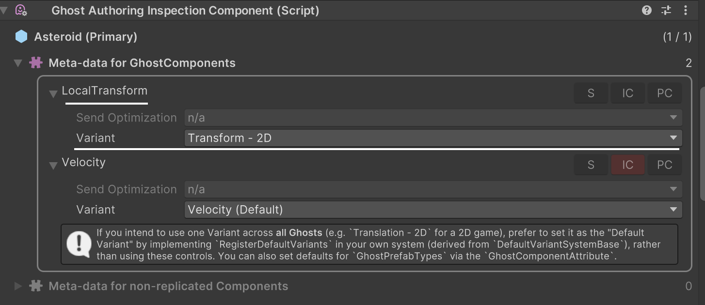

# Creating replication schemas with `GhostComponentVariationAttribute`

Use [`GhostComponentVariationAttribute`](xref:Unity.Netcode.GhostComponentVariationAttribute) to declare a replication schema for a type (at compile time) without needing to mark up fields in the original type, or the original type itself. These replication schemas are referred to as variants. The newly declared schema acts as a proxy in terms of code generation: instead of using the original type, the code generation system uses the declared variant to generate a specific version of the serialization code.

Variants rely on [`GhostFieldAttribute`](ghostfield-synchronize.md) and [`GhostComponentAttribute`](ghostcomponentattribute.md), so it's recommended to review those topics before creating a variant. You can also use [ghost types templates](ghost-types-templates.md) to manage custom serialization, but it's more complex to implement and is only recommended for advanced users.

> [!NOTE]
> Ghost component variants for `IBufferElementData` aren't fully supported.

## Variant use cases

`GhostComponentVariationAttribute` is designed for some specific use cases:

* You can use variants to declare serialization rules for a component that you don't have direct write access to, such as components in a package or external assembly. For example, you can use a variant to replicate [`Unity.Entities.LocalTransform`](xref:Unity.Transforms.LocalTransform).
* You can use variants to generate multiple serialization strategies for a single type, allowing individual ghosts to select their version. For example, replicating only the yaw value of [`Unity.Entities.LocalRotation`](xref:Unity.Entities.TransformAuthoring.LocalRotation), or the full `quaternion`.
* You can use variants to strip components from certain prefab types by overriding or adding a [`GhostComponentAttribute`](ghostcomponentattribute.md) to the type without changing the original declaration.

### Example

```c#
    [GhostComponentVariation(typeof(LocalTransform), "Transform - 2D")]
    [GhostComponent(PrefabType=GhostPrefabType.All, SendTypeOptimization=GhostSendType.AllClients)]
    public struct PositionRotation2d
    {
        [GhostField(Quantization=1000, Smoothing=SmoothingAction.InterpolateAndExtrapolate, SubType=GhostFieldSubType.Translation2D)]
        public float3 Position;
        [GhostField(Quantization=1000, Smoothing=SmoothingAction.InterpolateAndExtrapolate, SubType=GhostFieldSubType.Rotation2D)]
        public quaternion Rotation;
    }
```

In the previous example, the `PositionRotation2d` variant generates serialization code for `LocalTransform`, using the properties and the attribute present in the variant declaration.

The attribute constructor takes a few arguments:

* The `Type type` of the `ComponentType` you want to specify the variant for (in this case `LocalTransform`).
* The `string variantName`, which allows you to specify a human-readable string for viewing in the [`GhostAuthoringInspectionComponent`](xref:Unity.Netcode.GhostAuthoringInspectionComponent) UI.

Then, for each field in the original struct (in this case `LocalTransform`) that you want to replicate, add a [`GhostFieldAttribute`](ghostfield-synchronize.md) and define the field identically to that of the base struct. You can add an optional [`GhostComponentAttribute`](ghostcomponentattribute.md) to the variant to further specify the component serialization properties.

> [!NOTE]
> Only members that are present in the component type are allowed. Validation occurs at compile time and exceptions are thrown if this rule isn't respected.

You can declare multiple serialization variants for a component. For example, having both 2D and 3D variants for `LocalRotation`. If you only define one variant for a given `ComponentType`, it becomes the default serialization strategy for that type automatically.

## Replicating non-uniform (3D) scale

`LocalTransform` only supports a single, uniform `Scale` value. Non-uniform (per-axis) 3D scale is stored separately, in the optional [`PostTransformMatrix`](https://docs.unity3d.com/Packages/com.unity.entities@latest?subfolder=/api/Unity.Transforms.PostTransformMatrix.html) component (a `float4x4`).

Netcode for Entities provides a built-in variant, [`PostTransformMatrix3DScaleVariant`](xref:Unity.Netcode.PostTransformMatrix3DScaleVariant), to replicate this non-uniform scale. Negative (mirrored) per-axis scale is included. Refer to the [sign convention](#sign-convention-for-mirrored-negative-scale) for more information, especially if your matrix carries its own rotation.
<!--
TODO GhostObject
* For **GameObject-layer ghosts** (those using a `GhostObject`, currently behind the `NETCODE_GAMEOBJECT_BRIDGE_EXPERIMENTAL` define), `PostTransformMatrix` defaults to `PostTransformMatrix3DScaleVariant`, so non-uniform scale is replicated out of the box. You can opt out of replicating it per-prefab by enabling **Use Uniform Scale** on the `GhostObject`.
-->
* For entities ghosts, the default for `PostTransformMatrix` is `DontSerializeVariant`, so existing projects pay no additional bandwidth. Opt in by selecting `PostTransformMatrix3DScaleVariant` on the prefab, or by making it the [default for the type](#assigning-a-default-variant-to-use-for-a-type).
<!--
TODO GhostObject
> [!NOTE]
> On GameObject-layer ghosts the default is applied as a per-prefab override at registration time, so a project-wide `DefaultVariantSystemBase` rule for `PostTransformMatrix` does not affect them; use the per-prefab options above instead.
-->

The `PostTransformMatrix3DScaleVariant` only replicates the (signed) scale extracted from the `PostTransformMatrix`. Any other changes to the matrix, such as rotation, translation, shear, or arbitrary affine/non-affine effects, aren't replicated. On entities ghosts they are preserved locally on the receiving side (the incoming scale is re-applied on top of the existing matrix, subject to the [sign convention](#sign-convention-for-mirrored-negative-scale)), but they are never sent over the wire. 
<!--
TODO GhostObject
> On GameObject-layer ghosts there is no such preservation: the GameObject sync owns the `PostTransformMatrix` and rewrites it every frame as a pure scale matrix built from `localScale`, so don't author rotation/shear into a `GhostObject`'s `PostTransformMatrix`.
-->

You can author your own variant to change how the scale is replicated, such as increasing the quantization precision or using an unquantized field. `Clamp`, `Interpolate` and `InterpolateAndExtrapolate` are all supported. Refer to the `PostTransformMatrix` variant comparison on this page for the code.

> [!NOTE]
> If your use case needs more than scale replicated for `PostTransformMatrix` (for example rotation/shear, per-axis selection, or the full matrix), please reach out to the Netcode for Entities team on [Unity Discussions](https://discussions.unity.com/c/multiplayer-and-networking) so we can prioritize supporting it. The right trade-off depends heavily on the specific use case and its bandwidth budget.

### Sign convention for mirrored (negative) scale

Replication extracts the scale with a convention, implemented by `MatrixScaleHelper`: per-axis magnitude from the matrix column lengths, per-axis sign from the diagonal (`m00`, `m11`, `m22`). For a scale-only matrix, that's exactly the scale you authored.

If your `PostTransformMatrix` carries its own rotation, that rotation can turn diagonal entries negative (rotating past 90° around an axis), and Netcode for Entities replicates those signs as mirrored scale (refer to `MatrixScaleHelper` for why it can't do otherwise):

* **Sending:** the extracted signs are the diagonal's. A matrix authored as yaw(180°) × scale(2, 3, 4) is sent as `(-2, 3, -4)`.
* **Receiving:** the incoming signs win. Applying a positive replicated scale onto a matrix whose local rotation makes a diagonal entry negative un-mirrors that column. This is stable (re-applying the same scale never flip-flops), but the per-axis signs follow the replicated scale, not your authored rotation/scale split.

Adapt your code to the convention whenever the matrix isn't scale-only:

* Read scale with `MatrixScaleHelper.SignedScaleFromScaleOnlyMatrix` instead of caching the values you authored; it returns exactly what replication sends and applies.
* Write scale with `MatrixScaleHelper.SetScale`; it shares the convention, so your writes and the replicated ones compose without sign flips.
* Author mirroring as negative scale rather than as 180° rotations, and prefer keeping rotation in `LocalTransform.Rotation` with a scale-only `PostTransformMatrix` — the replicated signs are then exactly the ones you authored.

### `LocalTransform` compared to `PostTransformMatrix`

These two components illustrate the two shapes a variant can take: fields that map directly to replicated values, versus a single field that needs a custom serialization strategy.

#### `LocalTransform`

When using `LocalTransform`, field map 1:1 to replicated values. `LocalTransform` exposes `Position` (`float3`), `Rotation` (`quaternion`), and `Scale` (`float`). Each has a built-in template, so a variant just redeclares the fields you want to replicate and marks them with `[GhostField]`:

```c#
    [GhostComponentVariation(typeof(LocalTransform), "Transform - Position & Rotation")]
    [GhostComponent(PrefabType = GhostPrefabType.All, SendTypeOptimization = GhostSendType.AllClients)]
    public struct PositionRotationVariant
    {
        // float3 has a built-in template, so no SubType is needed.
        [GhostField(Quantization = 1000, Smoothing = SmoothingAction.InterpolateAndExtrapolate)]
        public float3 Position;

        // quaternion also has a built-in template.
        [GhostField(Quantization = 1000, Smoothing = SmoothingAction.InterpolateAndExtrapolate)]
        public quaternion Rotation;

        public float Scale; // No GhostField to omit it
    }
```

Each field is independent: it gets its own quantization and its own change-mask bit, and you pick what to replicate by including or omitting fields.

#### `PostTransformMatrix`

`PostTransformMatrix` has a single field, `float4x4 Value`. There's no built-in template for `float4x4` (replicating all 16 floats would be far too expensive), so a variant must use `SubType` to route the field to the dedicated scale template, which replicates only the per-axis scale extracted from the matrix. This is what the built-in `PostTransformMatrix3DScaleVariant` does:

```c#
    [GhostComponentVariation(typeof(PostTransformMatrix), "PostTransformMatrix - 3D Scale")]
    [GhostComponent(PrefabType = GhostPrefabType.All, SendTypeOptimization = GhostSendType.AllClients)]
    public struct PostTransformMatrix3DScaleVariant
    {
        // float4x4 has no default template; SubType routes it to the scale-extracting template.
        // Quantization applies to the extracted scale; set it to 0 to use the unquantized template.
        [GhostField(Quantization = 1000, Smoothing = SmoothingAction.InterpolateAndExtrapolate,
                    SubType = GhostFieldSubType.PostTransformMatrixScale)]
        public float4x4 Value;
    }
```

To author your own (for example, higher precision), copy the struct and change `Quantization`:

```c#
    [GhostComponentVariation(typeof(PostTransformMatrix), "PostTransformMatrix - High Precision Scale")]
    public struct HighPrecisionScaleVariant
    {
        [GhostField(Quantization = 100000, Smoothing = SmoothingAction.InterpolateAndExtrapolate,
                    SubType = GhostFieldSubType.PostTransformMatrixScale)]
        public float4x4 Value;
    }
```

## Specifying which variant to use on a prefab

You can use [`GhostAuthoringInspectionComponent`](xref:Unity.Netcode.GhostAuthoringInspectionComponent) to specify which variant to use on a per-prefab basis. You can choose a variant for each individual component (including the special case variant: `DontSerializeVariant`).

> [!NOTE]
> You can also [apply variant overrides from a baker](baker-variant-overrides.md).

Add `GhostAuthoringInspectionComponent` to a GameObject and the Unity Editor will display which components in the runtime entity are replicated, and allow you to change the following properties:

* The `GhostPrefabType` that the component should be added to (and thus replicated), as toggle buttons; 'S' for Server, 'IC' for Interpolated Client, and 'PC' for Predicted Client. Refer to [`PrefabType` details](ghostcomponentattribute.md#prefabtype-details) for more information.
* The `GhostSendType` 'Send Optimization' and `SendToOwnerType` 'Send to Owner' dropdowns for this component (if applicable).
* The serialization 'Variant' dropdown to use for that component, which includes the [built-in variant types](#special-variant-types).



All available variants for that specific component type are shown in a dropdown menu. Components on child entities aren't serialized by default. To modify how children of ghost prefabs are replicated, add a `GhostAuthoringInspectionComponent` to each individual child.

> [!NOTE]
> `GhostAuthoringInspectionComponent` is also a valuable debugging tool. Add it to a ghost prefab (or one of its children) to view all replicated types on that ghost, and to diagnose why a specific type is not replicating in the way that you expect.

### Special variant types

There are some built-in variant types that have specific behaviors.

| Built-in variant | Description                                                                                                                                    |
|--------------------------|----------------------------------------------------------------------------------------------------------------------------------------------|
| [`ClientOnlyVariant`](xref:Unity.Netcode.ClientOnlyVariant)      | Use this to specify that a given `ComponentType` should only appear on client worlds. |
| [`ServerOnlyVariant`](xref:Unity.Netcode.ServerOnlyVariant)      | Use this to specify that a given `ComponentType` should only appear on server worlds. |
| [`DontSerializeVariant`](xref:Unity.Netcode.DontSerializeVariant)   | Use this to disable serialization of a type entirely. Replication attributes (`[GhostField]` and `[GhostEnabledBit]`) are ignored. |
| [`PostTransformMatrix3DScaleVariant`](xref:Unity.Netcode.PostTransformMatrix3DScaleVariant) | Use this to replicate the non-uniform (3D) scale that a `PostTransformMatrix` component stores. This variant sends the per-axis scale only, as three quantized floats. Refer to [Replicating non-uniform (3D) scale](#replicating-non-uniform-3d-scale). |

[!code-cs[blobs](../Tests/Editor/DocCodeSamples/ghost-variants.cs#SpecialVariantTypes)]

You can also manually select the `DontSerializeVariant` in the ghost component on ghost prefabs (via the `GhostAuthoringInspectionComponent`).

### Preventing a component from supporting variations

There are some situations where you want to prevent a component from having its serialization modified via variants. For example, to ensure that [`GhostInstance`](xref:Unity.Netcode.GhostInstance) is always properly serialized, Netcode for Entities prevents user code from modifying its serialization rules.

To prevent a component from supporting variation, use [`DontSupportPrefabOverridesAttribute`](xref:Unity.Netcode.DontSupportPrefabOverridesAttribute) and an error will be reported at compile time if a `GhostComponentVariation` is defined for that type.

### Assigning a default variant to use for a type

If multiple variants are available for a type, Netcode for Entities may be unable to infer which variant should be used for serialization. If the default serializer for the type is replicated, that becomes the default. If not, it's considered a conflict and produces runtime exceptions when creating any world (including baking worlds). Netcode for Entities uses a deterministic fallback method to guess which variant to use, but in general it's your responsibility to indicate which variant should be used as the default.

To specify which variant to use as the default for a given type, you need to create a system that inherits from the
[`DefaultVariantSystemBase`](xref:Unity.Netcode.DefaultVariantSystemBase) class and implements the `RegisterDefaultVariants` method. For example:

[!code-cs[blobs](../Tests/Editor/DocCodeSamples/ghost-variants.cs#DefiningVariants)]

The previous example code ensures that the default `LocalTransform` variant to use is the `TransformDefaultVariant`. For more details, refer to the [`DefaultVariantSystemBase`](xref:Unity.Netcode.DefaultVariantSystemBase) documentation.

> [!NOTE]
> This is the recommended approach for specifying the default variant for a ghost across an entire project. Prefer `DefaultVariantSystemBase` over direct variant manipulation (via `GhostAuthoringInspectionComponent` overrides).

## Additional resources

* [`GhostComponentVariationAttribute` API documentation](xref:Unity.Netcode.GhostComponentVariationAttribute)
* [`GhostAuthoringInspectionComponent` API documentation](xref:Unity.Netcode.GhostAuthoringInspectionComponent)
* [Customizing replication with `GhostComponentAttribute`](ghostcomponentattribute.md)
* [Serializing and synchronizing with `GhostFieldAttribute`](ghostfield-synchronize.md)
* [Ghost types templates](ghost-types-templates.md)
