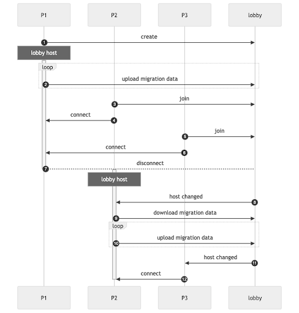

# Introduction to host migration

Understand the basics of host migration in Netcode for Entities and whether it might be suitable for your project.

Host migration in Netcode for Entities uses [Unity Gaming Services](https://unity.com/solutions/gaming-services) to allow a client hosted networking experience to continue after the loss of the host. You can use host migration to manage a variety of voluntary and involuntary interruptions, including network disconnections, power failures, or the host exiting the application.

## Host migration basics

Host migration is the process of transferring the responsibilities of the host role from one client to another with minimal gameplay disruption. In Netcode for Entities, host migration requires using [Unity Gaming Services](https://unity.com/solutions/gaming-services), specifically the [Unity Lobby service](https://docs.unity.com/ugs/manual/lobby/manual/unity-lobby-service), [Unity Relay](https://docs.unity.com/ugs/en-us/manual/relay/manual/introduction), and [Unity Authentication](https://docs.unity.com/ugs/en-us/manual/authentication/manual/overview). This requires your project to be linked to a project in the [Unity Cloud Dashboard](https://cloud.unity.com/).

For a complete list of host migration requirements, refer to the [Host migration requirements page](host-migration-requirements.md). You can also refer to the [Host migration in Asteroids sample](host-migration-sample.md) for an example implementation of host migration.

## Host migration process

When host migration is enabled, the host serializes a snapshot of the synchronizable game state at regular intervals, including the list of connected clients, added components, loaded scenes, and all ghost and ghost prefab information. This host migration data is uploaded securely to the connected lobby, with each snapshot overwriting the previous one.

A host migration is triggered when the host leaves or is disconnected and the relay connection is lost. The lobby notifies all connected clients and one of the clients is chosen as the new host, requests a new [relay allocation](https://docs.unity.com/ugs/en-us/manual/relay/manual/connection-flow#1), and updates the lobby data with the new relay allocation information. The other clients can then join the new relay allocation when they receive the lobby update.

After the host role is migrated, the new host downloads the most recent snapshot from the lobby and creates a new server world based on that game state. Ghosts are instantiated and their ghost component data deployed so that they're in the same state as when the last snapshot was sent. When connections from clients arrive, the lobby identifies which ones were previously connected and which ghosts were owned by them, ensuring that the game state is maintained for all clients.

### Host migration data

The following data is saved and restored on the new host as part of host migration:

* All user components on the connection entity on the server, as well as the [`NetworkStreamInGame`](https://docs.unity3d.com/Packages/com.unity.netcode@latest?subfolder=/api/Unity.NetCode.NetworkStreamInGame.html) component presence. The connection entity on the client has no special handling.
* All ghosts and their ghost components. The full component data of ghost components is saved and restored, not just ghost fields.
* Server-only components with at least one variable marked with a `GhostField` attribute.
* The current network tick and elapsed time values.
* Only data which is normally included in [snapshots](ghost-snapshots.md) is supported (components and dynamic buffers). For example, native containers aren't included in the migration data.

### Detecting connection loss

Connected players detect the loss of a connection to the server first, although this doesn't immediately result in a host migration. It's the disconnection signal to the [Lobby service](https://docs.unity.com/ugs/en-us/manual/lobby/manual/unity-lobby-service) that triggers the election of a new host and a host migration. The disconnection signal comes from one of two events, whichever comes first:

* A timeout on the Relay connection (10s)
* A disconnection from the Lobby WebSocket connection

You must subscribe to Lobby events for the WebSocket connection to be active and send disconnection events.

### Managing end-to-end latency

Multiple delays and timeouts are involved in the end-to-end host migration process. Some of these values are customizable in code, others are configurable via the Unity Dashboard, and others are fixed constants.

| Description                     | Default                | Minimum | Configurable |
| - | - | - | - |
| Relay keepalive | 10s | 10s | No |
| Lobby player removal delay | 120s | 5s | Yes, on the Unity Dashboard |
| Lobby host election delay | 120s | 5s | Yes, on the Unity Dashboard |

## Host migration sequence

The following diagram shows the high level interactions during a host migration with three players.

The steps described in the diagram are as follows:

1. P1 creates a lobby with connection information (the [Relay join code](https://docs.unity.com/ugs/en-us/manual/relay/manual/join-codes) or direct IP address and port).
1. P1 starts uploading migration data periodically.
1. P2 joins the lobby and reads the connection information.
1. P2 connects to P1.
1. P3 joins the lobby and reads the connection information.
1. P3 connects to P1.
1. P1 is detected as disconnected from the lobby and the service changes the host to P2.
1. The lobby informs P2 of the host change.
1. P2 downloads and applies the migration data left by the previous host.
1. P2 starts uploading migration data periodically.
1. The lobby informs P3 of the host change.
1. P3 connects to P2 and the host migration is complete.

## Additional resources

* [Host migration in Asteroids sample](host-migration-sample.md)
* [Unity Lobby documentation](https://docs.unity.com/ugs/en-us/manual/lobby/manual/unity-lobby-service)
* [Unity Relay documentation](https://docs.unity.com/ugs/en-us/manual/relay/manual/introduction)
* [Unity Authentication documentation](https://docs.unity.com/ugs/en-us/manual/authentication/manual/overview)
* [`NetworkStreamInGame` API documentation](https://docs.unity3d.com/Packages/com.unity.netcode@latest?subfolder=/api/Unity.NetCode.NetworkStreamInGame.html)
