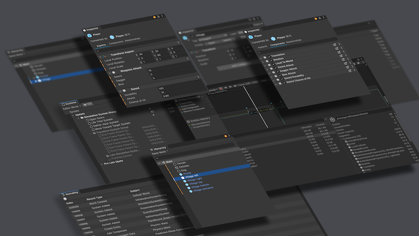

# Unity Netcode for Entities

The Netcode for Entities, part of the Unity's Data Oriented Technology Stack (DOTS), provides
a server authoritive with client prediction framework that you can use to create multiplayer games.

See our publicly available [Unity Netcode Samples](https://github.com/Unity-Technologies/EntityComponentSystemSamples/tree/master/NetcodeSamples) for introductory step by step sample, material, and some more advanced demos.

## Installation

To install this package, follow the [installation](installation.md) instructions.

## Supported Unity Versions

* 2022.3 (LTS)
* Unity 6 (LTS)

## Requirements

To use the Netcode for Entities package, you must have a supported version of Unity installed.

This package uses Unity’s [Entity Component System (ECS)](https://docs.unity3d.com/Packages/com.unity.entities@latest) as a foundation. As such, you must know how to use ECS to use this package.

## Always looking for your feedback and providing support
The Netcode for Entities team is always looking for feedback, suggestion and improvement.
To give feedback on this package or get support, please post to
- [Netcode for Entities Discussions](https://discussions.unity.com/tags/c/unity-engine/52/netcode-for-entities) using the `netcode-for-entities` tag.
- For general DOTS and Unity support, see our `dots` channel inside the [Unity Discord Channel](https://discord.com/invite/unity) using the `Netcode for Entities` tag.

> [!NOTE]
> Netcode for Entities specific bugs should always be reported via the Editor (**Help > Report a Bug...**), and please link to related threads (and the bug incident number, if available), especially if cross-posting the same issue to both.

## Additional resources
* [Upgrade guide](upgrade-guide.md)
* [What's new](whats-new.md)
