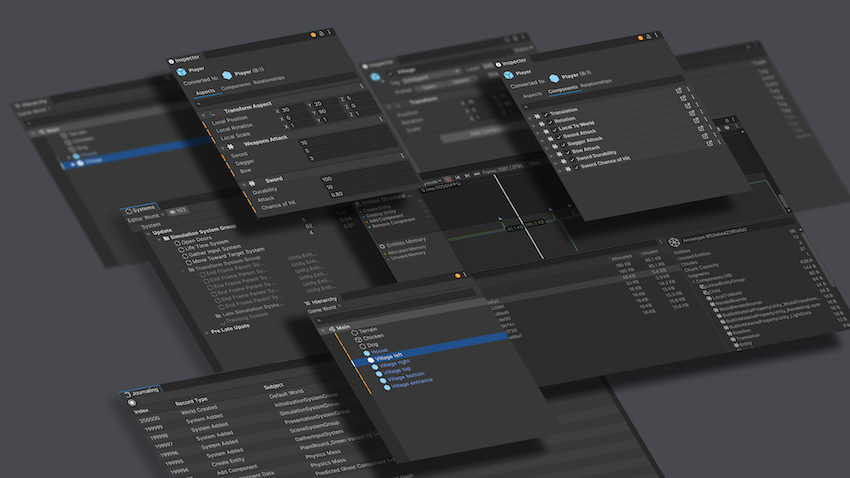

# Netcode for Entities

Netcode for Entities is a networking framework built on top of Unity’s Entity Component System (ECS) that allows you to create multiplayer games with server authoritative architecture and client prediction.

Refer to the [Unity Netcode Samples](https://github.com/Unity-Technologies/EntityComponentSystemSamples/tree/master/NetcodeSamples) for introductory step-by-step samples, material, and some more advanced demos.

## Requirements

Netcode for Entities requires Unity version 6.7.

Install Netcode for Entities via the Package Manager in the Unity Editor:

1. Navigate to **Window** > **Package Management** > **Package Manager**.
2. Click the plus icon in the top-left of the **Package Manager** window and select **Install package by technical name...** from the drop-down menu.
3. Enter `com.unity.netcode` into the **Technical name** field and click **Install**.

### Dependencies

Netcode for Entities depends on [Unity Transport](https://docs.unity3d.com/Packages/com.unity.transport@latest) and [Unity Entities](https://docs.unity3d.com/Packages/com.unity.entities@latest), which are both installed with the Editor by default.

## Always looking for your feedback and providing support

The Netcode for Entities team is always looking for feedback, suggestions, and improvements. To give feedback on this package or get support, please post to in the [Netcode for Entities Discussions forum](https://discussions.unity.com/tags/c/unity-engine/52/netcode-for-entities) using the `netcode-for-entities` tag.

> [!NOTE]
> Netcode for Entities specific bugs should always be reported via the Editor (**Help > Report a Bug...**), and please link to related threads (and the bug incident number, if available), especially if cross-posting the same issue to both.
