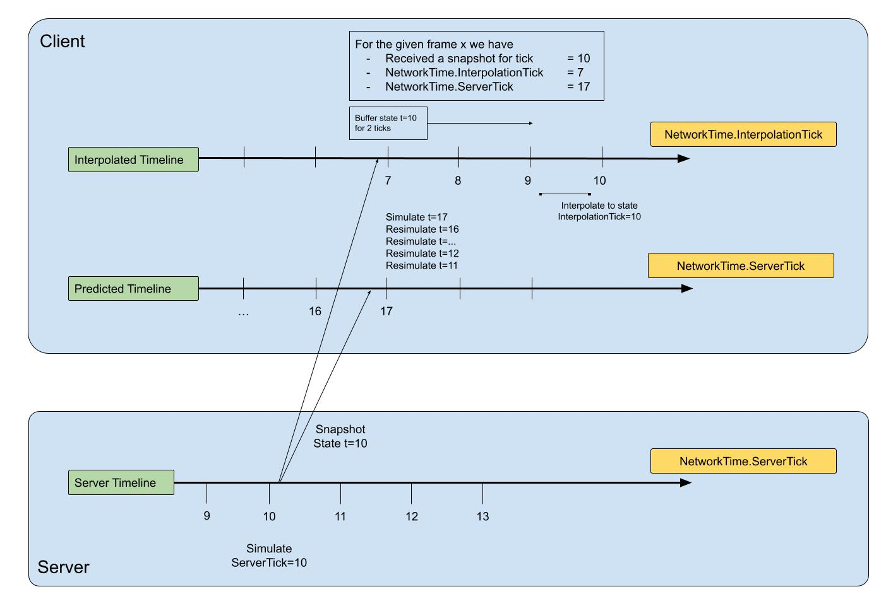
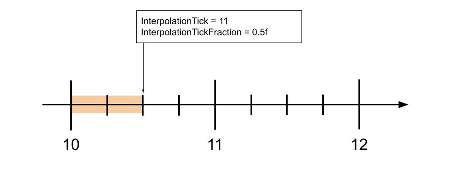

# Interpolation and extrapolation

Use interpolation and extrapolation in your game to minimize the effects of adverse network conditions on gameplay.

When networked games run over unstable or poor networks, they can experience latency and jitter which negatively affect gameplay for users. Interpolation and extrapolation are both processing methods that aim to minimize the effects of network disruption from the user's perspective.

This page is about ghosts in interpolated mode. Jitter affects predicted ghosts as well, but [prediction](intro-to-prediction.md) solves this on its own.

## Interpolation

Interpolation is the estimation of likely data points within the range of a known set of data points. In Netcode for Entities, interpolation specifically refers to the process of smoothly transitioning between two or more known values received in [snapshots](ghost-snapshots.md#snapshots) using linear interpolation, [waypoint pathing](#waypoint-pathing), and [buffered interpolation](#buffered-interpolation).

If the client renders at the same rate as the simulation rate, then the client is always rendering uninterpolated (but still buffered) snapshots.

### Waypoint pathing

Waypoint pathing is specific form of movement (playback) where an entity linearly interpolates between nodes `A`, `B`, and `C` by traveling first from `A` to `B`, then from `B` to `C`. In Netcode for Entities, each waypoint node is a received snapshot. The more snapshots received, the more accurate the interpolated ghost playback is. This is set using [`ClientTickRate.InterpolationTimeMS`](https://docs.unity3d.com/Packages/com.unity.netcode@latest?subfolder=/api/Unity.NetCode.ClientTickRate.html#Unity_NetCode_ClientTickRate_InterpolationTimeMS), which defines how large the [interpolation buffer](#buffered-interpolation) should be.

### Buffered interpolation

Buffered interpolation involves intentionally delaying ticks to allow snapshots to arrive and then interpolating between them. Buffering creates an opportunity for delayed packets to arrive before their data is needed. Larger buffer windows produce more correct playback (under realistic network conditions), but at the cost of additional latency.

## Extrapolation

Extrapolation is the estimation of likely data points outside the range of a known set of data points. In Netcode for Entities, extrapolation is effectively an unclamped interpolation. If the destination snapshot value isn't received in time, extrapolation causes the value to continue in the same direction, at the same rate.

Extrapolation is a basic form of estimation, and is often wrong, but can be preferable to having no estimation at all. Note that extrapolation still has a limit and doesn't continue forever. By default, extrapolation is limited to 20 ticks (which, at the default simulation rate of 60 Hz, is roughly a third of a second). You can adjust this limit using the [`ClientTickRate.MaxExtrapolationTimeSimTicks`](https://docs.unity3d.com/Packages/com.unity.netcode@latest?subfolder=/api/Unity.NetCode.ClientTickRate.html#Unity_NetCode_ClientTickRate_MaxExtrapolationTimeSimTicks) property.

The term dead reckoning is also used in a similar context as extrapolation, but can also mean using more complex logic to guess a trajectory. Netcode for Entities doesn't use dead reckoning.

>[!NOTE]
>Extrapolation is not the same as [client prediction](intro-to-prediction.md). Extrapolation is a simple linear mathematical operation that's applied to interpolated ghosts when snapshot data hasn't arrived by the current `interpolationTime`, whereas client prediction involves complex simulation of gameplay code that adjusts to the client's latency to try and mirror the server's own gameplay simulation. In other words, an interpolated ghost can be extrapolated, but not a predicted ghost. Extrapolation and prediction run on different [timelines](#timelines).

## Timelines

Clients operate on three different timelines simultaneously:
1. The client input target tick timeline (i.e. the 'present') - which must be ahead of the server to ensure that inputs you poll are sent to the server in time to be processed (by said server).
2. The [client predicted](intro-to-prediction.md) timeline - which is where the client non-authoritatively predicts its own future position - which typically runs on the same timeline as the input gathering timeline above, except when [Forced Input Latency](optimizations.md#using-forcedinputlatencyticks) is enabled.
3. The interpolated timeline - which runs behind the server authoritative simulation timeline, as it plays back interpolated `GhostField` values from received snapshots, and is therefore delayed by `RTT/2 + InterpolationTimeNetTicks`. Refer to the [time synchronization page](time-synchronization.md) for more details.

Server-side, there's only one timeline:
* The server authoritative simulation timeline (i.e. the 'present' from its POV).

> [!NOTE]
> The server is the authority on the current time (& tick), as well as the rate at which time passes.

Therefore, in total, there are four timelines (or 3, if not using Forced Input Latency):

| Timeline                                      | Fields                                                                                                    | Timeline Offset (ignoring `deltaTime` smoothing)           |
|-----------------------------------------------|-----------------------------------------------------------------------------------------------------------|------------------------------------------------------------|
| The client's input target tick timeline       | `NetworkTime.InputTargetTick (ClientWorld)`                                                               | T + (RTT/2 + TargetCommandSlack)                           |
| The client's client prediction timeline       | `NetworkTime.ServerTick (ClientWorld)` & `NetworkTime.ServerTickFraction (ClientWorld)`               | T + (RTT/2 + TargetCommandSlack) - ForcedInputLatencyTicks |
| The server's authoritative simulation timeline | `NetworkTime.ServerTick (ServerWorld)`                                                                    | T                                                         |
| The client's interpolated timeline            | `NetworkTime.InterpolationTick (ClientWorld)` & `NetworkTime.InterpolationTickFraction (ClientWorld)` | T - (RTT/2 + InterpolationTimeNetTicks)                    |

### Interpolation tick fraction

`NetworkTime.InterpolationTickFraction` contains the fraction that the client is currently interpolating to get to the target `InterpolationTick`. For example, with an `InterpolationTick` of 11 and a fraction of 0.5f, this means that the client is currently interpolating between ticks 10 and 11 and is halfway to tick 11. This is **not** tick 11.5f. In other words, `InterpolationTick` is the **target** tick and `InterpolationTickFraction` is the **progress** to get to the target tick.

When `InterpolationTickFraction` is 1.0f, the client is at the target tick. If there are no partial ticks, then `InterpolationTickFraction` will always be 1.0f. The same applies to prediction with `ServerTick` and `ServerTickFraction`.

## Additional resources

* [Ghosts and snapshots](ghost-snapshots.md)
* [Serialization and synchronization with `GhostFieldAttribute`](ghostfield-synchronize.md)
* [Customizing replication with `GhostComponentAttribute`](ghostcomponentattribute.md)
* [Prediction switching](prediction-switching.md)
* [Spawn and pre-spawn ghosts](ghost-spawning.md)
* [Physics](physics.md#interpolated-ghosts)
* [Time synchronization](time-synchronization.md)
* [Prediction smoothing](prediction-smoothing.md)
