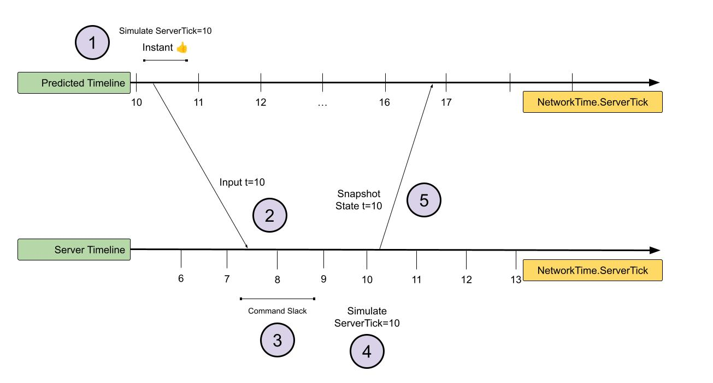

# Introduction to prediction

>The problems to solve: lag, security and consistency

Networked games experience unavoidable [latency](https://docs-multiplayer.unity3d.com/netcode/current/learn/lagandpacketloss/) when transmitting data over the internet. When a client sends input to the server (like for your character moving), it must wait for the server to process the input and send back the result before displaying it. Without any mitigation, this results in an undesirable experience for players, who experience [gameplay as laggy and unresponsive, as if they had inertia to them](https://docs-multiplayer.unity3d.com/netcode/current/learn/dealing-with-latency/#tldr).

One approach to addressing latency is to have client authority, allowing clients to simulate gameplay themselves and send the results to the server, which trusts that the given states are correct. However, this approach is susceptible to cheating like teleportation and flying cheats or even passing `nan` to crash the server and passing out of bounds values.
Client authority also results in a distributed simulation which requires additional [conflict resolution logic](https://docs-multiplayer.unity3d.com/netcode/current/learn/dealing-with-latency/#issue-world-consistency) when clients disagree about the state of the game. For example, two players who both say that their own character controller is sitting in a seat.

To maintain server authority while still having a responsive game, Netcode for Entities instead employs client prediction.

## Client prediction

Client prediction allows clients to use their own inputs to locally simulate the game, without waiting for the server's simulation result. Prediction in this context doesn't mean predicting the future, but the client using its own inputs to predict the server's simulation, with both client and server running the same simulation code. You can think of this as "ask for forgiveness not permission".

With client prediction, a client simulates the game locally while waiting for snapshots from the server. Each time it receives a snapshot, it corrects its game state to match the server's authoritative simulation and resimulate back to its "present" to continue where it left off. This is due to network latency and so the snapshot from the server is going to be several ticks behind the client's current timeline. Each time the client receives a snapshot from the server, it must resimulate its own version of the game from the older snapshot tick back to its current tick. For more details, see the [client prediction sequence section](#client-prediction-sequence).

This is great for responsiveness, since clients see the results of their inputs within the same frame that they are raised, while still having a single server authoritative simulation that's secure.

### Mispredictions

If the server state matches the client's predicted state when a snapshot is received, there should be no visual changes and the client will continue simulating as normal. If there is a discrepancy in the two states, however, a correction occurs and the client's instant replay from the snapshot's state will show a different result. This is referred to as a misprediction, and can be mitigated using [prediction smoothing](prediction-smoothing.md).

### CPU usage

Client prediction can be a very CPU intensive way of managing latency. Each time the client receives a snapshot, it must resimulate its own version of the game back to its current tick, processing multiple simulation ticks in the same frame to catch up. This can be very costly, and happens every time the client receives a snapshot from the server, regardless of whether there's a discrepancy between the client and server simulations.

Lowering `NetworkTickRate` can reduce the cost of using client prediction, although at the cost of increased latency from the lower tick rate.

### Client prediction sequence

At a high level, the sequence looks like this:

Step by step:

1. The client simulates its own inputs and runs its own gameplay logic.

2. The client sends its inputs to the server.

3. The client is set to be ahead of the server by a few ticks (set through command slack). The server receives the inputs and put them in a wait queue.

4. The server simulates the inputs.

5. The server sends the result to the client (which has continued simulating in the meantime and is now at tick 17).

6. The client receives the result, rolls back its simulation to tick 10, and replays its inputs back to tick 17. Since all this happens at once, it's invisible to players.

## The prediction loop

### Server

The server is authoritative, which means that it has the last say on gameplay decisions. This prevents cheating when hosted on a dedicated server, and improves consistency by having a single source of truth instead of trying to reconcile multiple authorities.

The server runs the game simulation at a fixed rate, the `simulation tick rate` (see [ClientServerTickRate.SimulationTickRate](https://docs.unity3d.com/Packages/com.unity.netcode@latest/index.html?subfolder=/api/Unity.NetCode.ClientServerTickRate.html#Unity_NetCode_ClientServerTickRate_SimulationTickRate)).
It isn't necessary for the simulation itself to be fully deterministic, although this is something you should aim for (without achieving it) to reduce corrections. If there are discrepancies on different machines, then the client will correct itself with the successive server updates, with the client's state becoming _eventually consistent_ with the server's state.

The server sends a snapshot (state) of its simulation (which can be a [partial snapshot](ghost-snapshots.md#under-the-hood-partial-snapshots), depending on your world's size) to clients at a fixed frequency, the [network tick rate](https://docs.unity3d.com/Packages/com.unity.netcode@latest/index.html?subfolder=/api/Unity.NetCode.ClientServerTickRate.html#Unity_NetCode_ClientServerTickRate_NetworkTickRate).

`SimulationTickRate` and `NetworkTickRate` can be different (by default they are both 60hz), but with the constraint that `NetworkTickRate` must be always less than the `SimulationTickRate` and a common factor of it. For example, `NetworkTickRate` is 30Hz and the `SimulationTickRate` is 60Hz.

Note that the server can still send data every simulation ticks, but to different subsets of clients, which distributes CPU load over multiple simulation ticks and avoids CPU spikes. For example, with a `NetworkTickRate` of 30Hz and a `SimulationTickRate` of 60Hz, the server will send snapshots to half of the clients for one tick and the other half the next tick. Each client still receives a packet every two simulation ticks, while the server distributes CPU load evenly over each tick.

### Client

For all client predicted ghosts, the client attempts to run the same simulation as the server. However, because the client runs on a variable render refresh rate, the actual client simulation tick rate is a bit different from the server (see [partial ticks](#partial-ticks)). For simplicity, the examples below assume that the client runs identically to the server.

To ensure that the server receives input before the next update, the client simulation needs to be ahead of the server, so that the input's tick matches the server's current simulation tick.
This means that the client is predicting the state of the world slightly ahead of the server, using its own inputs.
The delta between the client and the server depends on the network's round-trip time (RTT) and `slack` number of ticks (refer to [Target Command Slack](https://docs.unity3d.com/Packages/com.unity.netcode@latest/index.html?subfolder=/api/Unity.NetCode.ClientTickRate.html#Unity_NetCode_ClientTickRate_TargetCommandSlack)), with a default value of two ticks.

#### Example

- With a real world clock at midnight 00:00:00.000 and a server at tick 10, with a RTT of 200ms at 60 ticks per second, the client will be simulating tick ~18.
- The client sends input 18 to the server.
- At ~00:00:00.100 (half an RTT later), the server should have progressed to tick ~16. It receives the input for tick 18 and puts it in a wait queue.
- At 00:00:00.132, the server reaches tick 18 and consumes the input for tick 18 previously sent from the client.

Using [command slack](https://docs.unity3d.com/Packages/com.unity.netcode@latest/index.html?subfolder=/api/Unity.NetCode.ClientTickRate.html#Unity_NetCode_ClientTickRate_TargetCommandSlack) is an effective way to mitigate a small amount of network jitter and still allow the server to receive input in time.

<!--
// TODO added a little note "X TIMES, DEPEND ON PHYSICS"
// TODO have a nicer version of this
-->

#### Simulation groups

The `PredictedSimulationSystemGroup` is responsible for determining when and how to run the underlying systems and groups, and is present on both client and server. Apart from some exceptions, all systems present in this group constitute the pseudo-deterministic step for your game, and should run on both client and server.

When both the Physics and Netcode packages are installed in the same project, physics updates are automatically moved inside the prediction loop. Physics updates have an additional level of update rate: the `PredictedFixedSimulationGroup` can run the physics step multiple times per simulation tick. In other words, the physics tick rate can be higher than the simulation rate, but never slower.

### Predicted and owner predicted modes

Netcode has two modes of client prediction:

- Predicted mode, where all clients will try to predict a given ghost.
- Owner predicted mode, where only the owning client will predict the ghost, and all other clients will interpolate it.

So for a player character, predicted means that other clients will try to predict your character in their own simulation. For owner predicted, only you will predict it, and other clients will interpolate it.

When in predicted mode, you can predict other players by enabling input replication (set `[GhostField]` on your input's state). Inputs will be replicated to other clients. With that information, the other clients do two things:

1. For ticks with corresponding inputs, act normally and simulate using that input.
2. For ticks with missing inputs, the last input in the local input history is used.

### Rollback and replay

Also known as correction and reconciliation. When the client receives a snapshot from the server that contains predicted ghosts, it's first cached (internally in `SnapshotBuffer`), since packets can be received at any time. Then in the next frame, `GhostUpdateSystem` applies the new states to their respective ghosts. Only ghosts that received an update in the snapshot are rolled back, not the whole simulation. This is a selective rollback strategy that happens when receiving [partial snapshots](ghost-snapshots.md#partial-snapshots). Ghosts are marked with the `Simulate` tag to signal if they should be simulated or not, so make sure to include this in your entity query.

The `PredictedSimulationGroup` calculates from which tick the resimulation should start. Then all the ticks up to the current server tick are recalculated.

This loop is divided logically into:
- A loop that simulates ticks using the fixed delta time (1/simulation rate).
- One last simulation update, that simulates the next/current server tick, and that uses a variable step time. This can be a [partial tick](#partial-ticks).

[`NetworkTime`](https://docs.unity3d.com/Packages/com.unity.netcode@latest/index.html?subfolder=/api/Unity.NetCode.NetworkTime) flags can be obtained from `var networkTime = SystemAPI.GetSingleton<NetworkTime>()`. For example `networkTime.IsFirstTimeFullyPredictingTick`.

The **PREDICT CURRENT TICK** step above sets `networkTime.ServerTick` to the latest simulated tick, both client and server side.

Note that [partial ticks](#partial-ticks) will also rollback to the previous complete tick.

### Partial ticks

Clients can run at a variable frame rate to ensure that visuals are as smooth as possible for your players. The client still executes deterministic parts of the simulation at the same fixed rate as the server, but can execute partial ticks in between for smoothness. For example, a client running at 120 FPS with a simulation rate of 30 ticks per second can run one full tick, then three partial ticks, then one full tick again and so on.

- Deterministic ticks are called "full ticks".
  - Full ticks always have a `deltaTime` of 1/simulation rate.
- Ticks that execute in between full ticks are called partial ticks.
  - Partial ticks have a variable `deltaTime`.

To achieve updates at the client's framerate for partial ticks, Netcode rolls back partial ticks to the last predicted full tick, then simulates one partial tick with the appropriate `deltaTime`. When it's time to simulate a full tick, the same rollback will be done, but this time using `deltaTime` = 1/simulation rate.  `NetworkTime.ServerTick` and DOTS' `World.Time` and `deltaTime` will be updated accordingly.

#### Example

Given a simulation rate of 60Hz (16ms per full tick), but with the client's real frame rate at ~240Hz:

- Client is at tick 10 and has a local state backup for it.
- Next frame for partial tick 0.1 to 11:
  - Client samples its inputs.
  - Client simulates the partial tick from 10 to 10.1 with a `deltaTime` of ~2ms.
- Next frame for partial tick 0.3 to 11:
  - Client samples its inputs.
  - Client simulates the partial tick from 10 to 10.3 with a `deltaTime` of ~5ms
    - Note here that the client will again rollback to full tick 10, then simulate partial tick 10.3. It won't simulate from 10.1 to 10.3, since having a consistent baseline improves determinism.
- Next frame for partial tick 0.7 to 11:
  - Client samples its inputs.
  - Client simulates the partial tick from 10 to 10.7 with a `deltaTime` of ~11ms.
- Next frame for partial tick 0.2 to 12. **A change in full tick is detected**:
  - Client samples its inputs.
  - Sends cumulative input to the server.
    - Netcode has [InputEvent](command-stream.md#input-events) you can use to ensure that atomic inputs aren't lost during partial ticks. Other input values will be overwritten by their latest value.
  - Full tick simulation 10 to 11 with a `deltaTime` of 16ms.
  - Backup state 11.
  - Client simulates the partial tick from 11 to 0.2 to 12 with a `deltaTime` of ~3ms.
    - Note that there's two simulation steps here: one from 10 to 11 and one from 11 to 11.2.

If a partial tick's `deltaTime` lands on ±5% of a full tick, it's rounded to the nearest full tick.

On the server:
- Tick 10.
  - Get input for tick 10 for all clients, or apply the last received input.
  - Full tick simulation 10 to 11.

#### Behind the scenes

The `GhostUpdateSystem` restores the predicted ghosts' state using the backup of the last full tick. The `PredictedSimulationSystemGroup` uses the accumulated `deltaTime` since the last full simulation tick to run the simulation update. If it exceeds the simulation interval, the client performs a full simulation tick and continues with the next tick using the residual `deltaTime`.

`NetworkTime` flags are assigned as required, just like in simulation rollback and replay.

- In case of continuation, the `FirstPredictionTick` and `IsFinalPredictionTick` coincide. `IsPartialTick` is true.
- In case one or more full ticks need to be simulated, `FirstPredictionTick` is the tick for which a full resimulation is done.

### Batching and catch-up

If your client or server aren't able to simulate all the required ticks at a specific rate (if they are having performance issues where real `deltaTime` is greater than target `deltaTime`), then Netcode tries to batch ticks together by running fewer ticks with higher `deltaTimes`. See [this page for how to configure this](client-server-worlds.md#configuring-the-server-fixed-update-loop).

To help preserve determinism, if your inputs change between two ticks, Netcode won't batch those two ticks. For example, if input `FOO=1` for tick 10, 11, and 12 then changes to `FOO=2` for tick 13, 14, and 15, Netcode won't try to batch tick 12 and 13 together, only 10, 11, and 12, or 13, 14, and 15.

<!--
### Off frames

[Single-world hosts](client-server-worlds.md) can have off frames, where no netcode simulation code executes. These off frames can occur because the client runs at a variable frame rate (for presentation), but simulates on a fixed tick rate (for netcode simulation).

 > [!NOTE] The `InitializationSystemGroup`, `SimulationSystemGroup`, and `PresentationSystemGroup` still run on these off-frames, but system groups defined by Netcode for Entities will not (see `NetcodeHostRateManager`).

You can [use off frames to optimize the performance of your project](optimization/off-frame.md). For example, you can still execute visual-related systems during an off frame. `ServerTick` will be the last tick calculated when a tick executed. `InputTargetTick` will be the next tick, since you're gathering inputs for the next netcode simulation tick.
-->
## Multiple timelines

Clients have the interpolation and prediction timeline which behave differently. Refer to the pages below for more details.

- See the [timelines section](interpolation.md#timelines) on the interpolation page.
- For more implementation details, see [time synchronization](time-synchronization.md#the-networktimesystem).
