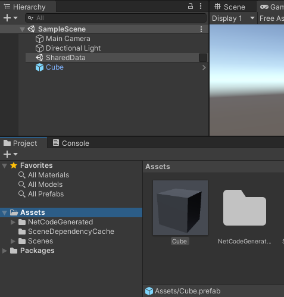

# Networked cube

Make sure you have set up the project correctly using the [installation guide](installation.md) before starting your adventure (of creating a simple client-server based simulation).

This tutorial briefly introduces the most common concepts involved in making client-server based games.

## Creating an initial scene

To begin, set up a way to share data between the client and the server. This separation is achieved in Netcode for Entities by creating [a different World](client-server-worlds.md) for the server and each client (via the [Entities Package](https://docs.unity3d.com/Packages/com.unity.entities@latest)). To share data between the server and the client:

1. Right-click within the __Hierarchy__ window in the Unity Editor.
2. Select __New Subscene__ > __Empty Scene...__
3. Name the new scene "SharedData".

Once this is set up, spawn a plane in both the client and the server world. To do this, right click the __SharedData__ subscene and select __3D Object__ > __Plane__ which then creates a plane nested under __SharedData__.

 _Scene with a plane_

If you select __Play__, then select __Window__ > __Entities__ > __Hierarchy__, you can see two worlds (ClientWorld and ServerWorld), each with the SharedData scene with the plane that you just created.

 _Hierarchy View_

## Establish a connection

To enable communication between the client and server, you need to establish a [connection](network-connection.md). In Netcode for Entities, the simplest way of achieving this is to use the auto-connect feature. You can use the auto-connect feature by inheriting from the `ClientServerBootstrap`, then setting the `AutoConnectPort` to your chosen port.

Create a file called *Game.cs* in your __Assets__ folder and add the following code to the file:

[!code-cs[blobs](../Tests/Editor/DocCodeSamples/networked-cube.cs#EstablishConnection)]

## Communicate with the server

When you're connected, you can start communicating with the server. A critical concept in Netcode for Entities is the concept of `InGame`. When a connection is marked with `InGame` it tells the simulation it's ready to start [synchronizing](synchronization.md).

Before entering `InGame` state, the only way to communicate with a Netcode for Entities server is via `RPC`s. So to continue, create an RPC that acts as a "Go In Game" message, (for example, tell the server that you are ready to start receiving [snapshots](ghost-snapshots.md)).

Create a file called *GoInGame.cs* in your __Assets__ folder and add the following code to the file.

[!code-cs[blobs](../Tests/Editor/DocCodeSamples/networked-cube.cs#GoInGame)]

## Create a ghost prefab

To synchronize something across a client/server setup, you need to create a definition of the networked object, called a **ghost**.

To create a ghost prefab:

1. Create a cube in the scene by right-clicking on the scene, then selecting __3D Object__ > __Cube__.
2. Select the __Cube GameObject__ under the __Scene__ and drag it into the Project’s __Asset__ folder. This creates a prefab of the cube.
3. After creating the prefab, you can delete the cube from the scene, but __do not__ delete the prefab.

 _Create a cube prefab_

To identify and synchronize the cube prefab inside Netcode for Entities, you need to create an `IComponent` and author it. To do so, create a new file called *CubeAuthoring.cs* and enter the following:

[!code-cs[blobs](../Tests/Editor/DocCodeSamples/networked-cube.cs#CubeAuthoring)]

Once you create this component, add it to the `Cube.prefab`. Then, in the Inspector, add the __Ghost Authoring Component__ to the prefab.

When you do this, Unity will automatically serialize the Translation and Rotation components.

Before you can move the cube around, you must change some settings in the newly added __Ghost Authoring Component__:

1. Check the __Has Owner__ box. This automatically adds and checks a new property called _Support Auto Command Target_ (more on this later).
2. Change the __Default Ghost Mode to Owner Predicted__. You need to set the __NetworkId__ member of the __Ghost Owner Component__ in your code (more on this later). This makes sure that you predict your own movement.

 _The Ghost Authoring component_

## Create a spawner

To tell Netcode for Entities which ghosts to use, you need to reference the prefabs from the subscene. First, create a new component for the spawner: create a file called _CubeSpawnerAuthoring.cs_ and add the following code:

[!code-cs[blobs](../Tests/Editor/DocCodeSamples/networked-cube.cs#CubeSpawner)]

1. Right-click on SharedData and select __Create Empty__.
2. Rename it to __Spawner__, then add a __CubeSpawner__.
3. Because both the client and the server need to know about these ghosts, add it to the __SharedData Subscene__.
4. In the Inspector, drag the cube prefab to the cube field of the spawner.

 _Ghost Spawner settings_

## Spawning our prefab

To spawn the prefab, you need to update the _GoInGame.cs_ file. As described earlier, you must send a __GoInGame__ `RPC` when you're ready to tell the server to start synchronizing. You can update that code to actually spawn our cube as well.

### Update `GoInGameClientSystem` and `GoInGameServerSystem`

`GoInGameClientSystem` and `GoInGameServerSystem` should only run on the entities that have `CubeSpawner` component data associated with them. To do this, add a call to [`SystemState.RequireForUpdate`](https://docs.unity3d.com/Packages/com.unity.entities@1.0/api/Unity.Entities.SystemState.RequireForUpdate.html) in both systems' `OnCreate` method:

[!code-cs[blobs](../Tests/Editor/DocCodeSamples/networked-cube.cs#RequireSpawner)]

Your `GoInGameClientSystem.OnCreate` method should look like this now:

[!code-cs[blobs](../Tests/Editor/DocCodeSamples/networked-cube.cs#ModifiedGoInGameClientCreate)]

Your `GoInGameServerSystem.OnCreate` method should look like this now:

[!code-cs[blobs](../Tests/Editor/DocCodeSamples/networked-cube.cs#ModifiedGoInGameServerCreate)]

Additionally, for the `GoInGameServerSystem.OnUpdate` method we want to:
- Get the prefab to spawn.
  - As an added example, get the name of the prefab being spawned to add to the log message.
- For each inbound `ReceiveRpcCommandRequest` message, instantiate an instance of the prefab.
  - For each prefab instance, set the `GhostOwner.NetworkId` value to the `NetworkId` of the requesting client.
- Finally, add the newly instantiated instance to the `LinkedEntityGroup` so when the client disconnects the entity is destroyed.

Update your `GoInGameServerSystem.OnUpdate` method to this:

[!code-cs[blobs](../Tests/Editor/DocCodeSamples/networked-cube.cs#ModifiedGoInGameServerUpdate)]

Your *GoInGame.cs* file should now look like this:

[!code-cs[blobs](../Tests/Editor/DocCodeSamples/networked-cube.cs#ModifiedGoInGameAll)]

If you press __Play__ now, you should see the replicated cube in the Game view and the Entity Hierarchy view.

 _Replicated cube_

## Moving the cube

Because you used the _Support Auto Command Target_ feature when you set up the ghost component, you can take advantage of the `IInputComponentData` struct for storing input data. This struct dictates what you will be serializing and deserializing as the input data. You also need to create a system that fills in input data.

Create a script called *CubeInputAuthoring.cs* and add the following code:

[!code-cs[blobs](../Tests/Editor/DocCodeSamples/networked-cube.cs#MovingCube)]

Add the `CubeInputAuthoring` component to your cube prefab, and then finally, create a system that can read the `CubeInput` and move the player.

Create a new file script called `CubeMovementSystem.cs` and add the following code:

[!code-cs[blobs](../Tests/Editor/DocCodeSamples/networked-cube.cs#CubeMovementSystem)]

## Test the code

Now you have set up your code, open __Multiplayer__ > __PlayMode Tools__ and set the __PlayMode Type__ to __Client & Server__. Enter Play Mode, and the cube spawns. Press the __Arrow__ keys to move the cube around.

## Build standalone build and connect an Editor-based client

Now that you have the server-client instance running in the Editor, you might want to see what it would be like to test connecting another client. To do this follow these steps:

- Verify that your __Project Settings__ > __Entities__ > __Build__ > __NetCode Client Target__ is set to *ClientAndServer*.
- Make a development build and run that standalone build.
- Select the __Multiplayer__ menu bar option and select the Editor __PlayMode Tools__ window.
  - Set the **PlayMode Type** to: Client
  - Set the **Auto Connect Port** to: 7979
  - Optionally, you can dock or close this window at this point.
- Enter Play Mode

You should now see on your server-client standalone build the Editor-based client's cube and be able to see both cubes move around!
