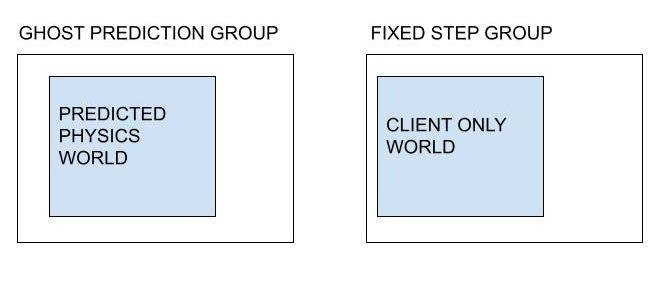
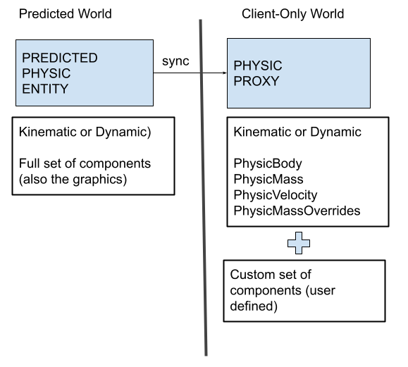
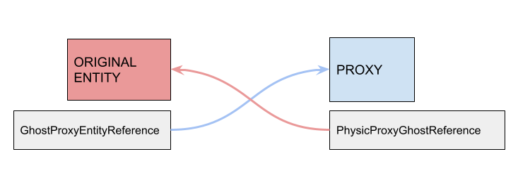

# Physics
The NetCode package has some integration with Unity Physics which makes it easier to use physics in a networked game. The integration handles interpolated ghosts with physics, and you can manually enable support for predicted ghosts with physics.

## Interpolated ghosts
For interpolated ghosts it is important that the physics simulation only runs on the server. 
On the client the ghosts position and rotation are controlled by the snapshots from the server and the client should not run the physics simulation for interpolated ghosts.
In order to make sure this is true NetCode will add a [`PhysicsMassOverride`](https://docs.unity3d.com/Packages/com.unity.physics@0.6/api/Unity.Physics.PhysicsMassOverride.html) component to every ghost which is also a dynamic physics object on the client.
The `PhysicsMassOverride` will mark the objects as kinematic - meaning they will not be moved by the physics simulation.
Furthermore, for interpolated ghost by default we setup the PhysicsMassOverride such that the the PhysicVelocity component velocities are ignored 
(the physis motion will have zero linear and angular velocity) but preserved (so they will never reset forcibly to zero).
This means that when using NetCode and Unity Physics you cannot use `PhysicsMassOverride` for game specific purposes on the client.

## Predicted Phyics Simulation
It is possible to use physics simulation for predicted ghosts. We will use the term _Predicted Physics_ to indidicate that the physics simulation run in the prediction loop.
In order to to use physics simulation for predicted ghosts you must enable it by creating a singleton with the [`PredictedPhysicsConfig`](https://docs.unity3d.com/Packages/com.unity.netcode@latest/index.html?subfolder=/api/Unity.NetCode.PredictedPhysicsConfig.html) component. 
The singleton must exist on both the client and server with compatible values (same simulation frequency). 
The component lets you specify the physics tick rate as a multiple of the NetCode simulation tick rate, so you can run for example a 60Hz game simulation with 120Hz physics simulation.

When the singleton exists, two distinct physics simulation islands, normally referred as _Physics Worlds_, will be present:
- A **Predicted Physics World**: will contains all the physics entities (interpolated and predicted ghosts, environment, etc...) for which the simulation need to run on both the client and server.
- A **Client-Only Physics World**: only simulated on the client, can be used to run VFX, particles and any other sort of physics interaction that does not need to be replicated.

The PredictedPhysics simulation run inside the [`PredictedPhysicsSystemGroup`]((https://docs.unity3d.com/Packages/com.unity.netcode@latest/index.html?subfolder=/api/Unity.NetCode.PredictedPhysicsSystemGroup.html)) as part of the prediction loop.
The PredictedPhysicsSystemGroup uses for the simulation a specific implementation of the physics systems and provide the same flow and phase you are already familiar with (the build, step, export etc). 
The Client-Only physics simulation run instead in the FixedUpdateSimulationGroup and uses the built-in physics systems.

The two simulations can use different fixed-time steps and are not supposed to be in sync, meaning that in the same frame it is possible to have both, or only one of them to be executed independently.
Furthermore on the client, because of the client-prediction. **when a rollback occurs the simulation may runs multiple times in the same frame, one the for each rollback tick**.

NetCode rely on the multi-physics-world feature of the Unity.Physics package to implement this logic. As part of the conversion process, a _PhysicWorldIndex_  shared component is added to all the physics entities, indicating
in which world the entity should be part of. **It is responsibility of the user to setup properly their prefab using the PhysicBody inspector, to make them run in the correct physics world**.

The default configuration for of the predicted and client-only physics world indices is the following:
- PredictedPhysicsWorld: index 0
- ClientOnlyPhysicsWorld: index 1

It is possible to override the default settings by adding a [`PredictedPhysicsWorldIndexOverride`](https://docs.unity3d.com/Packages/com.unity.netcode@latest/index.html?subfolder=/api/Unity.NetCode.PhysicsWorldIndicesOverride.html) component 
to the entity that hold the PredictedPhysicsConfig component.

### Interaction in between predicted and client-only physics entities
There are situation when you would like to make the ghosts interact with physics object that are present only on the client (ex: debris). However, but being them part of different simulation islands they can't interact each-other.
NetCode provides for that usecase a specific workflow using `Ghost Physics Proxy` entities.

For each entity in physics entity present in the predicted world you would like to interact with the client-only world, it is necessary to spawn/create a _proxy/companion_ entity, configured to run in the client-only physics simulation.
The simulated ghost entity in the predicted world will then be used to _drive_ the proxy by copying the necessary component data and setup the physics velocity to let the proxy move and interact with the other physics entities in the  client-only world.

The proxy entity must have PhysicsBody, PhysicsMass, PhysicsMassOverride a PhysicsVelocity components and can optionally have any other arbitrary number of components types.

For ghosts entities, the [`GenerateGhostPhysicsProxy`](https://docs.unity3d.com/Packages/com.unity.netcode@latest/index.html?subfolder=/api/Unity.NetCode.GenerateGhostPhysicsProxy.html) component can be added to the ghost prefab
to let make NetCode system automatically create a physics proxy when a ghost is spawned. 
It is possible to specify your own prefab to use or let NetCode auto-generated a default kinematic proxy entity with the minimal set of mandatory components.

For ghost configured to spawn proxy entity, a link in between the source predicted entity and the proxy is created. A `GhostPhysicsProxyReference` and a `PhysicsProxyGhostDriver` components, which provide an entity reference to the proxy and the driving/originating ghost, are added respectively to the ghost and the proxy entities.   

The ghost proxy position and rotation and are automatically handled by [`SyncGhostPhysicsProxies`](https://docs.unity3d.com/Packages/com.unity.netcode@latest/index.html?subfolder=/api/Unity.NetCode.SyncGhostPhysicsProxies.html) system. 
By default the kinematic physics entity is moved using kinematic veloctiy, by altering the PhysicsVelocity component. It is possible to change the default behavior for the prefab by setting the 
`GenerateGhostPhysicsProxy.DriveMode` component property. 
Furthermore, it is possible to change that beahviour dynamically at runtime by setting the `PhysicsProxyGhostDriver.driveMode` property to the desired mode. 

**It is user responsibility to implement the systems that syncronize/copy any user-defined components when a custom prefab is provided.**

## Limitations
As mentioned on this page there are some limitations you must be aware of to use physics and NetCode together.
* NetCode will use `PhysicsMassOverride` on the client, you cannot use it for game specific purposes.
* Physics simulation will not use partial ticks on the client, you must use physics interpolation if you want physics to update more frequently than it is simulating.
* The Unity.Physics debug systems that does not work correctly in presence of multiple world (only the default physics world is displayed).
