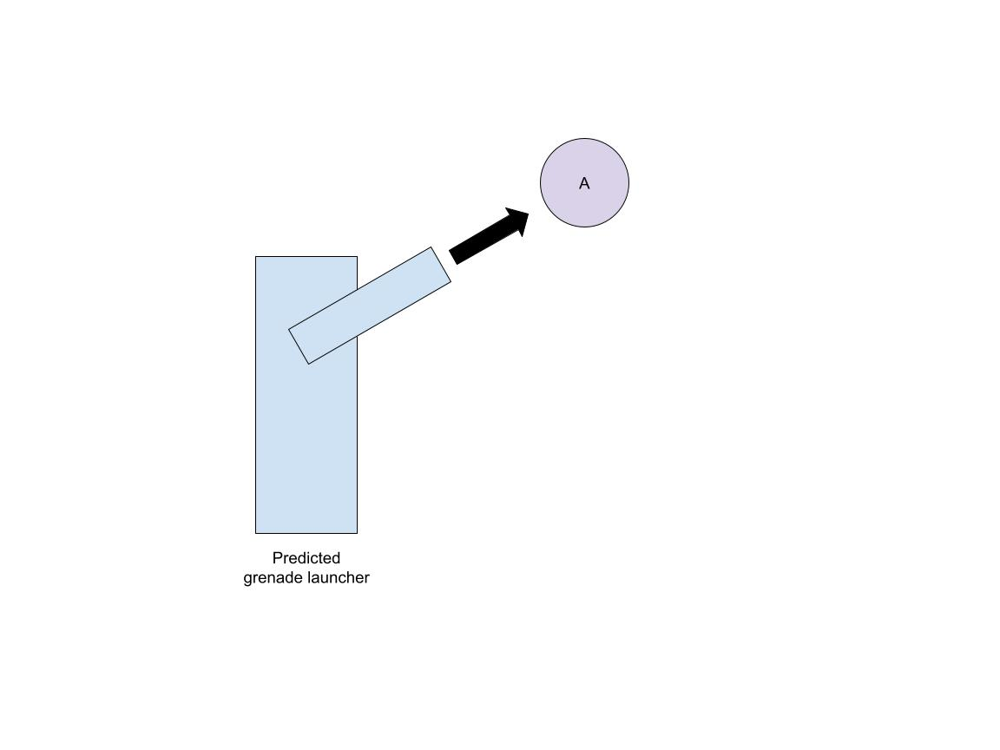
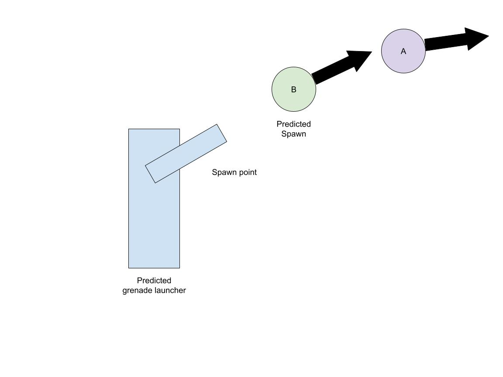
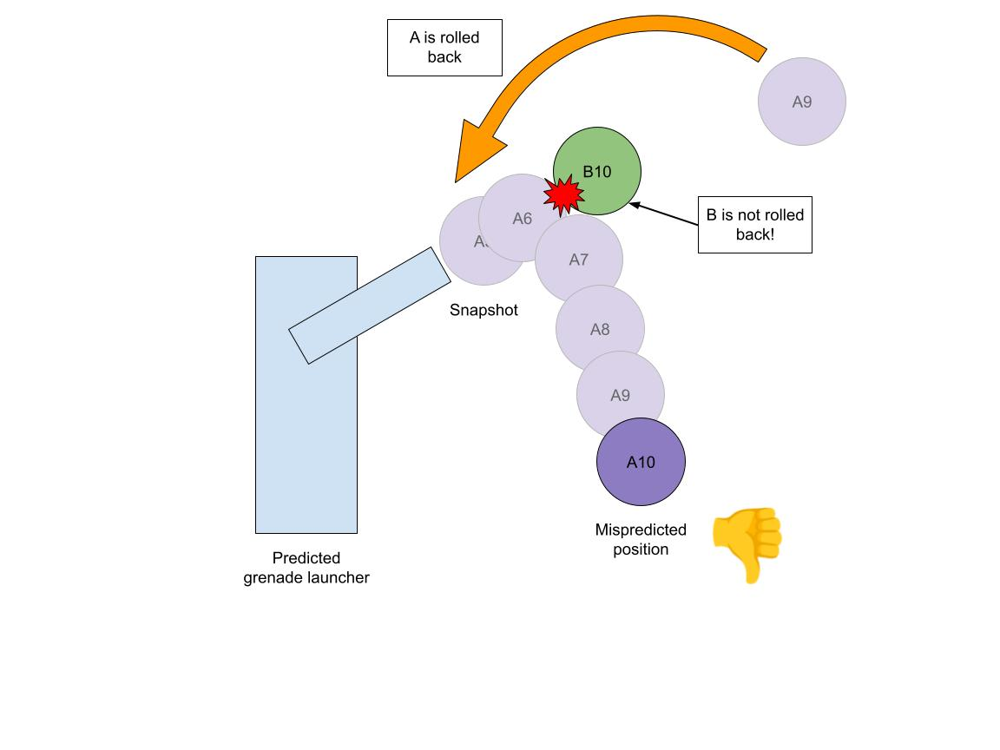
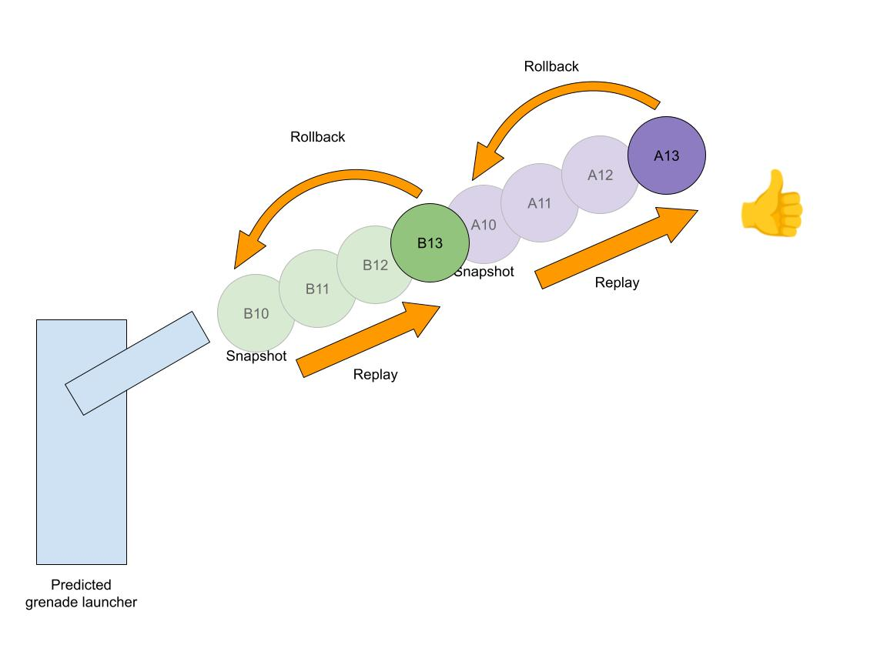

# Prediction edge cases and known issues

When using client-side prediction, there are a few known edge cases you should be aware of.

## Interactions between predicted ghosts using partial snapshots

When a client receives a complete snapshot from the server, Netcode rolls back the state of predicted ghosts to match the snapshot's state and then runs multiple iterations of `PredictedSimulationSystemGroup` to bring the client simulation back to the current predicted tick. All ghosts are ticked together.

However, when receiving [partial snapshots](ghost-snapshots.md#partial-snapshots), only the ghosts that are included in the snapshot are rolled back and ticked. For example, if ghosts A and B are received, but not C and D, then only A and B are rolled back to the tick received from the server and only A and B are resimulated. This includes both ghost data and inputs.

**Notes**:

- This does not rollback to infinity: Netcode will clamp the rollback to the input queue size (currently a const set to 64).
- The impact of partial snapshots is less noticeable for interpolated ghosts. Interpolated ghosts are queued and buffered over x milliseconds, as defined by `ClientTickRate.InterpolationTimeMs`, or frames, defined by `ClientTickRate.InterpolationTimeNetTicks`, to resist jitter. So it's likely that C and D would be updated at the same time client-side, if interpolated, since C's value would be delayed by that buffer, giving time for D's value to arrive.
- Despawns behave differently: ghost despawns are always sent immediately, regardless of the ghost priority. And, unless there are lots of them (about 100), the despawn events for the same tick are usually sent together. In the Asteroids sample, the bullet and the asteroid are destroyed on the server at the same tick, and very likely applied together on the clients.

You can artificially test partial snapshots by setting the `GhostSendSystemData.MaxSendChunks=1` singleton, which forces sending one chunk at a time.

[See predicted spawn issue for similar explanation diagrams](#predicted-spawn-interactions-with-other-predicted-ghosts).

### Example

Timeline on a client (all this happens in a single frame):

- A, B, C, and D have all predicted tick 20 already
- Client receives a partial snapshot for A and B's tick 10
- Client resets A and B back to snapshot 10's value, but leaves C and D at their tick 20 value
- Client replays tick 11, 12, 13, 14, ..., 20 only for A and B
  - C and D are still frozen at tick 20
- Client simulates tick 21 for all of A, B, C, and D

This means if your ghost B (rolled back) interacts with your ghost C (not rolled back), then the interaction might be incorrect, since both won't simulate at the same rate, with the same amount of steps. This is especially true when you're changing a ghost's state and expect the ghost to update itself using that state. For example, if B collides with C and changes C's velocity, C will still only execute one tick using that velocity, while A and B will interact with a 'frozen' C when replaying from the snapshot to current tick. Your simulation might expect C to move with that new velocity, but that won't be the case.

### Possible mitigations

- Use [client anticipation](https://docs-multiplayer.unity3d.com/netcode/current/learn/dealing-with-latency/#action-anticipation) instead of prediction.
  - Instead of an action starting instantly, the client waits for the server's confirmation before performing the action (and plays some animation/sound to hide the lag). For example, if a player is the ghost A in the example above and the ball to pickup is the ghost C, then predicting the ball pickup could take an unexpected amount of time to correct if the ball's state arrives only later.
    - This is just an example. In real life, having the player nearby, if correctly prioritized, is most likely going to receive the ball very soon, if not already in the current partial snapshot.
- Change other ghosts' states instead of waiting for them to change themselves.
  - For example, ghost A picks up ghost C. Instead of having ghost C update its own position according to ghost A, have ghost A update ghost C's position.
  - With this, ghosts that are currently simulated (marked with the `Simulate` tag) will see the expected result on ghosts they affect, even if those ghosts themselves are not being simulated.
- Use `GhostGroup`.
  - Since `GhostGroup` guarantees ghosts in that group will be sent together, this removes the partial snapshot issue. This is a more complex solution that requires careful grouping, however.
- Prioritizing the chunk.
  - Prioritize the chunk such that ghosts near the ball get higher priority, and the ball has always the highest priority (sent every tick). Refer to [Importance Scaling](optimizations.md#importance-scaling) for more details.
- Only allow interactions between ghosts that are being simulated.
  - Use the `Simulate` tag in your entity queries to filter for entities to interact with.
  - With this, A and B could only interact together and ignore C and D. This mitigation still produces mispredictions. It depends on your gameplay to see if corrections are more visible if you interact with a frozen ghost or skip it entirely.

In summary, this is a situation where mispredictions are unavoidable. Your goal is to hide corrections as much as possible so your player's experience is not too affected, while making sure you eventually converge to a correct state.

## Predicted spawn interactions with other predicted ghosts

As described above, predicted spawns are not rolled back and resimulated (because they don't have snapshots yet), and suffer from the same issues as predicted ghosts.

### Example

- Client has a 'ball thrower' that spawns balls and sends them flying with an arc.
- Client has already spawned and received a snapshot for ball A, which is currently in flight a short distance from the spawn point.


- Client then predicts the spawn of ball B, which flies a short distance for a tick.


- Client receives a snapshot containing state for ball A, with an old position that's behind ball B.
- Client rolls back ball A to the snapshot's position, **but doesn't roll back ball B**.
- Client replays multiple ticks of simulation. Ball A moves forward, but collides with the frozen ball B which is not part of the resimulation since it doesn't have a snapshot.
  - This produces a visible consistent misprediction.


- The misprediction is corrected later when ball B receives its first snapshot.



### Possible mitigations

You can use [allow predicted spawned ghost to rollback to spawn tick](ghost-spawning.md#specify-specific-rollback-options-for-predicted-spawned-ghosts) option to help fixing these issue. When the flag is set,
the predicted spawned ghost state is restored and re-predicted starting from the its spawning tick when other predicted ghost snapshot udpdate are received from the server.

In these case, using the 'ball thrower example', when the client receive a snapshot contaning state for ball A, with an old position that's behing ball B,
the client will also roll back ball B to its original position at spanw time.

The client will replay multiple ticks, starting from the oldest snapshot tick (that is the ball A state update). When the current simulation tick match the ball B spanw tick on the client,
both ball A and ball B are simulated, alleviating some mi-sprediction problem.

## Quantization and determinism

The client and server simulation doesn't [quantize](compression.md#quantization) values between ticks. So if a client resimulates tick 10, 11, and 12, then 10 to 11 and 11 to 12 will not quantize their initial values as they would with initial ticks from snapshots. Since clients base their initial simulation on the snapshot state (which is quantized), they base their simulation on values with less precision than their server counterparts, and thus, on values which are fundamentally different. As a result, enabling quantization worsens indeterminism (and higher quantization values are 'more incorrect'), causing larger discrepancies between the two simulations.

### Example

- Server simulates tick 10 and the float `FOO` now has value `123.12345678`.
- Quantization is set to `100`, so the value sent to the client is `12312`.
- While this is being sent to the client, it simulates tick 11 and increments the value by `0.002`. The server state is now at `123.12545678`.
- The client is at tick 20 and receives the snapshot for tick 10.
- It rolls back to tick 10, sets `FOO` to `123.12`, then starts resimulating to tick 20.
  - When simulating tick 11, it also increments the value by` 0.002`, resulting in `123.122`, producing a discrepancy.
- When the server sends tick 11, it sends 123.1**3** because of rounding during quantization.
- When the client receives tick 11, there is now a discrepancy between its simulated value of `123.122` and the server's value of `123.13`, resulting in an even bigger discrepancy.

The solution is to either increase the quantization value (making it more precise), disable quantization completely (at the cost of more bandwidth), or quantize values yourself at the end of your tick (even on the server) to make sure that the base state used for both client and server simulation remains exactly the same.

Note that inputs are not quantized when sent from client to server, but will be quantized if you replicate them to other clients using `[GhostField]`.

In general, Netcode does not guarantee determinism if you use unquantized values either. Fundamentally, Netcode is not a deterministic package.

## Race condition and issue when removing replicated components from predicted ghost on the client.
Removing a **replicated component** from a predicted ghost can cause some issue on the client when the state is restored from the last full tick history backup.

When a ghost is predicted, because of [partial ticks](intro-to-prediction.md#partial-ticks), the state of all predicted ghost for the last "full" ticks is backup.
This prediction backup contains the current value of all the components and buffers at that time, and it is used for continue the prediction.

Based on when a component is removed and re-added, and when new data is receive from the server different behaviours may be seen.

Let's make an example: let's say we have a ghost with a `component A` that has a int field with a value to 100. The component is incremented every single tick.
```
tick 100 -> A: 100
tick 101.7 -> A: 101 // data is retrieved from the history backup and incremented by 1
tick 101: A:101 <-- Full tick, backup B:101
tick 102.1 -> A is removed removed
tick 102.2

//A is re-added before another backup. The value is restored as it was a 101
tick 102.3 -> A re-added
tick 102.4 -> A:101 -> value at last backup, incremented to 102,
tick 102.6 -> A removed

//A snapshot for tick 99 is received from the server for another predicted entity X (A left untouched)
Tick 100 -> X
Tick 101 -> X, new full backup for tick 101, A: 0 (because the component is not there anymore)
Tick 102.8 -> A re-added
Tick 102.9 -> A: 0 incremented to 1  <------ Incorrect or at least not what expected.

//A snapshot for tick 100 is received from the server for another predicted entity (A: 100)
Tick 101 -> A: 101
Tick 102 -> A: 102 <-- this is now in sync with the server
Tick 103.2 -> A: 103


Tick 104.4 -> A removed (A was 104)
//A snapshot for tick 101 received (A: 101)
Tick 102: No value copied/update for A because not present
Tick 103: No value copied/update for A because not present
Tick 104.6: A re-added
Tick 104.8: A: 1
```

The net effect is this:

- If a replicated component is removed before the next snasphot backup the current state of the component cannot be restored:
    - Neither the old or any new more recent data receive from the server is applied to entity until the component is re-added and and new snapshot received
    - If a new snapshot with predicted ghost is received, causing a rollback, the new history backup will contains for all removed component data the default value (not the last received value from the server, that would be still wrong).

When the replicated component is re-added, depending on the timing, the restored component value from the backup can be:
- The last value computed by the client (if the component is re-added before a new backup has been perfomed)
- The default (all zeros) value for the component (if the backup occurred when the component was not present)

In all cases, re-adding the component do not cause a roll back and re-simulate behavior, thus the entity is restored to a partially correct state.


### Mitigation
In general, try to avoid reducing or removing the need to remove/add replicated components ghost is the best advice.

It this behaviour is necessary, prefer removing or re-adding the component before the GhostUpdateSystem update, to reduce at least the oddity when new data
is received from the server.
The problem with improper restored data from the backup (and thus continuation) can be fixed by forcing the ghost to rollback to the oldest received snapshot and re-simulate. While this not guarantee
that the value calculated will be the same (becasue other ghosts and data are not rollback) will do a better job in preserving the ghost state.
