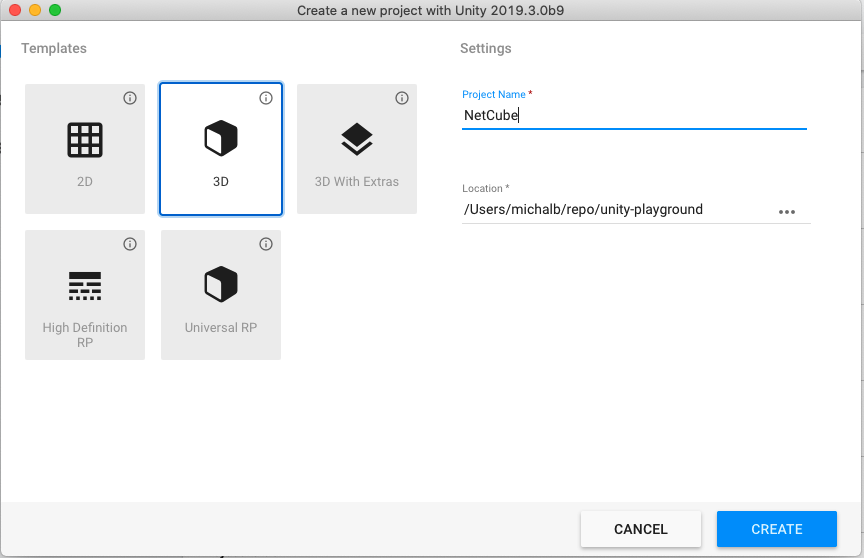
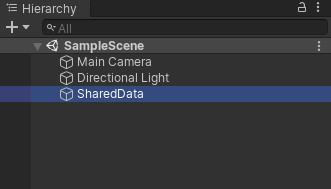
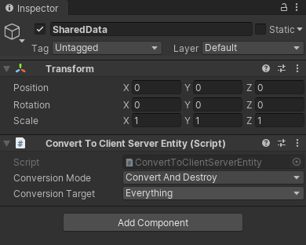
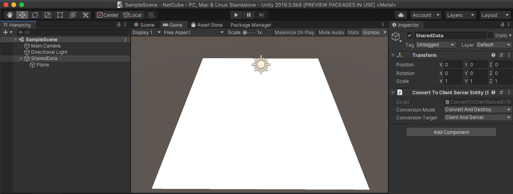
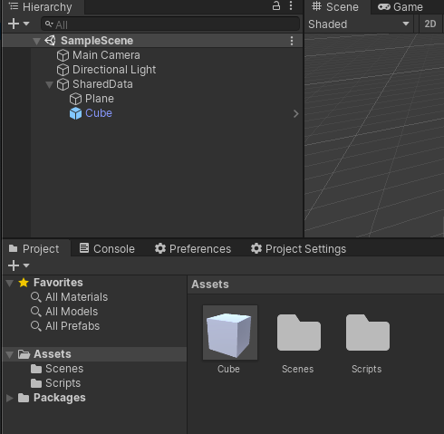
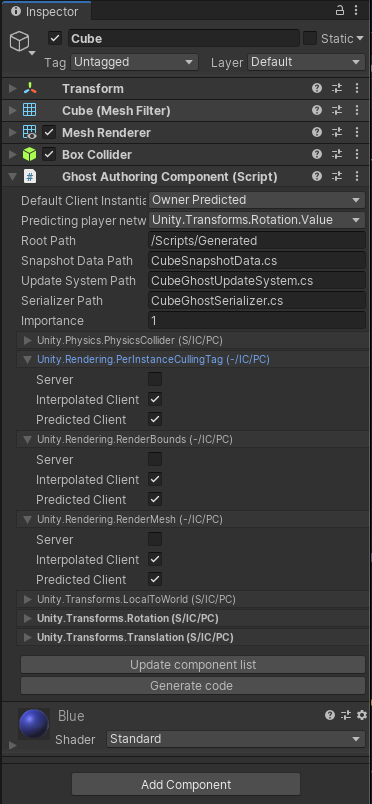
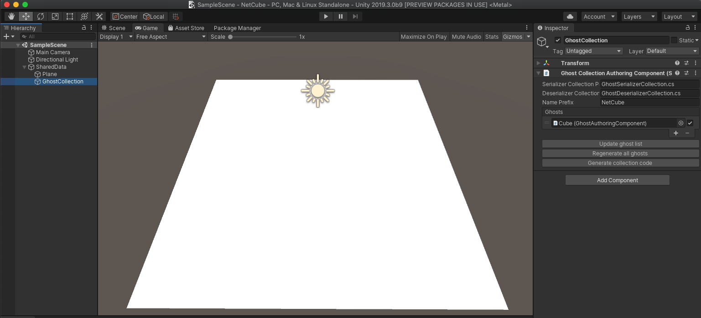

# DOTS NetCode quick start guide
This doc is a walkthrough of how to create a very simple client / server based simulation. We will be spawning and controlling a simple Prefab.

## Setup the project
The first step is to create a new project. From the hub we create a new project called "NetCube".

> NOTE: `com.unity.netcode` requires at least `Unity 2019.3.b11`



We need to add some packages to the new project, so open `Window > Package Manager`, make sure "Show preview packages" under "Advances is enabled and add the packages `Transport`, `NetCode`, `Entities`and `Hybrid Renderer`.

## Create the initial scene

To start off we want a way to share data between the client and the server. In NetCode we achieve the seperation by creating a different world for each client and the server.

To share data between the server and the client we need create a empty GameObject and add the `ConvertToClientServerEntity` Component.





For example if we want to spawn a plane in both the client and the server world we can just simply create a plane under `SharedData`, right click `SharedData` and select `3D Object > Plane`. 



## Create the ghost prefab

To make this scene run with a client / server setup we need to create a definition of the networked object - called a ghost. We start by creating a cube in our scene, e.g. `3D Object > Cube`. Then we need to create a prefab by dragging the "Cube" GameObject to the Assets panel in Unity.



We want to be able to indentify our Player and in Netcode we usually do that by PlayerId. So lets start by creating and adding a simple component that we will use to identify our cube with. 

```c#
using Unity.Entities;
using Unity.NetCode;

[GenerateAuthoringComponent]
public struct MovableCubeComponent : IComponentData
{
    [GhostDefaultField]
    public int PlayerId;
}
```

Then add the `MovableCubeComponent` to our `Cube` Prefab.

Next we add a `Ghost Authoring Component` to the prefab. In the inspector for the `Ghost Authoring Component` we can update the list of components by clicking "Update component list". The Translation and Rotation components should get values setup by default. All we need to do is expand the components in this list and select where they should be present. In our case we want to disable `PerInstanceCullingTag` and `RenderMesh` on the server. This is because the server is not supposed to render anything, and interpolated objects on the client are not supposed to simulate anything.

Make sure to change the `Default Client Instantiation` to `Owner Predicted` this will make sure that we predict our own movement.



With this in place we click "Generate Code" in the `Ghost Authoring Component`.

## Hooking up the collections
In order for the NetCode to know which Ghosts to use we need to setup a GhostCollection. Because both the client and the server need to know about these Ghosts we create it under our SharedData. Right click on `SharedData` and chose `Create Empty`. I will rename it to GhostCollection and then add a `GhostCollectionAuthoringComponent`.



In the `Inspector` click on the "Update ghost list" and then "Generate collection code".

## Establishing a connection
The next thing we need to do is make sure the server starts listening for connections, the client connects and all connections are marked as "in game" so the NetCode start sending snapshots. We do not need a full flow in this case, so we will just write the minimal amount of code to set it up. Create a file called `Game.cs` under Assets and add this code to it.
```c#
using System;
using Unity.Entities;
using Unity.NetCode;
using Unity.Networking.Transport;
using Unity.Burst;

// Control system updating in the default world
[UpdateInWorld(UpdateInWorld.TargetWorld.Default)]
public class Game : ComponentSystem
{
    // Singleton component to trigger connections once from a control system
    struct InitGameComponent : IComponentData
    {
    }
    protected override void OnCreate()
    {
        RequireSingletonForUpdate<InitGameComponent>();
        // Create singleton, require singleton for update so system runs once
        EntityManager.CreateEntity(typeof(InitGameComponent));
    }

    protected override void OnUpdate()
    {
        // Destroy singleton to prevent system from running again
        EntityManager.DestroyEntity(GetSingletonEntity<InitGameComponent>());
        foreach (var world in World.AllWorlds)
        {
            var network = world.GetExistingSystem<NetworkStreamReceiveSystem>();
            if (world.GetExistingSystem<ClientSimulationSystemGroup>() != null)
            {
                // Client worlds automatically connect to localhost
                NetworkEndPoint ep = NetworkEndPoint.LoopbackIpv4;
                ep.Port = 7979;
                network.Connect(ep);
            }
            #if UNITY_EDITOR
            else if (world.GetExistingSystem<ServerSimulationSystemGroup>() != null)
            {
                // Server world automatically listen for connections from any host
                NetworkEndPoint ep = NetworkEndPoint.AnyIpv4;
                ep.Port = 7979;
                network.Listen(ep);
            }
            #endif
        }
    }
}
```

Next we need a way to tell the server we are ready to start playing. To do this we can use `Rpc` calls that are availeble in the NetCode package.

We can continue in our `Game.cs` by first creating a `RpcCommand` that we will use to tell the server we are ready to start playing now.

```c#
[BurstCompile]
public struct GoInGameRequest : IRpcCommand
{
    public void Deserialize(DataStreamReader reader, ref DataStreamReader.Context ctx)
    {
    }

    public void Serialize(DataStreamWriter writer)
    {
    }
    [BurstCompile]
    private static void InvokeExecute(ref RpcExecutor.Parameters parameters)
    {
        RpcExecutor.ExecuteCreateRequestComponent<GoInGameRequest>(ref parameters);
    }

    public PortableFunctionPointer<RpcExecutor.ExecuteDelegate> CompileExecute()
    {
        return new PortableFunctionPointer<RpcExecutor.ExecuteDelegate>(InvokeExecute);
    }
}
```

> NOTE: Do not forget the `BurstCompile` Attribute on `InvokeExecute`

And to make sure `NetCode` handles the command we also create a `RpcCommandRequestSystem` 

```c#
// The system that makes the RPC request component transfer
public class GoInGameRequestSystem : RpcCommandRequestSystem<GoInGameRequest>
{
}
```

Next lets make sure we can send input from the client to the server. To do this we create a `ICommandData` struct. This struct will be responsible serialize and deserialize our input data. 

We can create the script `CubeInput.cs` and write our CubeInput CommandData.

```c#
public struct CubeInput : ICommandData<CubeInput>
{
    public uint Tick => tick;
    public uint tick;
    public int horizontal;
    public int vertical;

    public void Deserialize(uint tick, DataStreamReader reader, ref DataStreamReader.Context ctx)
    {
        this.tick = tick;
        horizontal = reader.ReadInt(ref ctx);
        vertical = reader.ReadInt(ref ctx);
    }

    public void Serialize(DataStreamWriter writer)
    {
        writer.Write(horizontal);
        writer.Write(vertical);
    }

    public void Deserialize(uint tick, DataStreamReader reader, ref DataStreamReader.Context ctx, CubeInput baseline,
        NetworkCompressionModel compressionModel)
    {
        Deserialize(tick, reader, ref ctx);
    }

    public void Serialize(DataStreamWriter writer, CubeInput baseline, NetworkCompressionModel compressionModel)
    {
        Serialize(writer);
    }
}
```

So our command stream will consist of the current `tick` and our `horizontal` and `vertical` movements.

In the same fashion as `Rpc`, `ICommandData` also needs a few systems to handle the command. So lets add them.

```c#
public class NetCubeSendCommandSystem : CommandSendSystem<CubeInput>
{
}
public class NetCubeReceiveCommandSystem : CommandReceiveSystem<CubeInput>
{
}
```

And then we want to sample our input that we will send over the wire. So let's create a System for that to.

```c#
[UpdateInGroup(typeof(ClientSimulationSystemGroup))]
public class SampleCubeInput : ComponentSystem
{
    protected override void OnCreate()
    {
        RequireSingletonForUpdate<NetworkIdComponent>();
        RequireSingletonForUpdate<EnableNetCubeGhostReceiveSystemComponent>();
    }

    protected override void OnUpdate()
    {
        var localInput = GetSingleton<CommandTargetComponent>().targetEntity;
        if (localInput == Entity.Null)
        {
            var localPlayerId = GetSingleton<NetworkIdComponent>().Value;
            Entities.WithNone<CubeInput>().ForEach((Entity ent, ref MovableCubeComponent cube) =>
            {
                if (cube.PlayerId == localPlayerId)
                {
                    PostUpdateCommands.AddBuffer<CubeInput>(ent);
                    PostUpdateCommands.SetComponent(GetSingletonEntity<CommandTargetComponent>(), new CommandTargetComponent {targetEntity = ent});
                }
            });
            return;
        }
        var input = default(CubeInput);
        input.tick = World.GetExistingSystem<ClientSimulationSystemGroup>().ServerTick;
        if (Input.GetKey("a"))
            input.horizontal -= 1;
        if (Input.GetKey("d"))
            input.horizontal += 1;
        if (Input.GetKey("s"))
            input.vertical -= 1;
        if (Input.GetKey("w"))
            input.vertical += 1;
        var inputBuffer = EntityManager.GetBuffer<CubeInput>(localInput);
        inputBuffer.AddCommandData(input);
    }
}
```

Finally we want to create a system that is able to read the `CommandData` and move the player.

```c#
[UpdateInGroup(typeof(GhostPredictionSystemGroup))]
public class MoveCubeSystem : ComponentSystem
{
    protected override void OnUpdate()
    {
        var group = World.GetExistingSystem<GhostPredictionSystemGroup>();
        var tick = group.PredictingTick;
        var deltaTime = Time.DeltaTime;
        Entities.ForEach((DynamicBuffer<CubeInput> inputBuffer, ref Translation trans, ref PredictedGhostComponent prediction) =>
        {
            if (!GhostPredictionSystemGroup.ShouldPredict(tick, prediction))
                return;
            CubeInput input;
            inputBuffer.GetDataAtTick(tick, out input);
            if (input.horizontal > 0)
                trans.Value.x += deltaTime;
            if (input.horizontal < 0)
                trans.Value.x -= deltaTime;
            if (input.vertical > 0)
                trans.Value.z += deltaTime;
            if (input.vertical < 0)
                trans.Value.z -= deltaTime;
        });
    }
}
```


## Tie it together

One last vital part is missing and its the systems that will handle when we go in game on the client and what to do when a client connects on the server.

The Client is simple enough, we want to be able to send a `Rpc` to the server when we have connected that we are ready to start playing.

```c#
// When client has a connection with network id, go in game and tell server to also go in game
[UpdateInGroup(typeof(ClientSimulationSystemGroup))]
public class GoInGameClientSystem : ComponentSystem
{
    protected override void OnCreate()
    {
    }

    protected override void OnUpdate()
    {
        Entities.WithNone<NetworkStreamInGame>().ForEach((Entity ent, ref NetworkIdComponent id) =>
        {
            PostUpdateCommands.AddComponent<NetworkStreamInGame>(ent);
            var req = PostUpdateCommands.CreateEntity();
            PostUpdateCommands.AddComponent<GoInGameRequest>(req);
            PostUpdateCommands.AddComponent(req, new SendRpcCommandRequestComponent { TargetConnection = ent });
        });
    }
}
```


And on the server we want to make sure that when we receive a `GoInGameRequest` we will create and spawn a `Cube` for that player.

```c#
// When server receives go in game request, go in game and delete request
[UpdateInGroup(typeof(ServerSimulationSystemGroup))]
public class GoInGameServerSystem : ComponentSystem
{
    protected override void OnUpdate()
    {
        Entities.WithNone<SendRpcCommandRequestComponent>().ForEach((Entity reqEnt, ref GoInGameRequest req, ref ReceiveRpcCommandRequestComponent reqSrc) =>
        {
            PostUpdateCommands.AddComponent<NetworkStreamInGame>(reqSrc.SourceConnection);
            UnityEngine.Debug.Log(String.Format("Server setting connection {0} to in game", EntityManager.GetComponentData<NetworkIdComponent>(reqSrc.SourceConnection).Value));
            var ghostCollection = GetSingleton<GhostPrefabCollectionComponent>();
            var ghostId = NetCubeGhostSerializerCollection.FindGhostType<CubeSnapshotData>();
            var prefab = EntityManager.GetBuffer<GhostPrefabBuffer>(ghostCollection.serverPrefabs)[ghostId].Value;
            var player = EntityManager.Instantiate(prefab);
            
            EntityManager.SetComponentData(player, new MovableCubeComponent { PlayerId = EntityManager.GetComponentData<NetworkIdComponent>(reqSrc.SourceConnection).Value});
            PostUpdateCommands.AddBuffer<CubeInput>(player);
            
            PostUpdateCommands.SetComponent(reqSrc.SourceConnection, new CommandTargetComponent {targetEntity = player});

            PostUpdateCommands.DestroyEntity(reqEnt);
        });
    }
}
```

And thats it. 

## Testing it

Now everything should be good to go. Open `Multiplayer > PlayMode Tools` and make sure "PlayMode Type" is set to "Client & Server". Enter playmode and you should see the cube spawn. By pressing `a`, `s`, `d`, `w` you should also be able to move the Cube around.

So to recap:

1. We Created a `GameObject` to hold SharedData between the Client and the Server. By adding the `ConvertToClientServerEntity` `Component`.
2. We created our Prefab out of a simple `3D Cube` and added a `GhostAuthoringComponent` to it as well as the  `MovableCubeComponent` to it.
3. We updated and generated code for the Ghost through the `GhostAuthoringComponent` Inspector view.
4. We created a GhostCollection by adding the `GhostCollectionAuthoringComponent` to a Empty GameObject.
   1. We Updated the ghost list and generated collection code.
5. We established a connection between the client and the server.
6. We wrote a `Rpc` to tell the server we are ready to play.
7. We wrote a `ICommandData` to be serialize Game Input.
8. We wrote a Client system to send a `Rpc`
9. We wrote a Server system to handle our incomming `Rpc`.