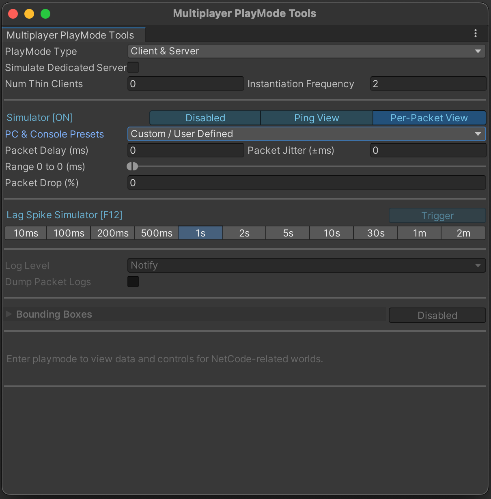
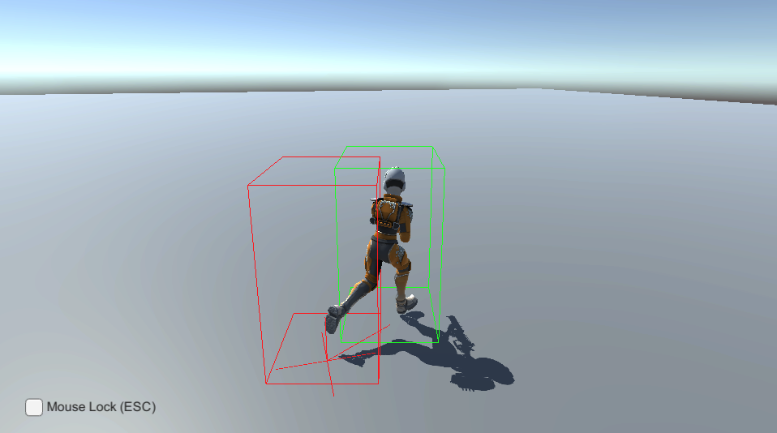

# PlayMode Tool

Use the Netcode for Entities PlayMode Tool to simulate a network and debug your multiplayer project while running in Play mode.

Open the __PlayMode Tools__ window from **Window** > **Multiplayer** > **PlayMode Tools** to do the following:

* Select the behavior of the Netcode for Entities bootstrapping flow (assuming it's enabled) when you enter Play mode. This controls whether [`ClientServerBootstrap`](https://docs.unity3d.com/Packages/com.unity.netcode@latest?subfolder=/api/Unity.NetCode.ClientServerBootstrap.html) creates a client world, a server world, or both client and server worlds, and whether they connect automatically.
* Enable and configure the [network simulator](../network-connection.md#network-simulator).
* Configure the number of [thin-clients](thin-clients.md) to use.
* Change the current [logging level](logging.md), and control whether or not Unity creates packet dumps.
* View, control, and debug Netcode for Entities client and server worlds and their transport data (only available after entering Play mode).
* Display bounding box gizmos for all ghosts.

## Properties

| **Property** | **Description** |
|---|---|
| __PlayMode Type__ | Determines the behavior of the Netcode for Entities bootstrapping flow (assuming it's enabled) when entering Play mode. __Client__ spawns only the client world, __Server__ spawns only the server world, and __Client & Server__ spawns one of each. |
| __Simulate Dedicated Server__ | Determines the build environment that Netcode for Entities emulates when it bakes the ServerWorld version of the sub scenes. For example, a client-hosted game server might have some additional assemblies that are unavailable on a Dedicated Game Server (DGS) build, so with this toggle unchecked, types in those assemblies show up on the entities within the ServerWorld. This option is only visible when **Client Hosted Builds** are enabled in the **Project Settings**, because it defaults to emulating a DGS if your client can't support hosting a game server. |
| __Num Thin Clients__ | Set the number of [thin clients](thin-clients.md) spawned and automatically maintained in-Editor by the package. You can use these clients to test multiplayer PvP interactions. Thin clients can't present and don't spawn any ghosts they receive from the server. However, they can generate fake input, and simulate a realistic load on the server. |

> [!NOTE]
> Be aware that this window, when open, adheres strictly to the target **Num Thin Clients** value at runtime. If you've spawned any thin clients yourself that take the total number of thin clients over **Num Thin Clients**, then those thin clients will be destroyed.

## Emulate client network conditions

Use the network emulator to replicate specific network conditions while your game is running in the Unity Editor. When you enable network emulation, you can set the packet delay and packet loss in the following ways:

 - Manually set the packet delay and drop values.
 - Select a preset. For example, '4G' or 'Broadband'.

Frequently testing your gameplay with the emulator enabled allows you to get a more accurate picture of how real-world network latency impacts gameplay quality. Gameplay tests also demonstrate the performance implications of the rollback and re-simulate logic involved in client prediction. For example, a higher ping requires the client to perform more prediction ticks which uses higher CPU resources on the client's side.

To manually specify network conditions, enter custom values in the following fields:
- **RTT Delay**
- **RTT Jitter**
- **Packet Drop**

If you use **Packet View**, enter custom values in the following fields:
- **Packet Delay**
- **Packet Jitter**
- **Packet Drop**

Unity runs the network emulation using a [Unity Transport pipeline stage](https://docs.unity3d.com/Packages/com.unity.transport@latest?subfolder=/manual/pipelines-usage.html). This stage is only added to the client driver and so Unity applies these settings to incoming and outgoing packets. To view the combined impact on the ping, open the dropdown and select __Ping View__.

| **Property** | **Description** |
|---|---|
| __RTT Delay (ms)__ | Use this property to emulate round trip time (RTT). This property delays the incoming and outgoing packet (in ms) such that the sum of the delays equals the specified value. |
| __RTT Jitter (ms)__ | Use this property to add (or subtract) a random value to the delay, which makes the delay a value between the delay you have set plus or minus the jitter value. For example, if you set __RTTDelay__ to 45 and __RTTJitter__ to 5, you will get a random value between 40 and 50. |
| __Packet Drop (%)__ | Use this property to simulate bad connections where not all packets arrive. Specify a value (as a percentage) and Netcode for Entities discards that percentage of packets from the total it receives. For example, set the value to 5 and Netcode for Entities discards 5% of all incoming and outgoing packets. |
| __Packet Fuzz (%)__ | Use this property to simulate security-related person-in-the-middle (PITM) attacks, where malicious clients attempt to bring down your server (or other clients) by intentionally serializing bad data. |
| __Auto Connect Address (Client only)__ | Specify which server address a client connects to. This field only appears if you set __PlayMode Type__ to __Client__. If you're not using auto connect functionality, your code needs to call `ClientServerBootstrap.IsEditorInputtedAddressValidForConnect` and manually connect to the output `NetworkEndpoint`. |
| __Auto Connect Port (Client only)__ | Override and/or specify which port to use for both listening (server) and connecting (client) |

When you enable network emulation, Unity forces the Unity Transport's network interface to be a full UDP socket. Otherwise, Unity uses an IPC (Inter-Process Communication) connection when both client and server worlds exist in the same process. Refer to [`IPCAndSocketDriverConstructor`](https://docs.unity3d.com/Packages/com.unity.netcode@latest?subfolder=/api/Unity.NetCode.IPCAndSocketDriverConstructor.html) for more information.

> [!NOTE]
> Unity uses `AutoConnectAddress` and `AutoConnectPort` when it automatically connects the client to a server in client-only mode, and overrides the values set in the [`ClientServerBootstrap`](https://docs.unity3d.com/Packages/com.unity.netcode@latest?subfolder=/api/Unity.NetCode.ClientServerBootstrap.html). However, Unity ignores these fields when the bootstrap sets `AutoConnectPort` to 0. You can use the __Connect__ button in the PlayMode Tools window to force the connection to the target `AutoConnectAddress` and `AutoConnectPort`.

### Initialize the network emulator from the command line

Use the command line arguments `--loadNetworkSimulatorJsonFile [optionalJsonFilePath]` to load an existing JSON (.json) `SimulatorUtility.Parameters` preset. Alternatively, use `--createNetworkSimulatorJsonFile [optionalJsonFilePath]` to generate a default JSON file automatically. The default file name (if unspecified) is `NetworkSimulatorProfile.json`.

Passing in either parameter always enables a simulator profile, even in the error case. If the file isn't found or generated, it uses the `NetworkSimulatorSettings.DefaultSimulatorParameters`.

> [!NOTE]
> You can only enable network emulation in development builds.

## Visualize bounding boxes on GameObjects

Entities that use [Entities Graphics](https://docs.unity3d.com/Packages/com.unity.entities.graphics@latest?subfolder=/manual/index.html) automatically draw bounding boxes. To draw bounding boxes around objects that don't use entities graphics, add the `GhostDebugMeshBounds` component to the GameObject's supporting entity. You can call `Initialize` for convenience to set it up.

Refer to [`GhostPresentationGameObjectEntityOwner`](https://docs.unity3d.com/Packages/com.unity.netcode@latest?subfolder=/api/Unity.NetCode.Hybrid.GhostPresentationGameObjectEntityOwner.html) for an example.

## Use the Playmode Tool window with Multiplayer Play Mode

You can use the Playmode Tool with [Multiplayer Play Mode](https://docs.unity3d.com/Packages/com.unity.multiplayer.playmode@latest?subfolder=/manual/index.html) to test a [virtual player](https://docs.unity3d.com/Packages/com.unity.multiplayer.playmode@latest?subfolder=/manual/virtual-players/virtual-players.html) in a project that uses Netcode for Entities.

1. [Install the Multiplayer Play Mode package](https://docs.unity3d.com/Packages/com.unity.multiplayer.playmode@latest?subfolder=/manual/install.html).
2. Open the Multiplayer Play Mode window (**Window** > **Multiplayer Play Mode**).
3. [Activate a virtual player](https://docs.unity3d.com/Packages/com.unity.multiplayer.playmode@latest?subfolder=/manual/virtual-players/virtual-players-enable.html).
4. In a virtual player's Play mode window, navigate to **Layout** and select **PlayMode Tool**.
5. Set the **PlayMode Type** to make this clone act as a __Client__, a __Server__, or both a __Client & Server__.

>[!NOTE]
> If the [Dedicated Server package](https://docs.unity3d.com/Packages/com.unity.dedicated-server@latest?subfolder=/manual/index.html) exists in your project, the [Multiplayer Role](https://docs.unity3d.com/Packages/com.unity.dedicated-server@latest?subfolder=/manual/multiplayer-roles.html) you select overrides the PlayMode Type.