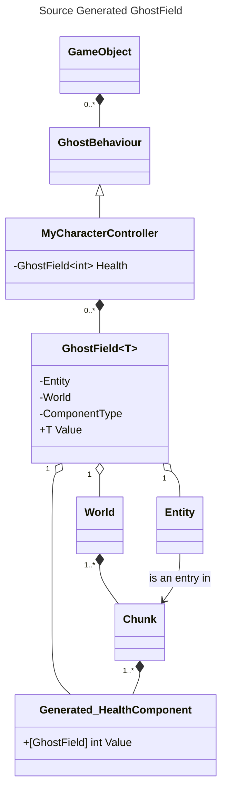
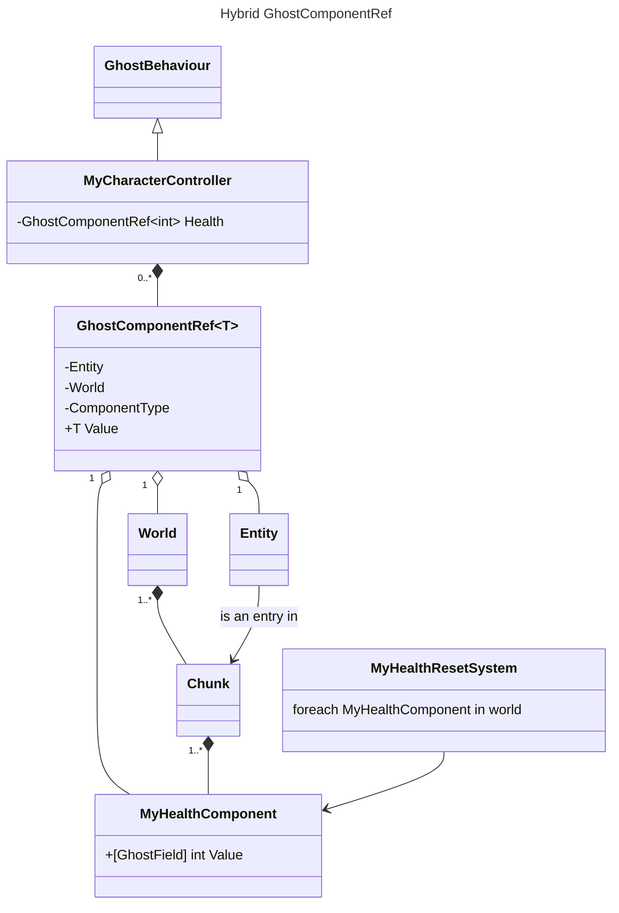

## Accessing Networked State using GhostField

GhostField acts as a "smart pointer" to ECS component data.
We can have two versions of it:
- One that source gens the underlying component for users. Users wouldn't be able to know which type to use to interact with it, the only way to interact with it would be through the GhostField that generated it.
- Another way would be using a "bridge" variable that allows specifying which component type to interact with, while still automatically handling component registration for users. Users declare this component themselves and can interact with it through their own systems.
    - We *could* have GhostField accept IComponentData and branch the logic under the same GhostField, instead of having two separate mechanism. The issue with this is that bridge variables and source generated variables behave differently. Two bridge variables with the same component type, on the same GameObject share the same component on the entity. For example GhostBridge\<MyHealthComponent> in Character and GhostBridge\<MyHealthComponent> in HealthMonobehaviour both point to the same data. While a GhostField\<int> doesn't share the int with another GhostField\<int>.
    - Having this split in behaviour being implicit would be too error prone, it's better to have users explicitely decide that behaviour.



IDEs don't know about generated components. Trying to use a generated component from user code would not be possible.
Hybrid GhostComponentRef uses a user defined IComponentData that can then also be accessed by user defined ECS systems. It's a way to "hardcode" a component used by GameObjects so it can be reused elsewhere.


This way, you can also share a component's value with other GhostBehaviours on the same ghost.
```csharp
    public partial class OtherBehaviour : GhostBehaviour
    {
        GhostComponentRef<MyShieldComp> m_SameShieldComponent; // shared with other behaviours on the same ghost, this is going to be the same component data
    }
```

Future note: we can potentially come back to this with C#13's partial properties.

Doing a GetComponentData everytime you access a GhostField state can have overhead. A solution is to cache a pointer to the chunk data. See implementation for details.


### OnValueChanged for state syncing

With GameObjects, you want to avoid having per-monobehaviour state polling for value changed like you'd do with entities. The overhead would be too high. Callback based OnValueChanged can be a good way to only trigger use code when necessary.
NGO has OnValueChange per GhostField. This can make it hard to understand which variable updates before which.
An idea can be to have a per GhostBehaviour OnValuesChanged and only store a "previous value" on GhostField.
TODO-next we need to iterate on this
TODO-next how would that work for predicted state? Do we trigger an OnValueChange on every rollback and replay?
See this thread for some arguments https://unity.slack.com/archives/C057V46DWFK/p1727967668701059

```csharp

     void Awake()
     {
         // bad since it's unknown in what order those callbacks will be called. If there's a dependency between the two, users can't control it.
         m_Shield.OnValueChanged += (int previous, int current)
         {
             if (m_Shield.Value == 0)
                 DoSomething();
         }
         m_Mana.OnValueChanged += (int previous, int current)
         {

         }
     }
```

```csharp
     // Can have a callback for the whole GhostBehaviour
     // We can make it so it respects monobehaviour sort order --> like we already do for PredictionUpdate
     // allows users to control order of consumption
     Event OnShieldChange;
     public void OnStateChanged()
     {
         if (m_Shield.Value != m_Shield.PreviousValue && m_Shield.Value == 0)
         {
             DoSomething();
             OnShieldChange.invoke();
         }
         if (m_Mana.Value != m_Shield.PreviousValue)
             DoSomethingElse(); // this can assume shield is already up to date
     }
```

### Networked lists

We could just return a `DynamicBuffer` to GO users for their network list, but if we decide later to change our underlying implementation (for example, what if we stored the netvar's value directly in the snapshot buffer instead of a component?). We'd be stuck with DynamicBuffer's API. It'd maybe be better
if we just wrapped this ourselves and expose the [i], get, set APIs we want to support.

TODO-next

### "Partial" GhostBehaviour Discussion

Either we require a GhostBehaviour to be partial to automatically register its private Netvars, or we require all Netvars to be public (so that netcode can get them). Either way, netvar registration is slightly intrusive. going with the partial class requirement for now, as it allows keeping the ability for users to have encapsulation.

### Instead of sourcegen, why not have generic components?

```csharp
public struct GenericGhostComponent<T> : IComponentData where T : unmanaged
{
    [GhostField] public T Value;
}
```
- You can't have a GenericGhostComponent<int> since there might be multiple ints on the same ghost
- You can't use generic components in general, we don't support them in our sourcegen right now
    - input's generated component works since we just reuse known structs. the inner input is known and the component to replicate is a generic type (InputBufferData<T>). We just do `InputBufferData<UserInput>` and dynamically construct generic types in source gen using existing syntax trees.
- We COULD just improve our sourcegen to support netvars or generic components
- BUT looks like we can create new compilation artifacts dynamically. And reference syntax trees from those to generate components in sourcegen. Going with that for now.

### Variants
Variants are there for
- overriding replication behaviour for types users or Netcode doesn't control (e.g. LocalTransform).
- having different replication schemas for the same type

Users could still use the bridge to directly use a component type that's not replicated and then from there add a variant the usual way.
It's mostly an entities concept. Potentially, if other parts of the engine migrate to using components and entities, we could create variants for those as well. For example
- if AI moves some of their state to components, we could add a variant to make that replicated.
  For having different replication config for the same component, again that's mostly an ECS thing. With ECS, I should be able to reuse the same component, but on prefab A have it replicate with field x and on prefab B with field y.

So what if I wanted to reuse my GhostBehaviour on different prefabs, but with different replication settings? We could potentially have a version of variants that work the same way, but for generated components. But at that point, we could also have a way to have runtime settings for those instead of sourcegenned and just offer to change that config at runtime.

TBD and doesn't need to be solved now.

### Possible Designs Archive

- [Replicate] field attribute
    - magic IL weaving is dangerous and hard to follow. I have a field int, it's hard to figure out that in fact, in the background there's this machinery doing all sorts of
      netcode things to replicate it. It's also hard to debug as a user. You also have a worst time storing metadata around this component handle
      (like "previous value" or "OnValueChanged").
      It's also not great to maintain on our side.
- GhostField type
    - Can have a "previous value" field stored in there and other metadata.
    - This gives a better signal to users that this is a smart pointer to the underlying netcode data (compared to magic [Replicate] attribute).
- Users specify what to replicate at the component level
    - That component could be an INetworkSerializable
    - More boilerplate to write for default GameObject only case. This is closer to ECS flows.
    - Could be an additional option, like a GhostComponentRef<MyComponentType>
    - Still needs some sourcegen to remove the boilerplate users would have to write to initialize the underyling entity/world
- Monobehaviour to ECS component mapping
    - Similar to Motion
    - Has Monobehaviour overhead. As a user, to track state, I need to add a monobehaviour to my GameObject.
    - Has automatic awake called, allowing to initialize world and entity automatically, no sourcegen needed.
- Specify in editor "this field is replicated" --> nice for experimentation and iteration speed.
    - It'd still require your code to be aware that this variable is replicated.
    - As a user, it's dangerous and hard to track. How do I do a code review on this? How do I "find all references"? How do I track this in my version control? Plus having this UI side
    - gives the wrong message it's meant to be used by any non-technical folks while there are pitfalls to just adding more and more bandwidth usage to your game. this can incure
    - A monetary cost that's not trivial.
    - We can still provide a "replicate this object's transform" single checkbox, that's easy and already done in this current implementation.

#### ADRs
- [Should we keep GhostVariable](https://docs.google.com/document/d/1bphz5rgCFqHGBgP44bhmlYoZbT8EjcMr_C8-ynqDJM0/edit?tab=t.0#heading=h.a115vmpc4mgz)

### GhostVariable vs GhostField name

```csharp
// right now we have
struct MyComp : IComponentData
{
   [GhostField] int myField;
}
// AND
GhostVariable<int> myField;
// OR
GhostField<int> myField
```

As a user, if I want to add some state that's networked, I'd need to ask myself two questions. Do I use the attribute or the field? Do I use the name GhostVariable or GhostField?

If it's just "GhostField" for both, you don't need to remember "GhostVariable" vs "GhostField", only one name, so it removes half the problem at least? You still have to remember attribute vs type.

So to summarize, with different names, we have two questions. type or attribute + var or field?

if they have the same name, that question becomes: type or attribute.

So going with GhostField.

Also:
GhostField would be used as the "this works the same as ECS component behaviour" primitive. For things GameObject side only, we'd potentially create a new primitive. This way, it's easy for users to migrate between GO and ECS. Their monobehaviour GhostField behaves the same as their component GhostField. No surprises, no "this managed type used to work now it doesn't".

### Replicating state on non-monobehaviours (and why we're not doing it now)
- What if we want a Scriptable Object with a GhostField? or any other non monobehaviour replication?
    - Netcode is very prefab based. We spawn a ghost client side from their prefab.
- So we'd need to create a prefab entity from that pure class? And have a way to "spawn" it server side.
- We COULD have another interface for those non-GameObject based flows, but that shouldn't be part of the main flow and doesn't need to be solved now. Plus it's something users can handle themselves as well, by creating/destroying/tracking entities just like we do.
    - Since the underlying low level layer (entities) is exposed to users, there's nothing preventing them from handling this themselves.
