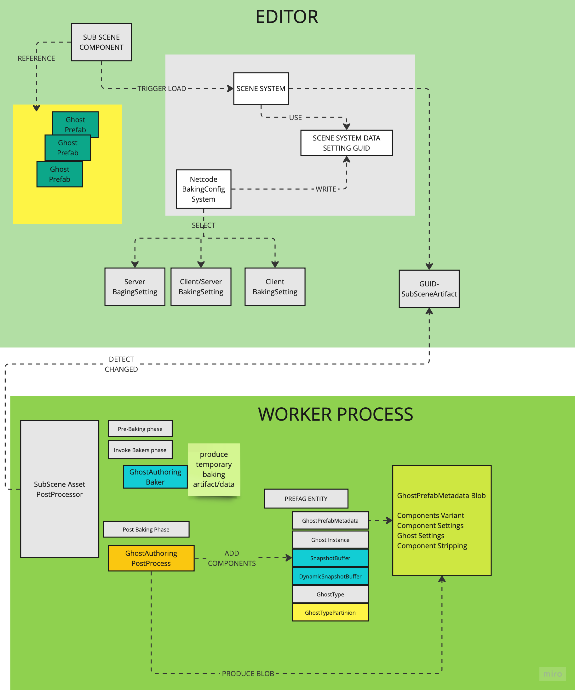

# Netcode Baking

## The ghost prefab baking and authoring flow

Netcode for Entities has its own (sufficiently complex) baking systems that are responsible to do multiple things:
1. Transferring the authoring information from the `GhostAuthoringComponent` and `GhostAuthoringInspectionComponent` to internal data structure (burst compatible)
   used by the runtime
2. Collect and pre-process the prefab serialization information:
   - All the replicated component and associate the serialization `variant` to use (see `GhostAuthoringInspectionComponent`)
   - All the per-prefab component overrides (see `GhostAuthoringInspectionComponent`).
3. Configure what components need to be stripped at runtime from the prefab based on the World destination and/or ghost modality.
4. Pre-bake pre-spawned ghost data, used by the runtime to find and initialize the in-scene replicated entities.


## The Baking Process and the NetCode artifact

Once a ghost prefab has been authored and referenced in a sub-scene (i.e by using a spawner behavior) and the entity
reference baked into a component, the prefab asset depedency is tracked by the Entities baking system and prefab entity
is added the serialized archive data.



As result of that baking process:
- Netcode specific components are added to the prefag entity.
- A binary blob asset (the `GhostPrefabMetadata`) is produced and attached to the prefab root entity.

That binary data provide the necessary glue in between authoring and runtime, and contains all the authoring options,
serialization and component stripping information.

## Netcode bakers and post-processors

//TODO ADD THE BAKER AND POST BAKERS. Is that a low level implementation details?

//TODO ADD MORE INFO ABOUT THE BUILT METADATA CONTENT. Is that a low level implementation details?

## Specify what type of baking data you need

Baking setting regulate what type of data is baked for the different world types.

| Build         | Baking Target   |
|---------------|-----------------|
| Client        | Client          |
| Server        | Server          |
| Client/Server | Client/Server   |

The baking settings available depends on the current selected build target: either `Standalone` or `DedicatedServer`

| Standalone      | Editor World  | Client World  | Server World     |
|-----------------|---------------|---------------|------------------|
| Client          | Client        | Client        | Server           |
| Client/Server   | Client/Server | Client/Server | Emulation Target |

When the DedicatedServer sub-target platform is selected, only one setting is available.

> Rationale: no rationale, it is just wrong.

| Dedicated Server | Editor World             | Client World            | Server World     |
|------------------|--------------------------|-------------------------|------------------|
| Server           | Client Or Client/Server  | Client Or Client/Server | Server           |


### Baking required for the different play modes

Based on the current settings in the PlayMode tool and the BuoldConfiguration different combination of baking
may be queued, based on the world conbination at runtime.

| Baking Configuration | Edit Mode      | Client Mode   | Server Mode      | ClientServer Mode            | Max Num Baking |
|----------------------|----------------|---------------|------------------|------------------------------|----------------|
| Client               | Client         | Client        | Server           | Client + Server              | 2              |
| ClientServer         | ClientServer   | ClientServer  | Emulation Target | ClientServer + EmulationMode | 2              |
| Server               | Client         | Client        | Server           | Client + Server              | 2              |

> IMPORTANT: The number of baking required when entering playmode can become a problem, because it may requires minutes to complete for
complex scene

Some configuration are un-intuitive and require multiple baking to be done when entering playmode.

I.e: if you specify `Client` in the build settings for Standalone, and select to use Client/Server mode (at the very least the first time)
when entering playmode 2 baking (one per each sub-scene used in the scene) will be done:
- One baking for the client worlds (if any)
- One baking for the server worlds (if any)

## Optimal baking settings for iteration speed

> Remarks: in the editor the sub-scene import process is blocking: you need to wait until completed.

> Remarks: The default Netcode For Entities setting is to use `Client` for the multiplayer build setting.
> This is quite problematic for large game/scene. It may take considerable amount of time to enter
> play-mode the first time because of the multiple baking process.

For faster and better iteration speed while working in the editor always prefer:
```
BakingSetting: ClientServer
EmulationMode: Cliented-Hosted-Server
```

This way, all the sub-scene data are baked asynchronously while in edit mode (most of the time), thus removing completely (or reducing substantially)
entering playmode / exiting playmode


