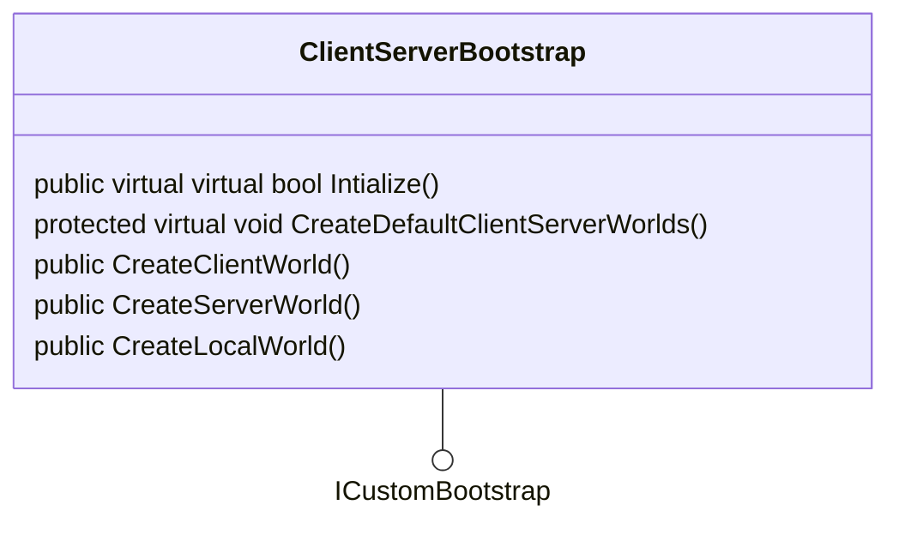
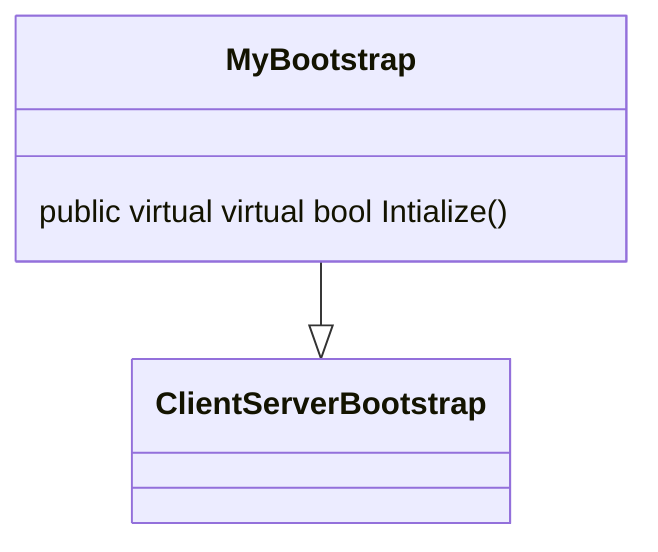

# AUTOMATIC WORLD CREATION

Netcode worlds are by default automatically created when entering playmode in the editor or in player build.

> Rationale about the design: When you hit play mode, we want the game is already in multiplayer mode: that it, ideally
> everything is already setup such that:
> - you can just see things synchronizing across the network
> - connecting/disconnecting from any server
> - ideally, drag thing in the editor and let them start replicating.
>
> The original intent was to bring Entities + Netcode for Entieis closer to a `Multiplayer by Default` scenario.

## Implementation Details

The `ClientServerBootstrap` is the class responsible to handle:
- The defualt bootstrapping when enter playmode. It implements the `ICustomBootstrap` interface
- The world management (creation) and tracking.

Each world can have its own specific set of system, for the given role type.

World systems are automatically populated by Netcode when the world are created via the ClientServerBootstrap factory methods.

Systems are filtered using the `WorldSystemFilter` attribute with the following rules:

| WorldSystemFilter | REQUIRES             |
|-------------------|----------------------|
| SERVER            | ServerSimulation     |
| CLIENT            | ClientSimulation     |
| THIN              | ThinClientSimulation |

The `CreateDefaultClientServerWorlds` default creates the necessary worlds based on the current mode switch selected
in the PlayModeTool and the
users preferences set there.

## Bootstrap customization and requirement: single inheritance chain constraint

User can customize the default bootstrapping behaviour by inheriting from ClientServerBootstrap and customize either the `Intialize` or the `CreateDefaultClientServerWorlds`.
Changin the `Initialize` method should be always preferred.

Custom systems can be added manually by the user by either:
- Adding them to the world after it has been created
- Implement their own logic to create worlds, similar to what provided by the default methods present in the `ClientServerBootstrap`.

Because of the way bootstrap is handled by Entities, it is mandatory to have one and only one bootstrap class in your project.
If multiple bootstrap inheritng from `ICustomBootstrap` exist, there is no "deterministic" guaratee or ability to inform Entities about
what it is the class to use.

For this reason, a single chain of inheritance, originating from `ClientServerBootstrap` or any of its sub-classes is mandatory.
Furthermore, if you want to have multiple boostrapper for different needs, these need to be enabled via `ifdef` or
more complex and ad-hoc mechanism for bootstrapping (i.e via scriptable delegate or other delegate form) can be used instead.

## The problem with the current design

The current approach, creating the world automatically (based on the selected modality) does have some major nuances:

- Break any project as soon as Netcode for Entiies is installed. It usually requires some changes in the Scene (disable the automatic boostrap per-scene) or
  for the whole project (NetcodeConfig).
- To implement the most basic flow (front-end scenes) it is again necessary to disable the behavior on a per-scene basis
- Still necessary to implement the most basic bootstrap to auto-connect client and server in self-hosting mode.
- Only work great when using direct client/server connection. When relay is used, it also requires special handling and flows.

