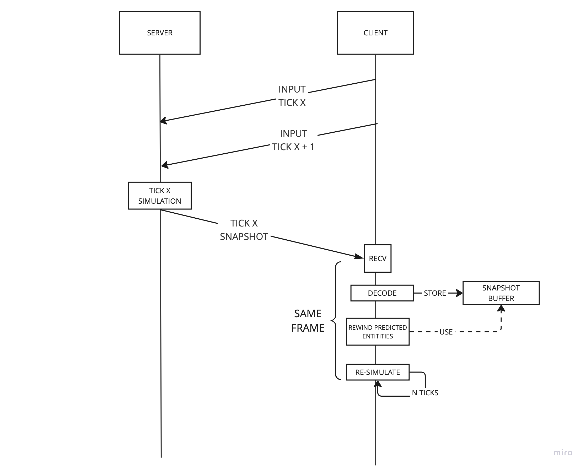
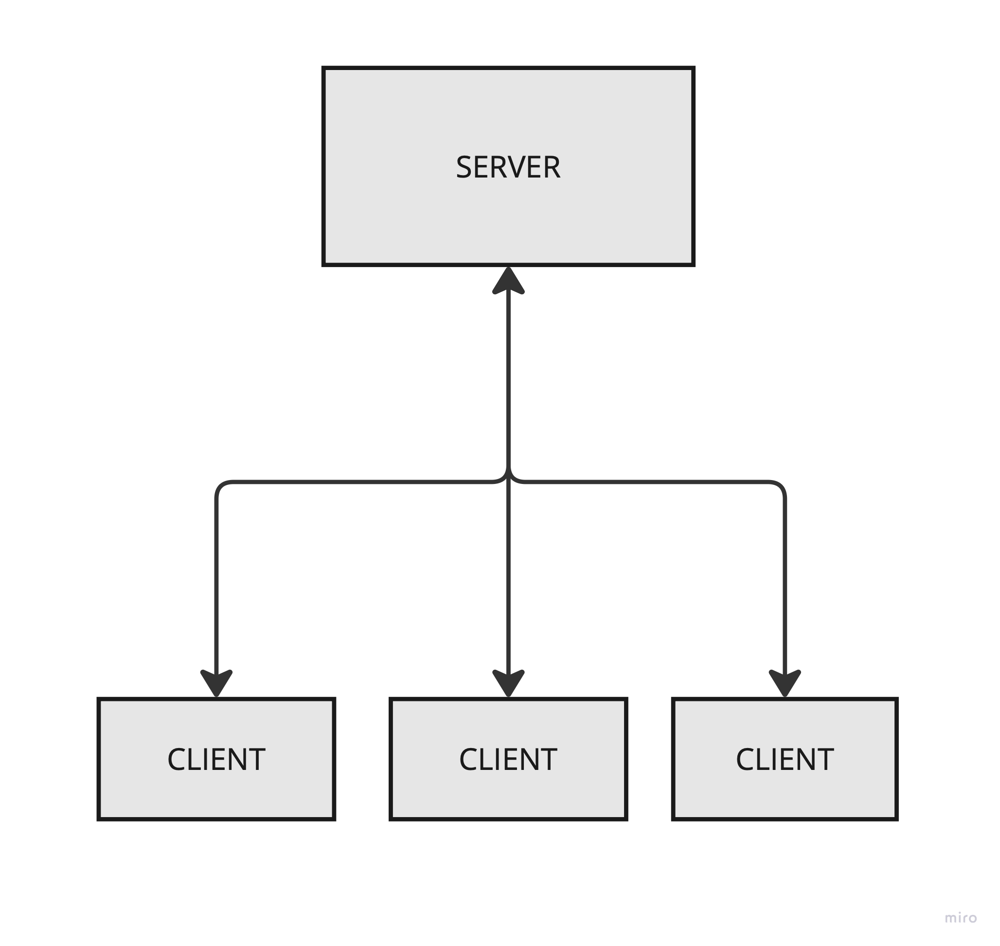
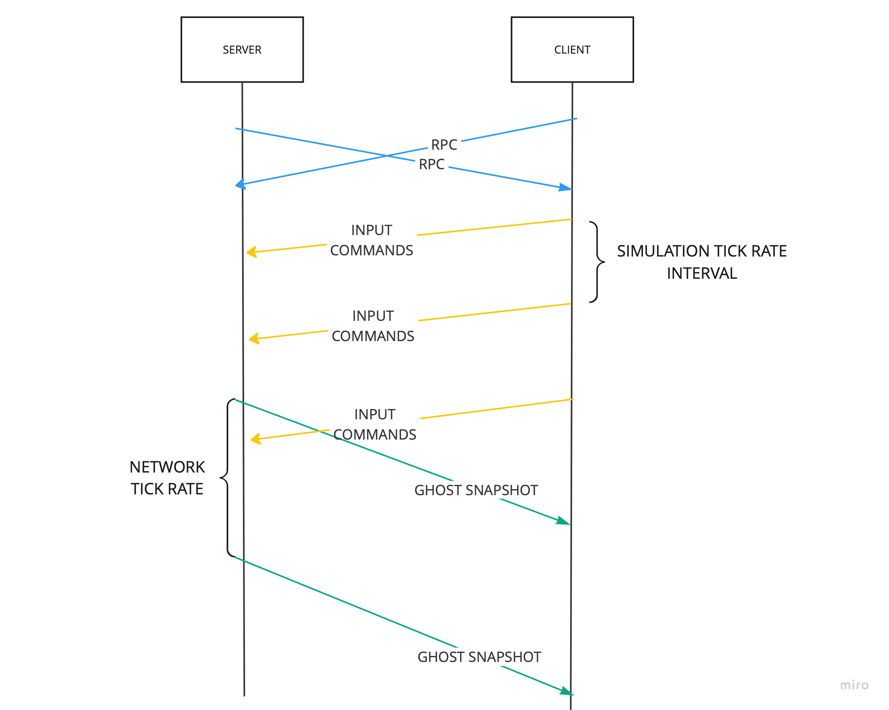
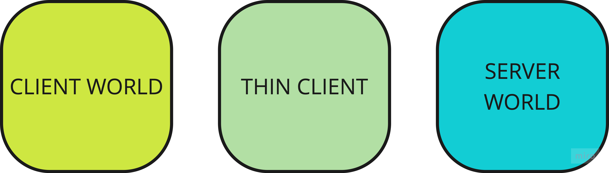
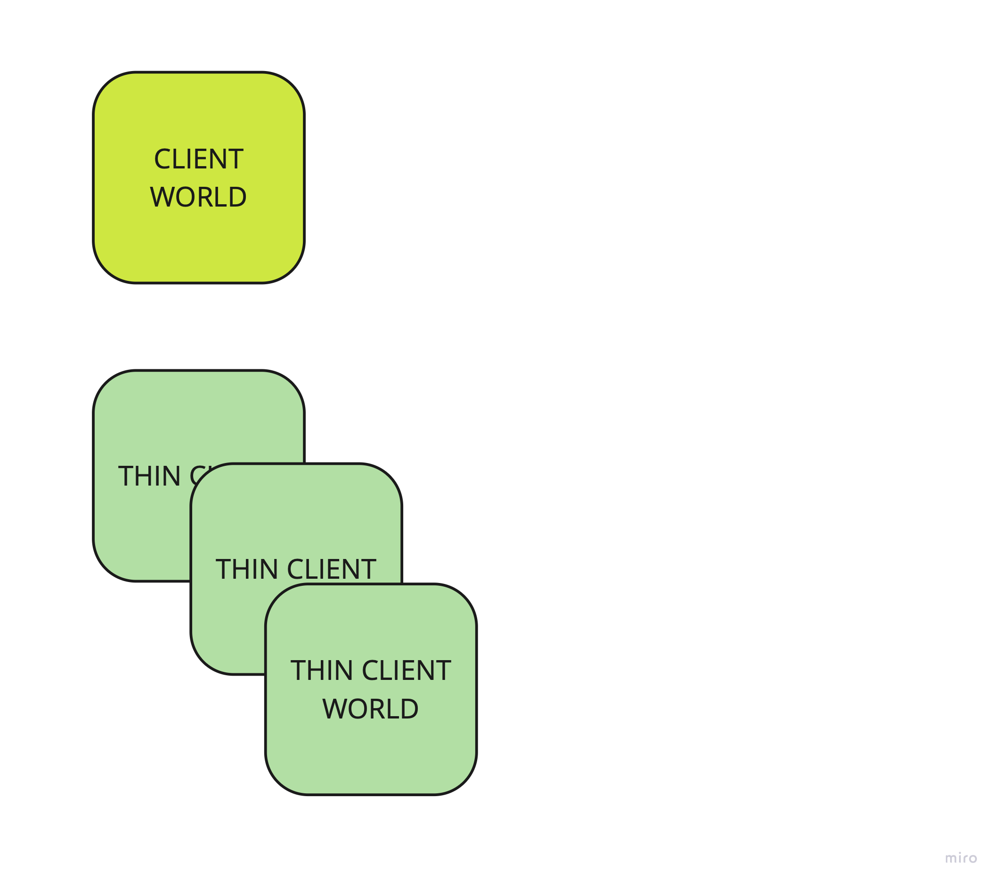
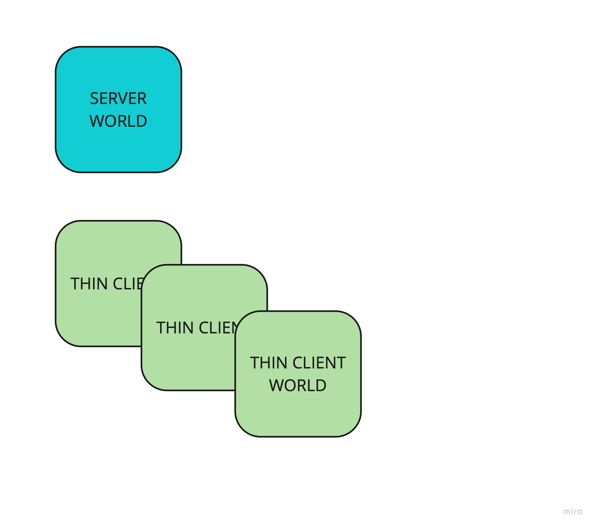
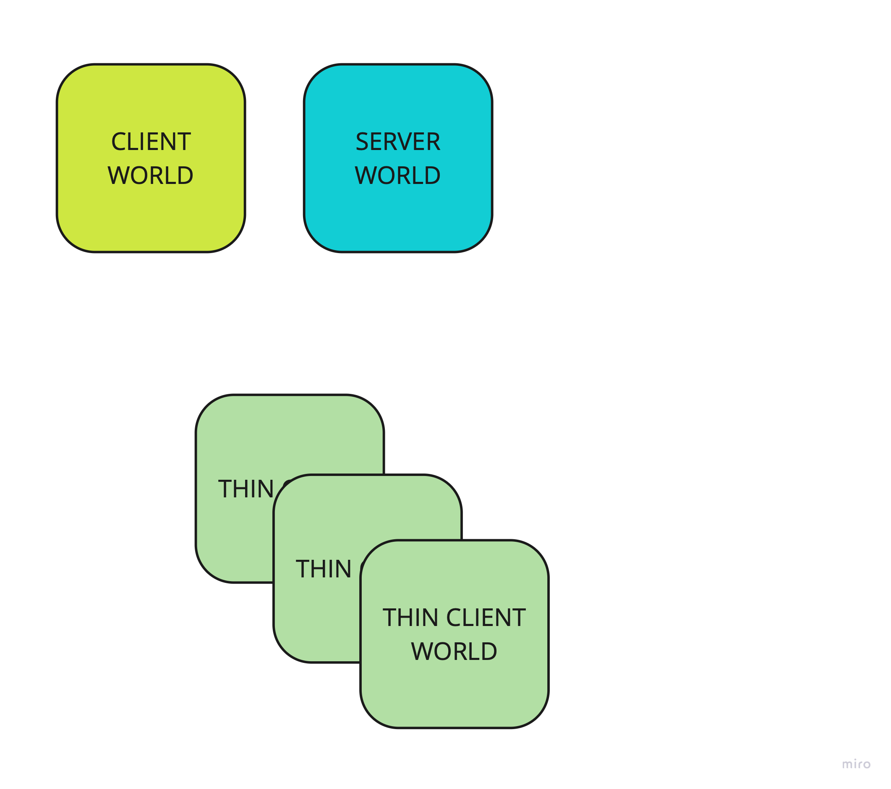
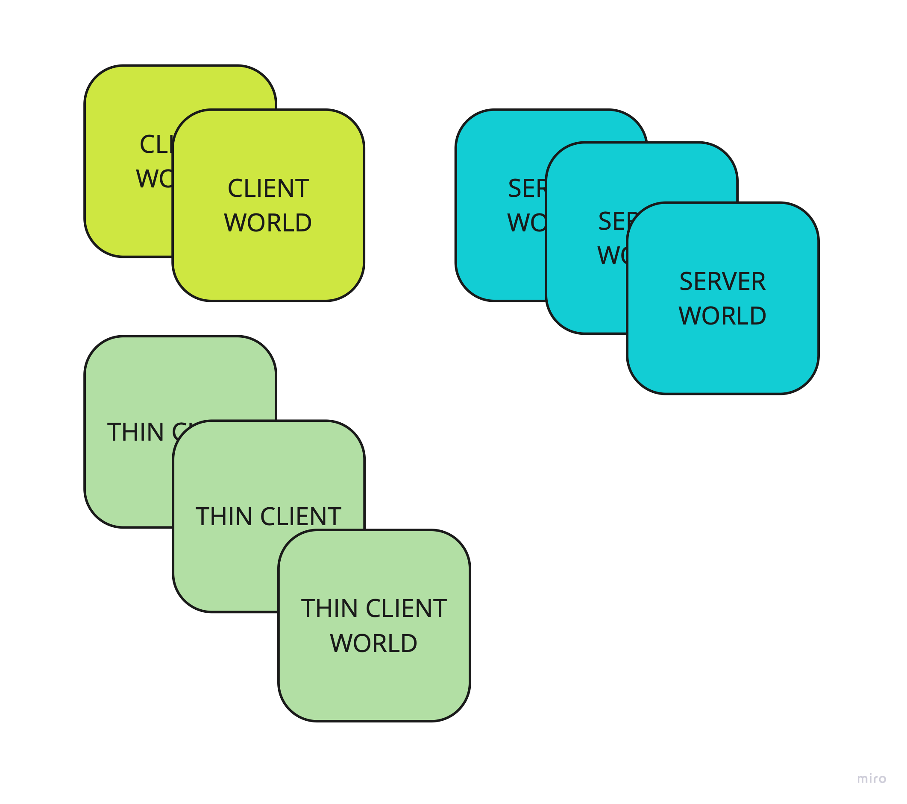
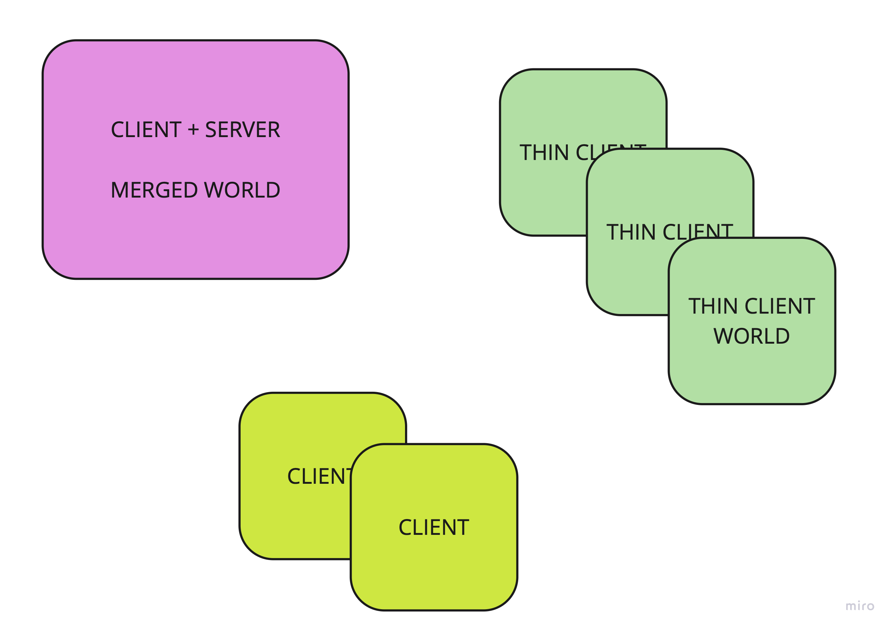

# Client/Server architecture

Netcode for Entities use the classic and well understood client / server model popularized by QuakeWorld, Source, Unreal and Tribes
engines, just to name a few.

## Simplified Replication Model

- Netcode for Entities use `client-side prediction` as primarty latency compensation technique to make the game feel responsive.
- Server is the authority and it run the simulation at fixed rate (some determism is required).
- Clients send commands to the server at fixed frequency, targeting a simulation "tick" in the future based on the connection round-trip time.
- To compensate for the network fluctuation, some form of time-syncing is used to ensure that the client estimation of the next simulated server tick
  is always slighty in the future.
- When the server receive the messages from the client, it queue/buffer the commands for later use (we can think of it as a sort of "jitter buffer").
- The server later will update the state of the simulation using the collected inputs/commands received for the current simulated tick.
- If no input by a clienet is received by server for the current simulation step, to avoid waiting for the player input to arrive, the server also
  implement a form of "server-side" prediction/dead-recknoning strategy for that, by e "input-prediction", by re-using the previous input received instead (dead-reckoning/prediction strategy).
- The server send to the client the new state of the simulation (full or partial)
- The client receive the state, eventually rewind the state of the client-side predicted entities to the tick received by the server
- The client re-simulate up to its current (future) tick.

### Design decision: No Client/Authority.

Netcode for Entities is designed from the ground up to use a server-authoritative replication model: Only
The server has the authority over the simulation state.

There is no explicit support for client-authority.

> Rationale: we want to focus on proper robust solution for the most common use case Netcode for Entities has been designed for.

In that respect, it is again worth to clarity that the Client has the "authority" to predict locally the state of entities in the future.
However, the state of the predicted entities is always and forcibly "reconciled" to the Server authoritative one once new updates are received and
re-predicted.

It is possible theoretically to implement client-authority user-side, with some additional changes in the package (some little modification are necesasry)
but it is not supported out of the box.

## Connection Topology: Limited Client/Client awareness

Because Netcode for Entities focus on the client/server model it also uses a star connection topology.

All clients are connected only to the server and they are not aware of each other by design.
It is application choice to send, sync and make aware the other clients about the current participants.

Sending information about new joined player can be implemented on top of other primitives offered (i.e connection events and RPCs)
or provided by other SDK (i.e Multiplayer SDK)

> Rationale about the design: The main reason to not provide either events (i,e client joined) and sharing player/client
> information has been because usually that imply sharing and sending custom player data (i.e identity) and the handling
> of such logic is in many cases game and platform dependent.
>
> Also, because Netcode for Entities does not provide a player authority, sharing the NetworkId of other players as
> identifier only partially fullfill the requirement, because of the re-use of the network ids.

If this rationale change over time, we may consider implementing a proper Joined/Left event mechanism to notify
new connections, but that also will require appropriate hooks and way to add any custom data we need to send to player
that may be game specific.

## Message Primitives

Server and client exchange different type of messages after they are connected.

| Message Types   Direction          | Reliability | Size Limit                           | Frequency              |
|------------------------------------|-------------|--------------------------------------|------------------------|
| RPC             Server <--> Client | Reliable    | 1 MTU                                | Variable, Not frequent |
| Ghost Snapshot  Server ---> Client | Unreliable  | 1 or more MTU (require custom setup) | Network Rate           |
| Commands        Server <--- Client | Unreliable  | 1 or more MTU                        | Simulation Rate        |

Client and Server can send each other generic messages (that we call RPC but they aren't because there is no method invocation involved)
at any point in time. The RPC are always sent reliably over the network, and their use case is for governing the game flow or
in general for sending information at low frequency.

Ghost Snapshot are sent by the Server to Client and they are used to sync the state of all the replicate objects (ghosts).
The state syncing is unreliable and guarantee only `eventual consistent` replication of the server game state.

Commands contains usually the player input or, generalizing, the commands that the server should execute for the specified tick
at which the command should be applied.

### Consequences of using multiple channel and reliablity: race conditions

Because Netcode for Entities uses multiple channel/pipeline (and so packet, partially because of how Transport is implemented) to deliver RPC and Snapshot,
race condition can arise.

> In particular, in term of sequencing, Rpc, Commands and Snapshot may arrive out of order. There are sent using different packet and
reliability as well, implying that the `causality` of messages is in general lost. Users should never relying on any order
of arrival.

### Enabling/Disabling snapshot streaming

In Netcode for Entities once client and server are connected they can only send RPC messages.
It is application decision to enable a connection to start exchanging `commands` and `snaphots` packets.

For more details about the game mode vs non-game mode see  [in game mode](in-game-mode.md) document.

## DATA SEPARATION AND MULTIPLE WORLDS

Netcode for Entities is designed to have a complete data and code-logic seperation in between client and server when they are running in the same process.
The separation is achieved by using multiple entity Worlds, one for each client and/or server.

Pros:
- Cleaner code
- Less mistakes
- Easier to extend (i.e multiple clients, multiple servers)
- Easier to debug
- Make simpler implement tests
- Robustness and quality: less combination test (if self hosting work, client does, server does)

Cons:
- Performance (prediction is heavier)
- Memory (scenes loaded multiple times, double the amount of entiites, etc)
- Necessity for good debug tooling
- Different from other framework: less familiarity.

### Different World types

| MODE   | AUTHORITY | SEND RPCS | RECEIVE RPC | RECV SNAPSHOT        | SEND SNAPSHOT | SIMULATION | PRESENTATION |
|--------|-----------|-----------|-------------|----------------------|---------------|------------|--------------|
| SERVER | yes       | yes       | yes         | no                   | yes           | yes        | no           |
| CLIENT | no        | yes       | yes         | yes                  | no            | yes        | yes          |
| THIN   | no        | yes       | yes         | yes (but no parsing) | no            | no         | no           |

### Multiple Worlds In The Same Process

| MODE          | SERVER WORLDS | CLIENT WORLDS | THIN WORLDS           | NOTES                                                                   |
|---------------|---------------|---------------|-----------------------|-------------------------------------------------------------------------|
| CLIENT/SERVER | 1+            | 1+            | 0 or more, dynamic    | only one client cand render the scene   at any given point in time. |
| CLIENT        | 0             | 1             | 0 or more, dynamic    |
| SERVER        | 1+            | 0             | 0 or more, dynamic    |

## Client Server Mode Details

The `Client/Server` enable the application to creates virtually any number of server and clients in the same process.
However, because of rendering restriction and CPU cost, by default Netcode For Entities create only one Client and Server world in this mode.

There aren't restriction about how the connection in between a server and a client is done is in the same process.
This extra degree of freedom, make it possible to use the Client/Server mode for multiple purpose:

| NetworkInterface Type | Purpose                                       |
|-----------------------|-----------------------------------------------|
| UDP / WebSocket       | Emulation Mode                                |
| IPC                   | - 'Self-hosting' (Optimized Mode) - Tests |

By using UDP or WebSocket for connecting client to server, the client is actually emulating a "remote" connection locally.

IPC can be used to implement **client-hosting**. When IPC is used to connect the client with the server, some host specific optimization are enabled:

| Protocol Type   | RTT/JITTER/LOSS                              | Prediction Ticks
|-----------------|----------------------------------------------|-------------------------|
| UDP / WebSocket | Variable, depend on OS and NetworkEmulation  | Variable, depend on RTT |
| IPC             | Forced to be 0 (actually 1 tick)             | Guarateed to be 1       |

### Special case: Merge Client + Server world

> This feature is not available yet in Unity 6
