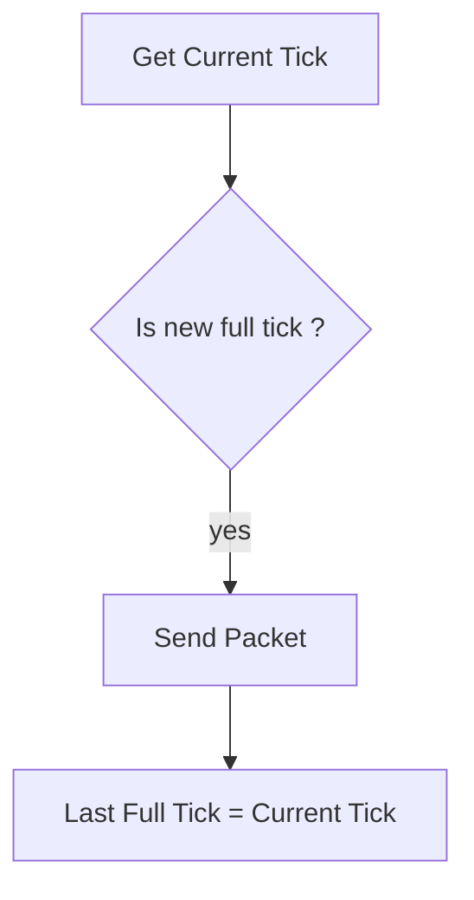
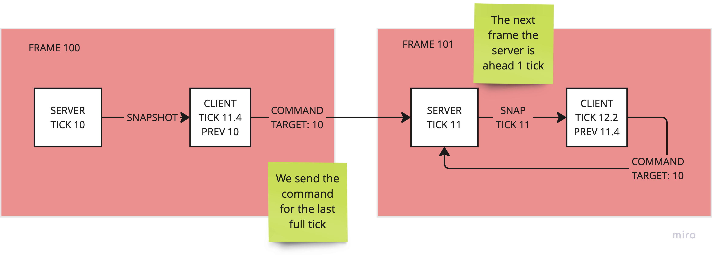

# Command protocol

The client start sending the `Command` packet after the `NetworkStreamConnectionInGame` is added to the `NetworkStreamConnection`
entity.

The packet is sent roughtly at `Simulation Tick Rate` frequency.



> Remarks: the check use the `NetworkTime.ServerTick`,
> because the delta time is adjusted by the  [time synchronization](time-sync.md),
> commands can (during the catch up phase) arrive at slighter higher frequency to the server.


## Issue with commands and Local Hosting

Command can be lost when using local hosting (bad issue)



> Reason: we inverted the server and client world update. The correct order is
> update the ClientWorld first and then the ServerWorld. This has also other advantages
> and motivation. But that fix this and other problems.

``` text
    CLIENT ---> COMMAND TICK X --> SERVER (SIM TICK X)
      A                                              |
      |                                              |
      |-----------SNAPSHOT TICK X -------------------V
```

## PACKET FORMAT
```text
<----------------------- 32 bits ------------------------------->
0 1 2 3 4 5 6 7 0 1 2 3 4 5 6 7 0 1 2 3 4 5 6 7 0 1 2 3 4 5 6 7
+-+-+-+-+-+-+-+-+-+-+-+-+-+-+-+-+-+-+-+-+-+-+-+-+-+-+-+-+-+-+-+-
MSG TYPE      | LAST SNAPSHOT TICK                             |
+-+-+-+-+-+-+-+-+-+-+-+-+-+-+-+-+-+-+-+-+-+-+-+-+-+-+-+-+-+-+-+-
 ...          | SNAPSHOT ACK MASK                              |
+-+-+-+-+-+-+-+-+-+-+-+-+-+-+-+-+-+-+-+-+-+-+-+-+-+-+-+-+-+-+-+-
 ...          | LOCAL TIME                                     |
+-+-+-+-+-+-+-+-+-+-+-+-+-+-+-+-+-+-+-+-+-+-+-+-+-+-+-+-+-+-+-+-
 ...          | RETURN TIME                                    |
+-+-+-+-+-+-+-+-+-+-+-+-+-+-+-+-+-+-+-+-+-+-+-+-+-+-+-+-+-+-+-+-
 ...          | INTERPOLATION DELAY                            |
+-+-+-+-+-+-+-+-+-+-+-+-+-+-+-+-+-+-+-+-+-+-+-+-+-+-+-+-+-+-+-+-
 ...          | NUM LOADER PREFAB                              |
+-+-+-+-+-+-+-+-+-+-+-+-+-+-+-+-+-+-+-+-+-+-+-+-+-+-+-+-+-+-+-+-
 ...          | TARGET TICK                                    |
+-+-+-+-+-+-+-+-+-+-+-+-+-+-+-+-+-+-+-+-+-+-+-+-+-+-+-+-+-+-+-+-
 ...          | COMMAND DATA                                   |
 +-+-+-+-+-+-+-+-+-+-+-+-+-+-+-+-+-+-+-+-+-+-+-+-+-+-+-+-+-+-+-+-
                                                               |
                                                               |
 +-+-+-+-+-+-+-+-+-+-+-+-+-+-+-+-+-+-+-+-+-+-+-+-+-+-+-+-+-+-+-+-
```

The `LOCAL TIME` and `RETURN TIME` are used to calculate the RTT of the connection

> Rationale: we didn't have a precise way to do that from transport at that time. We may remove this in favour of using
> other form of estimate transport level.

`INTERPOLATION DELAY` is the delta in between the `Target Tick` and the `Interpolation Tick`.
See the [lag compensation](lag-compensation.md) section.
