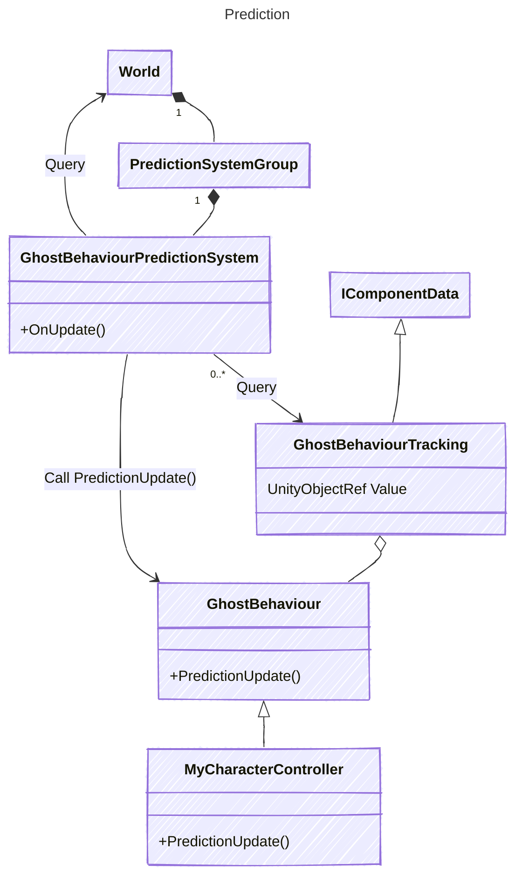

# GameObject Layer on Top of Netcode for Entities

Some UML diagrams for the general structure of the GameObject layer in Netcode and design decisions. Names may change, this is to show general structure visually.

## The North Star

The end goal is to be able to do something like this. No ECS calls required.

First, a user creates a prefab that's networked. They click the "Network" checkbox on their prefab's GameObject (which in the background can add a GhostObject --> That flow is still TBD). At the end, you have a GameObject with a GhostObject on it.
This is enough to sync transforms.

To add custom state and logic, a user can create a class that inherits from GhostBehaviour.

```csharp
// Input gathering design still WIP.
public struct CharacterInput : IInputComponentData
{
    public Vector2 Movement;
    public InputEvent Jump; // InputEvent needed to make sure we're not missing inputs when capturing inputs outside fixed rate ticks
}
// User gameplay logic is done in GhostBehaviours, similar to NGO's NetworkBehaviour
public partial class MyCharacter : GhostBehaviour
{
    public GhostVariable<int> MyHealth;
    public GhostVariable<Vector3> Velocity;
    public GhostVariableBridge<CharacterInput> Input; // TODO this input design is still TBD. This works, but isn't great and has gotchas (like I can forget to setup ownership)

    public GhostVariable<Vector3> PlayerHeadPosition = new GhostVariable(Authority=Authority.Client); // VR player head can't be corrected, so setting it as client authoritative. TODO Design still TBD

    public void Awake()
    {
        if (IsServer)
            Netcode.Relevancy.SetRelevantFor(Netcode.Connections[0]); // static APIs are all accessible from the same Netcode static API for discoverability.
    }

    // TODO this GatherInput design is TBD, we can improve that UX
    public override void GatherInput(float networkDeltaTime)
    {
        if (Input.GetKey("left") || Input.GetKey("a"))
            input.ValueAsRef.Movement.x -= 1;
        // ...

        if (Input.GetKeyDown("space"))
            input.ValueAsRef.Jump.Set();
    }

    public override void PredictionUpdate(float networkDeltaTime)
    {
        if (input.Value.Jump.IsSet)
            m_GravityVelocity.Value = JumpVelocityConfig;
        m_GravityVelocity.Value -= 9.8f * networkDeltaTime;
        var horizontalMovement = new Vector3(this.input.Value.Movement.x, 0, this.input.Value.Movement.y).normalized * VelocityConfig;
        transform.position += (Vector3.up * m_GravityVelocity.Value + horizontalMovement) * networkDeltaTime; // transforms are automatically rolledback and replicated
        if (transform.position.y < 0)
        {
            transform.position = new Vector3(transform.position.x, 0, transform.position.z);
            m_GravityVelocity.Value = 0f;
        }

        MyHealth.Value = 100; // value rolled back automatically for prediction
        MyHealthUpdatedRPC(); // RPC works similarly to NGO

        if (input.Value.Shoot.IsSet && Netcode.NetworkTime.IsFirstTimePredicting)
            GameObject.Instantiate(someRocketPrefab); // Predicted spawn
    }

    public void Update()
    {
        // this should be done once per frame, so not running in PredictionUpdate()
        this.PlayerHeadPosition.Value = VRUtility.GetHeadsetPosition();
    }

    [Remote]
    public void MyHealthUpdatedRPC()
    {
        Debug.Log("health!!");
    }
}
```

For users that want to do high performance code (optional flow), they can transform a bit of their logic to use a known component and then use that component from their ECS systems.

```csharp

public struct HealthComponent : IComponentData
{
    [GhostField] public int value;
}
public partial class MyCharacter : GhostBehaviour
{
    public GhostVariableBridge<HealthComponent> health;

    void PredictionUpdate()
    {
        health.Value = new HealthComponent(){value=123};
    }
    // ...
}

// And this same data can be accessed from a bursted system and jobs
[BurstCompile]
public partial struct MyHealthResetSystem : ISystem
{
    [BurstCompile]
    public void OnUpdate(ref SystemState state)
    {
        foreach (var healthRef in SystemAPI.Query<RefRW<HealthComponent>>())
        {
            healthRef.ValueRW.value = 0;
        }
    }
}
```

Connection management is done through the same static Netcode API.

```csharp
void Awake()
{
    Netcode.Connect(new NetworkEndpoint(){...});

    Netcode.OnConnect += (Connection c) =>
    {
        var player = GameObject.Instantiate(playerPrefab);
        player.GetComponent<GhostObject>().OwnerId = c.NetworkId; // Most of the per-network object operations are done through the GhostObject class
    }
}
```


## Per Ghost GameObject Bridge (GameObject to Entity)

Entities integration is coming eventually. In the meantime, we have a simple static hashmap of GameObject ID to Entity that allows us to simulate that behaviour of implicit association between a GameObject and entity.


## GhostAdapter

GhostAdapter is an abstraction for the entities side per-ghost data. Things like Ghost ID, ghost type, spawn tick, etc. This way users don't need to do ECS queries to access that data.

### Design notes on whether GhostAdapter should exist long term.

GhostAuthoringComponent is an editor time thing. It stops to exist at runtime.

A ghost's data (like its ID, type, spawn tick, etc.) is owned by entities and lives in a chunk. So what's the use of GhostAdapter at runtime, assuming we do have entities integration eventually.

UX:
- It can still serve as a wrapper for per ghost APIs. e.g. how do you access a networked object's owner with unified netcode?
  - Alternatives:
  - This could be extension methods on GameObject. You could have
```int ownerID = go.GetGhost().NetworkId```
which would do the GhostComponent query for you.
  - Without these, the line would look like
```int ownerID = go.World().EntityManager.GetComponentData<GhostOwner>(go.Entity(false)).NetworkId;```
  - VS doing something like `int ownerID = go.GetComponent<GhostAdapter>().GhostInstance.NetworkId`
- UX issue: extension methods could bloat gameObject's API. That'd add a few netcode utilities to an API that's already pretty large. It'd be hard to find for users.

Performance:

It's all about GameObject's `GetComponent<GhostAdapter>().Something` vs accessing that info from a static hashmap.
- `GetComponent<GhostAdapter>()` is about 2x slower than a static bursted hashmap.tryGet (needed for the `go.Entity()` call to get the mapped entity for a GO in the extension method pattern). BUT you can cache a GhostAdapter in other monobehaviours, and that's 5-10x faster.
  - In most cases, users will cache GhostAdapter in their own GhostBehaviours. In cases where you can't do this (like Physics OnTriggerEnter events or other animation events for example), then you do have that cost. We could also potentially explore having a map of EntityId to GhostAdapter... see if that's faster than Unity's GetComponent... --> This could also be done by users if need be.
  - For a quick 10k operations perf tests trying to access a GhostInstance's ID:
    - Cached GhostAdapter + bursted access using cached ComponentRef is 0.24ms burst, with safety off, in release
    - Extension method using hashmap and GetComponentData is 1.18ms when bursted. Hashmap access is about 1ms and GetComponentData is about 0.18ms

So from a perf perspective, it's better if we have a place to store cached data and pointers.
From a UX perspective, have a central point of access for all things "ghost" would be good as well. It's also similar to the Rigidbody pattern. Photon and NGO have NetworkObject, so we stay within familiar patterns for users and we help with discoverability.

What about GhostAuthoringComponent?

GhostAdapter should become "the" thing that's baked in the future, in 2.0.
It should probably be renamed to something like "Ghost" or "GhostObject". Not NetworkObject since that could be confused with NGO's NetworkObject?

## Entity to GameObject


## Spawning

`GhostPrefabReference` is a scriptable object.
This is to artificially get a pre-built list of prefabs, something that was already done for us by baking with pure entities flows.
See next step for the auto registration at game start.


## Accessing Networked State


## Prediction

The following is the current design. In a future version, we should get PredictionUpdate inside Monobehaviour, like FixedUpdate.




# Static `Netcode` API
Main point of access to Netcode APIs. All global calls and configuration should be available from here.
This is the main class you should remember when dealing with Netcode.
This should be callable from both GameObject and ECS flows. An ECS system should be able to connect using `Netcode.Connect` for example.


