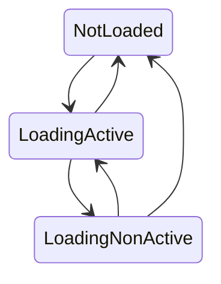

# The Ghost Collection Systems

## Data
- ComponentTypeSerializationStrategy
- GhostCollection
- GhostCollection
- GhostComponentSerializer.State
- GhostCollectionPrefab
- GhostCollectionComponentType
- GhostCollectionComponentIndex
- GhostCollectionPrefabSerializer

## Systems
- GhostCollectionSystem
  GhostComponentSerializerCollectionSystemGroup

## The role of GhostCollection

In order to replicate data over the network, both client and server need to know how the component data should be serialized. And these information are contained in the prefabs metedata.

The `GhostCollectionSystem` is a critical and foundamental system of the the whole Netcode for Entities architecture.
It has multiple responsibilities:

- **Detect new ghost prefabs**:
  - Strip/Remove the un-necessary component from it based on the world (i.e client-only components).
  - Build a`GhostType` -> `Entity` mapping, used by the Netcode for Entities runtime during serialization and deserialzation
- **Process the prefab metadata**:
  - creates the necesary booking structs for serializing the replicated components.
  - produce an **unique hash** (or let call that CRC) for the loaded prefab (more on that later) used to validate that both server and client has
    the same data layout, options and component serialization variants for the given prefab.
- On the client: **Validate** that server and client prefabs are compatible (they are serialized in the same way)
- **Collect and generate all the debug info** (i.e prefab and component names) used for debugging and stats reporting.

The processing is quite involvoved and there are a lot of little details (coverd mostly by in-code comments) but as an high-level
understanding of the flow this is how it is looks like.

## Component stripping

When the prefab is baked using a Client/Server target, the entity may contains components that need to be removed
when imported in world.
In such a case, the prefab present a `GhostCollectionStripping` component, that is used to trigger the run-time component
stripping logic.

## Where ghost prefabs come from

There are two way to have ghost prefab entities present into the world:
- Loading a sub-scene that reference them.
- Creating the prefab at runtime via `GhostPrefabCreation` API.

> Remarks It is possible to have multiple entities present in world for the same prefab when loaded from sub-scene.
The `GhostColliectionSystem` handle the presence of multiple prefab with the same `GhostType` automatically remapping a lost reference
(i.e unloading of a sub-scene) with another one preset for the same type.

### Why multiple ghost prefab with the same type

When a prefab asset is referenced by an authoring Monobehaviour (a behaviour that has a Baker) that bake the associated entity reference
into a component, the prefab asset is tracked as a dependency and added to an entity archive as part of the baking process.

The archive in which the prefab is stored may be different from the one in which the sub-scene is
serialised (i.e shared among sub-scenes using the same resources). In some cases, i.e pre-spawned ghosts,
the prefab is contained in the sub-scene archive.

## Server Flow

The Server check first if there are prefabs to strip. The stripping occurs on the main thread.

New loaded prefabs are then collected into the `GhostCollectionPrefab` list and the mapping updated. The Server has full
authority over this list contant, in particular the order of the element in it. This list is replicated to the client as
part of the [ghost snasphot protocol](snapshot-protocol.md).

> 1. The order of prefab it may feel "roughly" the order in which sub-scenes are loaded, but it is not. In any case, the sub-scene loading timing is non-deterministic and
> as such don't make assumptions on that.
> 2. The order of the prefabs **it is strictly the order in which entities report the chunks**.
> That means there is not 1:1 correlation to the loading order (if sub-scenes are loaded at the same time).
> 3. Prefab chunks are consistenly reported pretty much on "per-sub-scene" (shared component), but the order of that sub-scene does
> not necessarily match the order in which they were loaded.
> 4. Code Prefabs are always handled after the sub-scene prefabs.

After the prefabs has been added to the `GhostCollectionPrefab` list, the prefab entity itself is processed and the blob metadata used to:
- Populate he `GhostCollectionPrefabSerializer`
- Populate the `GhostCollectionComponentIndex`
- Calculate thet [ghost hash](ghost-hash-specs.md)

The full process looks like this:

```
FOR EACH NEW LOADED PREFAB THAT HAS STRIPPING NEED:
    PREFAB STRIPPING

FOR EACH NEW LOADED PREFAB:
    BUILD GHOST-TYPE MAPPING (GhostType -> Entity)
    ADD THE PREFAB TO THE GHOST PREFAB COLLECTION (GhostType -> index)

FOR EACH NEW LOADED PREFAB:
    PROCESS THE PREFAB
        Build the GhostPrefabSerializer data
        Associate code-generated component serializer variant to use (glue runtime/compile-type/prefab-override)
        Calculate the hash (CRC)
        Generate debug info
        Add the new prefab to the loaded prefab list.
```

## Client Flow

The Client check first if there are prefab to strip. The stripping occurs on the main thread.

The Client wait until the `GhostCollectionPrefab` list (or part of it) is received from the server before:
- Populate the client-side of the `GhostCollectionPrefab`, by mapping any existing entity that match the `GhostType`
- Further processing the loaded prefab metadata.

> This ensure the same `index` can be used to access the ghost on both client and server. We could have
> used a more flexible approach, using some remapping.

If prefabs are present that are not in the list, they are skipped. If the list contains prefabs not
loaded yet by the client, the entry in the `GhostCollectionPrefab.Entity` is Entity.Null.

> The latter case is foundamental, and require user handling. See later.

Finally, the client perform two main steps:
- Validate entry of the `GhostCollectionPrefab`: it is expected that the associated Entity is not Entity.Null.
The presence of missing prefabs entities is considered an error unless marked as `loading` (see next section).

> Important: because of how the flow is implemented, the error is true only if the `GhostPrefabCollectionSerializer`
> for that prefab has not been initialized yet,

- Process the prefab (if an entity is associated with it) as the server does and:
  - Populate he `GhostCollectionPrefabSerializer`
  - Populate the `GhostCollectionComponentIndex`
  - Calculate thet [ghost hash](ghost-hash-specs.md)

The flow looks like this:

```
FOR EACH NEW LOADED PREFAB THAT HAS STRIPPING NEED:
    PREFAB STRIPPING

FOR EACH NEW LOADED PREFAB
    BUILD GHOST-TYPE MAPPING (GhostType -> Entity)
    TRY TO ASSOCIATE THE NEW PREFAB TO THE ONE REPORTED BY THE SERVER (GHOST TYPE -> INDEX)

FOR EACH REPROTED PREFAB BY THE SERVER
        CHECK IF THE PREFAB IS STILL LOADING
            If the resource is marked as loading: skip this frame and wait until the resource is available
            If the resource is not loaded (entity reference is null): error and disconnect

        Build the GhostPrefabSerializer data
        Associate code-generated component serializer variant to use (glue runtime/compile-type/prefab-override)
        Calculate the hash (CRC)
        Generate debug info
        VERIFY THE CRC MATCH WITH THE ONE REPORTED BY THE SERVER
```

### Avoid validation error: set GhostCollectionPrefab entries as Loading

The client is supposed to load all the resources as demanded by the server. However, depending on the scenario, that may
requires some time. For example, the prefab need to loaded asynchronously, or the prefabs reported are part of a new loaded scene.

> Design: The logic to how the resource is loaded and/or when it is loaded is application specific. Netcode does not take care of that.

The most common cases wny the `GhostCollectionPrefab` entries can have their Entity set to Entity.Null:

2. `NetworkStreamInGame` added to the connection before the sub-scenes in which the prefab is referenced are
   loaded into the world (either still loading or to be loaded).
2. A sub-scene has been unloaded, and the prefab reference is also gone.
3. Prefab resources are loaded or added on demand.

Regardless of the reason, **the client should (must) inform the `GhostCollectionSystem` what to do with the missing entries**.

The default behaviour is the following: a missing or invalid prefab entry will cause the client disconnect.

The `GhostCollectionPrefab.Loading` property can be used to change this behaviour.

| Entity reference | Loading       | Result                |
|------------------|---------------|-----------------------|
| Entity.Null      | NotLoading    | Disconnect            |
| Entity.Null      | LoadingActive | Skip check next frame |
| Entity.Null      | LoadNotActive | Disconnect            |
| Valid            | -             | Validate Hash         |


### Use the GhostCollectionPrefab.Loading flag

1. For any prefab in the `GhostCollectionPrefab` that has an entity reference that is not set (Entity.Null) the client should
  set the `Loading`flag to `LoadingActive`.
2. Prefabs marked as `LoadingActive` will be tested to see if the prefab is valid or not. The `GhostCollectionSystem` forcibly
set the flag to`LoadingNotActive` if the prefab is still not set or invalid.
3. The `GhostCollection` early exit the validation and prefab processing Because the client need to report the number of prefab loaded in the order reported by the server, as soon
an entry in the `GhostCollectionPrefab` that has: the `Loading` flag set to `LoadingActive` is found and that



The client logic must continue to set the `Loading` flag every frame, until the resource hasn't been loaded.

> IMPORTANT: in simple case scenario, where you have a single scene and sub-scene situation or need rarely happen.
> This is expecially true the editor, because importing is "blocking". But in the player build, the asynchronous loading of the
> resources (i.e sub-scene) may cause a slightly timing change.
>
> If the application logic add the `NetworkStreamInGame` to the the connection on both the server and the client, there is a non-zero chance
> that the GhostCollectionSystem may receive data from the server before the client has loaded the sub-scene, causing error being reported and
> client disconnection. This can happen also (and somewhat frequently) for the local-client in Client/Server mode.


### LIMITATIONS

Because the client only report the portion of list loaded, and not ack each individual resource, it is not easy or naively possible to load just
a sub-set of the prefabs.

For example:
Let's say the the server loaded scenes A,B,C,D, that contains ghost type A,B,C,D respectively. It report to the client A,B,C,D ghost type has been loaded.

- If the client load A, the counter increment to 1
- If the client then load C, the number of reported ghost types will still be 1.
- if the client then load B, the counter go to 3 (A,B,C)
- if the client load D, the counter go to 4 (A,B,C,D)

From the previous example, it is clear that the current mechanism does not work well for "open world" like streaming scenerio, where:
- The server load all world scenes (because he need to simulate the whole world)
- The client load only a portiaon of the map (that has way more detailed data for example)

If prefabs types are loaded as part of these sub-scenes (i.e because of spawner in the scene), this will make impossible to the client to receive the
necessary "nearby" ghosts, if their types are not loaded.

### MITIGATIONS
It is possible to mitigate some of the aforementioned problems. An easy, and probably the best, solution it is to remove the problem altogether
by creating one or more specialised sub-scenes that contains only ghost prefabs. These scenes are alwasy loaded by both server and client, or
as necesasry (i.e reported by the server via RPC or other mapping logic).

The client is then free to load/stream sub-scene in any order (caveats: there are other things to consider if you want to unload them, but this goes beyond the scope of the document).


