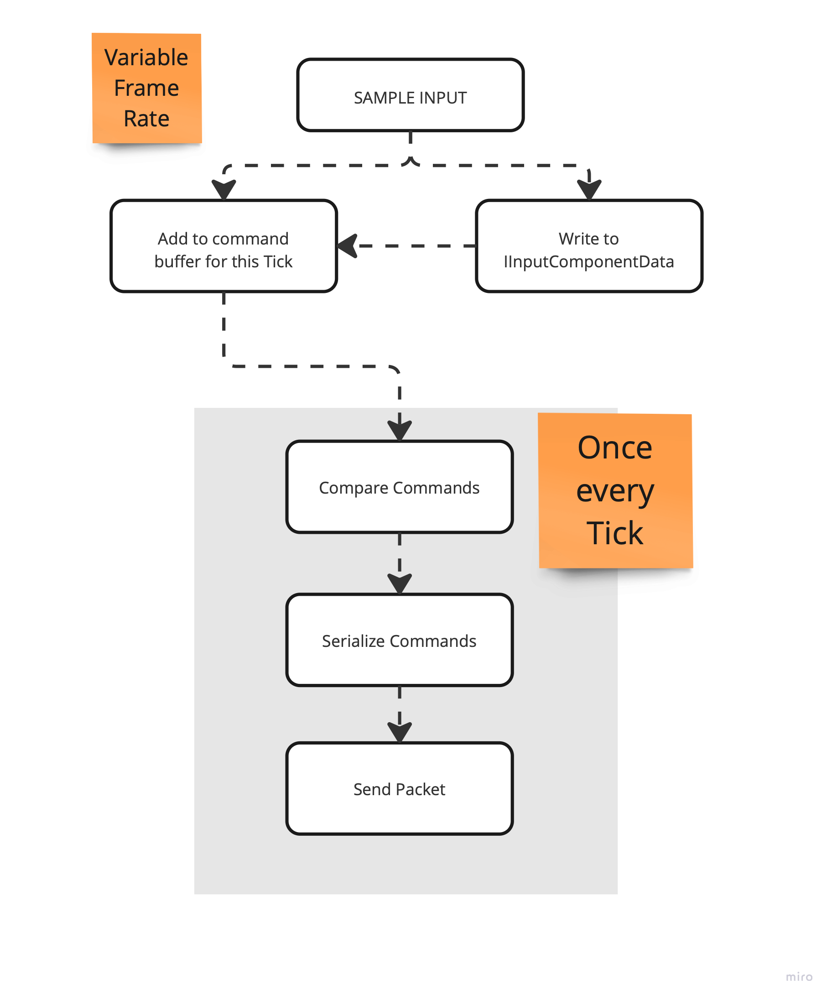

# HOW INPUTS WORK

## Components
- `ICommandData` : the buffer that hold the user command. Used for prediction by both client and server.
- `IInputComponentData`: higher level primitive to hold inputs and command. Backed by internal `ICommandData` under the hood.
- `AutoCommandTarget`: specify if a ghost is a target for receiving commands.
- `UniqueInputTickMap`: used to collect the unique input. Unique inputs are used to split the prediction on the client in
blocks, where each block uses the same input for multiple ticks (see tick batching).

## Systems
- GhostInputSystemGroup: group where users should put their input systems logic.
- CommandSendPacketSystem: system responsible to grab the commands queued into the `OutgoingCommandDataStreamBuffer` and flush
them over the network.
- CommandSendSystem<T> : generic system that is used to serialize commands in the `OutgoingCommandDataStreamBuffer`.
- CompareCommandSystemGroup: contains all systems that compare inputs and populate the  `UniqueInputTickMap`.
- CopyInputToCommandBufferSystemGroup: contains all systems that copy data from the IInputComponentData to the underlying ICommandData buffer.
- CommandSendSystemGroup: group that contains all the CommandSendSystem<T>, CompareCommandSystemGroup and CommandSendPacketSystem.

## High level logic

- Users a write system that sample each frame the current player input (i.e using UnityEngine.Input) and add that to the
`GhostInputSystemGroup`.
- At the end of the `GhostInputSystemGroup`, all IInputComponentData are stored in their respective ICommand buffer.
- If it is time to send the new commands (new tick), the `CommandSendSystemGroup` run:
  - All the commands are serialized into the `OutgoingCommandDataStreamBuffer`
  - The `CommandSendPacketSystem` create a packet that contains all the serialized input and send it to the server.

The client send the packets on average at Simulation Tick Rate.

## WHY WE REQUIRE TRANSLATE INPUTS (AND THE SAMPLING) INTO THEIR OWN DATA ?

- Because we need to have the inputs handled in jobs.
- Because we need to replicate the input to the server.
- Because we need a way (consistent and simple) to store them into an history buffer.

## PACKET LOSS MITIGATION: INPUT REDUNDACY

To compensate for packet loss, and still keep vary high responsiveness, Netcode for Entities adds to the command
packet the last N (configurable) client inputs.

> Rationale: In case a command packet it lost, if the server receive the next one with the right timing, he can use the old input information
to fill hole in the received command queue.

The client `current time` is in `the future` in respect to the server. How much the clien simulate its state in the future is
vary over time, depending on the connection RTT. To ensure packets are received `on-time`, the client also add a fixed `slack`
factor`, configurable by the client. of N ticks.

> Rationale: in the best case scenario, if latency and jitter are estimated correclty, we expect the server receive the client commands
> alwasy before it needs to use them to simulate the next tick. How much before: the `slack factor` ticks.

### Connection in between redundancy and slack

At a first glance doesn't looks like it is necessary to have or report older inputs more than the last N, where N is the `slack` used
to ensure commands arrive on time.

However, depeding on the time synchronization and latency condition three common scenario are possible:

- Estimate Correct: the RTT + jitter is estimated correclty. commands arrive exactly 'slack' ticks before they are used.
- Under-Estimate: the RTT + jitter is not estimated correclty, or there is latency spike. Commands still arrive on time, but less than 'slack' ticks before they are used.
- Over-Estimate: the RTT + jitter is not estimated and the client is over-compensating (or latency reduction spike). Commands arrive way to early to the server

If packet losses occors in one of the three cases:

- Estimate Correct: we can recover up to `slack` packet losses.
- Under-Estimate: we can recover less than `slack` packet losses.
- Over-Estimate:  we can recover up to `N` packet losses. If the over-estimation is larger than `N`, we are going to lose commands.

Therefore, because the client has the tendency to over-estimate, it is better strategy to have a slightly larger redundancy of input in the command packet (i.e 1 or 2 more than the `slack`) to compensate
for packet loss (that is what they are meant to be used for) and still guarentee that if the client is not late (in this case the commands are discarded),
we receive all the inputs.
