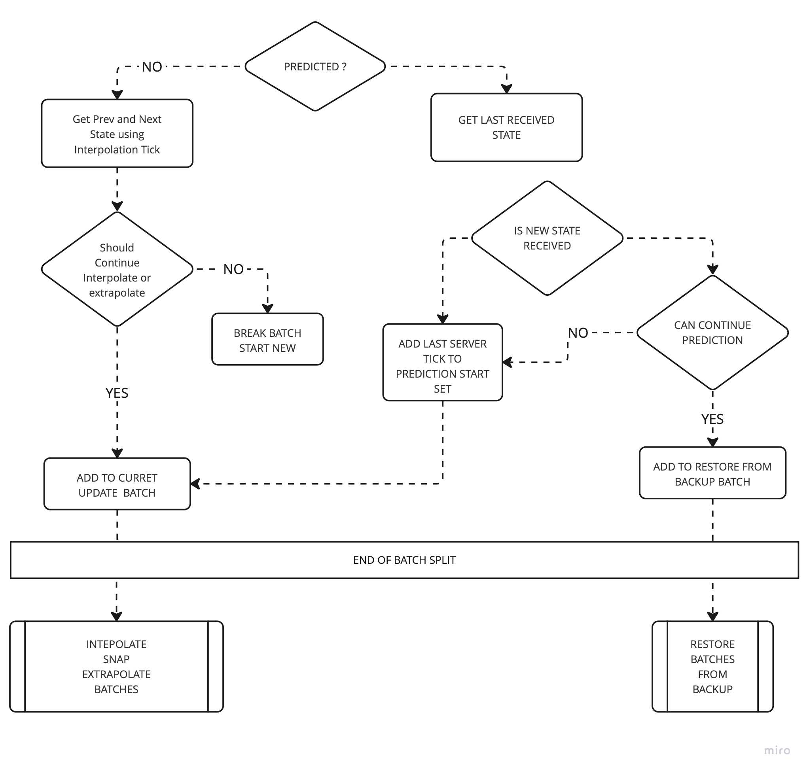
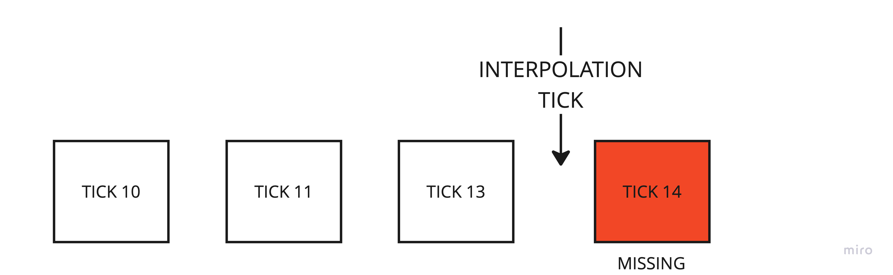
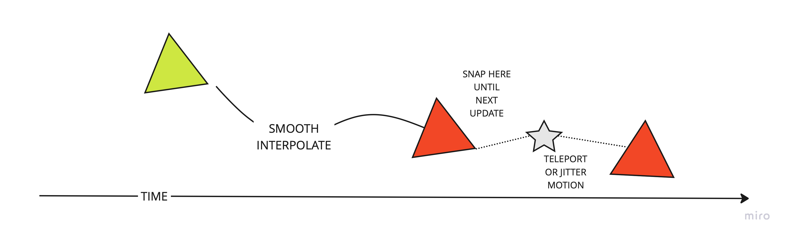
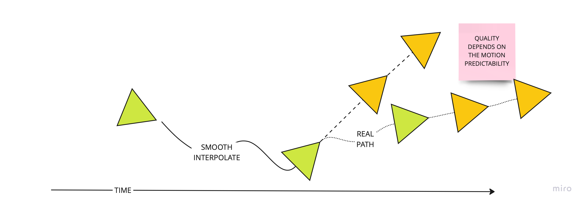

# Ghost Update System

The `GhostUpdateSystem` is a central and critical system on the Client. It is responsible for:

- Updating the state of Interpolated Ghosts
  - Interpolate the ghost fields
  - Extrapolate the ghost fields
- Updating the state of Predicted Ghosts to either
  - The last received state from the server (new data)
  - The last prediction backup (continue prediction, partial ticks)

## Ghost Update System logical flow

All work is performed by jobs, that run in parallel per chunk. The jobs runs every single frame, at variable frame rate.

The `GhostUpdateSystem` is pretty much composed by two phases:

1. Split the chunk entities in batches
2. Update the batches using the generate component serializers.

The first phase has different rules and logic for predicted ghosts vs interpolated ghosts.

For predicted ghosts, the `GhostUpdateSystem` collects the set of unique ticks (sorted) from which
the simulation should be rewind to.

This set is used by the `ClientPredictionRateManager` to determine where the prediction loop should start
from (oldest tick) and witch ghosts should re-run prediction (based on the 'GhostComponent.PredictionStartTick` property).
or not.

### Example

| Start Tick 10 | Start Tick 11             | Start Tick 12 | Start Tick 15 |
|---------------|---------------------------|---------------|---------------|
| Ghost 1       | Ghost 3, 4                |               | Ghost 2, 5    |

The prediction loop is split in "ranges" and in each range only certain ghosts re-simulate.
(based on the `Simulate` tag). The other have their state set to their corresponding
start tick (either because of rewind or continuation).

| Tick 10   | Tick 11              | Tick 12        | Tick 15               |
|-----------|----------------------|----------------|-----------------------|
| Ghost 1   | Ghost 1, 3, 4        | Ghost 1, 3, 4  | Ghost 1, 2, 3, 4, 5   |

## Differences in between static ghosts and dynamic ghosts

| Optimization      | Interpolation | Extrapolation | Interpolate Condition             |
|-------------------|---------------|---------------|-----------------------------------|
| Static Optimized  | Yes           | No            | InterpolationTick < Last Received |
| Dynamic           | Yes           | Yes           | Always                            |

Static Optimized ghosts stop the interpolation as soon the `InterpolationTick` it greater than the last
received state.

## LIMITATION OF THE SINGLE INTERPOLATION TIME LINE

All interpolated ghosts are rendered (or let's say interpolated) all the same time in the past (single `Interpolation Tick`).
The `Interpolation Tick` is behind the last received snapshot from the server by certain amount ticks (configurable, variable
based on the Network Condition).

Because of that, if some interpolated ghosts has a low update frequency (i.e low priority) or the updates are in general received
sparsingly, there is the possibility that the `snapshot buffer` may run out of samples.

Two cases to consider:

1. The ghost entity doesn't have any extrapolated fiels. The data snap to the last state received.

2. The ghost entity has replicated fields that extrapolate (i.e Transform). Depending on the predictability of the fields
(or components) changes, quality can be good, acceptable or bad.

