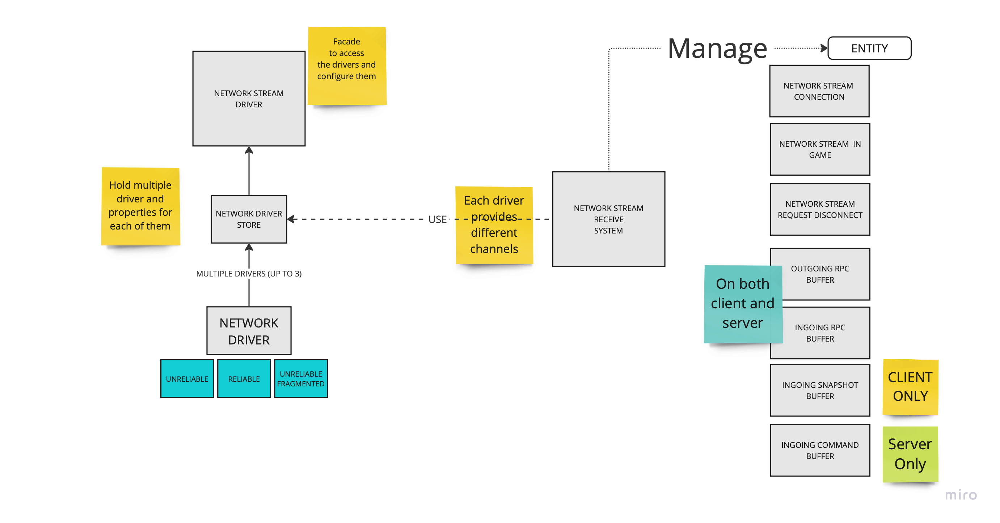
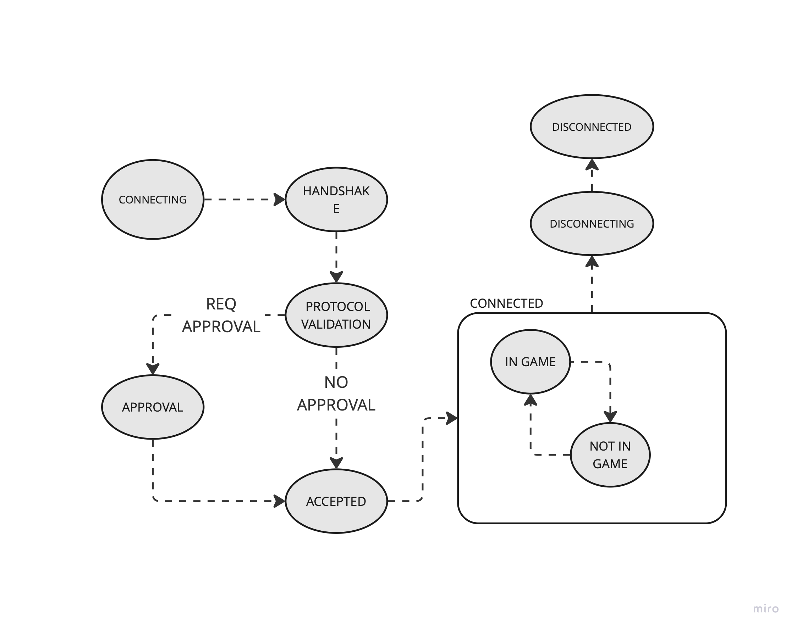

# Connections

## DriverStore and NetworkStream Drive

The NetworkStreamDriver is a facade, that should be used to:
- Configure the NetworkStreamDriver
- Start Listening for connections (server)
- Connect to a remote (or local) host

The `NetworkStreamDriver` singleton is created by the `NetworkStreamReceiveSystem` inside its `OnCreate`.

The `NetworkStreamDriver` drivers are configured at World creationg time, by using a custom delegate assigned to the
`NetworkStreamReceiveSystem.DriverConstructor`.

> Rationale for creating the driver at creation time:
> - It was giving at the time the consistency we wanted. After the world
    > is created, everything was setup correctly.
> - Consistent behaviour for the Auto-Connection feature and Thin-Client feature (partially true with Relay).
>
> However, over time this behaviour has become a lack of flexibilty and problematic (i.e connection with relay, session integration).

The `NetworkStreamDriver` is also used to report `ConnectionEvent` to the application.

### Reset driver state
It is possible to reset and re-configure the driver after creation, by `resetting` the driver configuration via the
`NetworkStreamDriver` interface.

> Resetting the driver is also the only way to stop the Server listening for connections.

## NetworkStreamConnection life cycle.

Each transport connection is mapped to an entity. The entity is created:
- By the `NetworkStreamDriver`, whe connect is called, or an entity provided to the method.
- By the `NetworkStreamReceiveSystem`, when listening for connection and new incoming request is accepted.

The entity created as a set of components added to it that are used to store:
- Its state
- Track the destruction
- Queue incoming/outgoing rpcs
- Queue incoming commands
- Queue incoming snapshosts

### Disposing NetworkStreamConnection

Users should never dispose a connection entity. This is a runtime error.

The only way to close a connection is to call either `NetworkStreamDriver.Disconnect` or add the `NetworkStreamDisconnectComponent`.

## NetworkStreamConnection state machine

