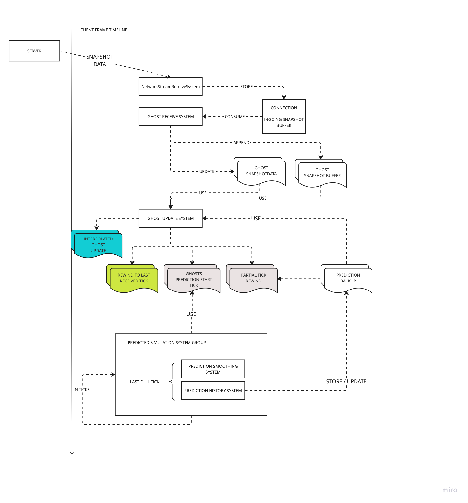

# PREDICTION LOOP

The concept about prediction has been already covered in multiple places and docs:

https://docs.google.com/document/d/1owCFBmxiwrEtHrrejxjXOl1qv4jcJIeC8Si4IavCXXQ/edit?tab=t.0
[prediction](../Documentation~/prediction.md)
[prediction edge cases](../Documentation~/prediction-details.md)

In this document other low-level details necessary to understand the various actors and what data is
touched/generated.

### Systems

- `NetworkTimeSystem`: provide the next ServerTick to simulate
- `GhostReceiveSystem`: receive the snapshot, thus affecting rewind/rollback
- `GhostUpdateSystem`: "rollback" the predicted ghost state and calculate the prediction tick starting point.
- `PredictedSimulationSystemGroup`: the fixed step loop responsible to update all simulation state.
- `GhostPredictionHystorySystemGroup`: store the last fully simulated tick. Used for continuing prediction
- `GhostPredictionSmoothingSystem`: smooth the misprediction

### Data

- NetworkTime (in/out)
- ClientTickRate (in)
- ClientServerTickRate (in)
- GhostPredictionGroupTickState (in/out)
- UniqueInputTickMap (in/out)
- IInputComponentData (in/out)
- ICommandData buffer (in)
- Simulate tag (in/out)

## When predicted ghost state is rollback ?

The predicted ghost state is rollback before the next execution of the `PredictedGhostSimulationSystemGroup` by
the `GhostUpdateSystem`.

The state of predicted ghost is rollback in following cases:
- A new authoritative state is received by the server.
- The client is `continuing` prediction for the ghosts that has not received any new update yet (see [prediction backup](prediction-backup.md))
- Forced rollback to last tick received by the server
- Forced rollback to spawning tick (for predicted spawned ghosts)

the `GhostUpdateSystem` is also responsible to collect the oldest tick to start/continue the prediction from
based:
- Prediction History Backup available for the ghost
- New Data received for the ghost
- Forced rollback to last tick received by the server
- Forced rollback to spawning tick (for predicted spawned ghosts)

The ticks are stored in a map, used later by the `PredictedGhostSimulationSystemGroup` to re-simulate from the oldest tick
in the map to the current simulation tick.

##  Decoupled Render and Simulation rate. Partial Ticks

The server always execute the `SimulationSystemGroup` at fixed tick rate. On the client instead, simulation and rendering frequency update are decoupled:
it can render at faster rate than the simulation (and viceversa).

Partial ticking is the Netcode for Entities way to deal with the classic problem of fixed-update loop and variable frame rate.

To recap how it work: The simulation is re-run multiple times from the last full simulated state (and predicted ghost state rewind to that state)
advancing the simulated state by an increasing delta time each time.

> Rationale: Because of the fast-paced multiplayer game target, we didn't want to trade reactivity, therefore instead of interpolating
the state of the simulation in between the last two fully simulated ticks (like physics does for example and other netcode solution do),
we opted for "extrapolating" the state of the simulation  by partially predict the next state.

There are several advantages with that:
- It work out of the box.
- There is no added lag to user input. Reactivity feel great, especially when using mouse to look at
- Easier to perform certain logic (i.e camera movement in prediction)

There are though several downside:
- CPU cost. Prediction run way more time. Does not scale well on mobile or low spec platform.
- Rollback the state every frame (potentially, we do change filtering logic to avoid that) has associated costs
- Mental model complexity:
    - you need to understand how the prediction loop work to avoid mistakes
    - certain logic must necessarily not run for partial ticks (i.e spawning projectile)
    - physics still not run for partial ticks, meaning that there will be some jittery behaviour in some situation if not handlded correctly.

## Data Flow

