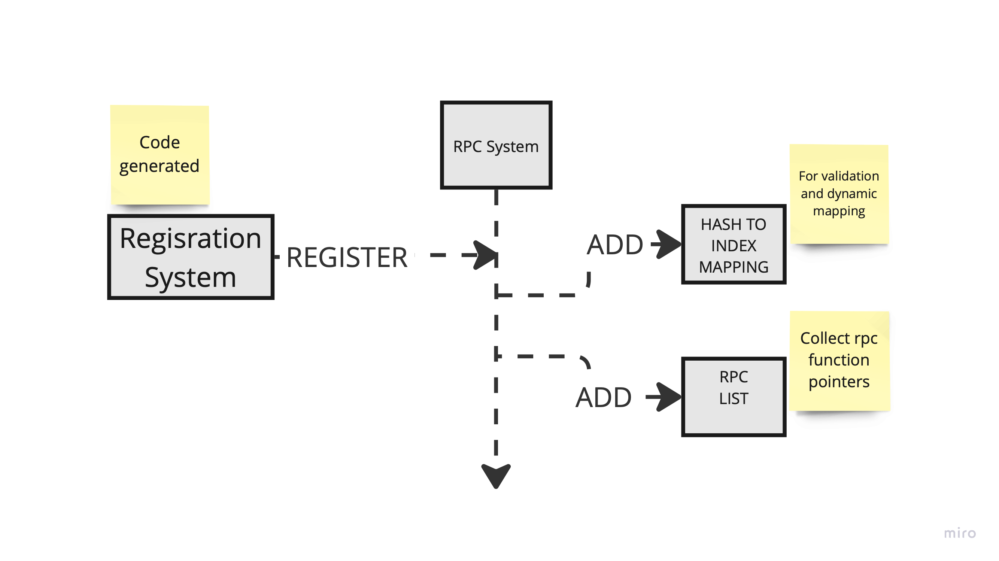
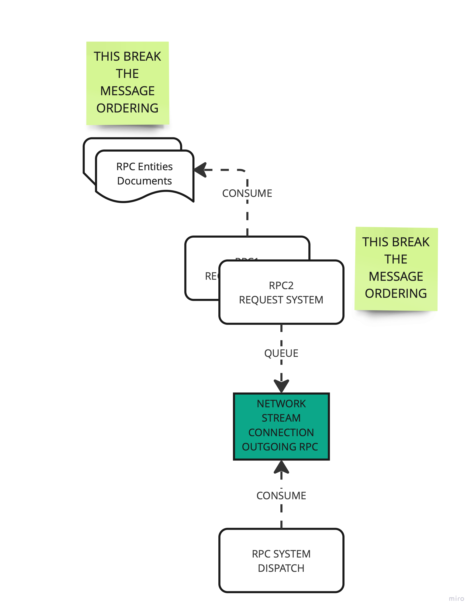
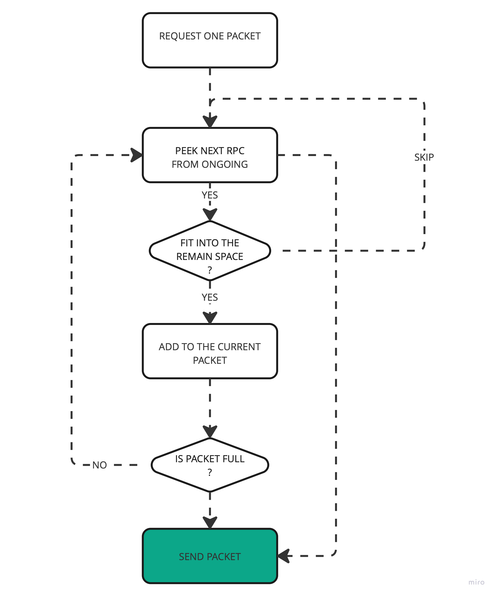
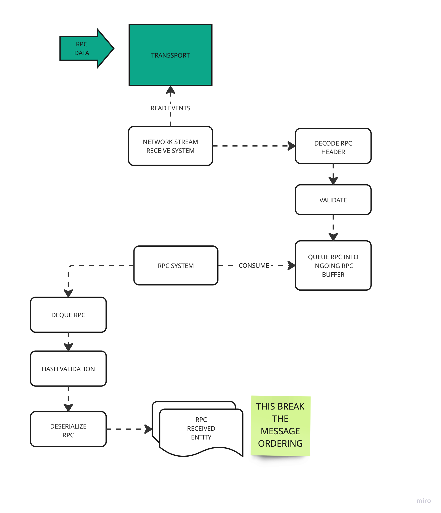

# RPC Architecture

## RPC Registration



## Sending RPC



> Remark: the fact we create entities and we process them
> in arbitrary order (chunk and system ordering) break the message ordering.

Rpcs in the queue are sent to the remote target by
aggregating the rpc messages in the `outgoing rpc queue` into
one single packet.



If a message does not fit into the remaining space, the next
one is inspected, until we fill-up the packet.

> Remark: this process completely break the message ordering.

## Recv RPC



## RPC Packet Format

```text
<----------------------- 32 bits ------------------------------->
0 1 2 3 4 5 6 7 0 1 2 3 4 5 6 7 0 1 2 3 4 5 6 7 0 1 2 3 4 5 6 7
+-+-+-+-+-+-+-+-+-+-+-+-+-+-+-+-+-+-+-+-+-+-+-+-+-+-+-+-+-+-+-+-
MSG TYPE      | LOCAL TIME                                     |
+-+-+-+-+-+-+-+-+-+-+-+-+-+-+-+-+-+-+-+-+-+-+-+-+-+-+-+-+-+-+-+-
LOCAL TIME    | RPC SIZE                      | RPC TYPE       |
+-+-+-+-+-+-+-+-+-+-+-+-+-+-+-+-+-+-+-+-+-+-+-+-+-+-+-+-+-+-+-+-
RPC1 SIZE      | RPC1 DATA  (VARIABLE SIZE)                    |
+-+-+-+-+-+-+-+-+-+-+-+-+-+-+-+-+-+-+-+-+-+-+-+-+-+-+-+-+-+-+-+-
RPC1 DATA           | Padding | RPC2 SIZE                      |
+-+-+-+-+-+-+-+-+-+-+-+-+-+-+-+-+-+-+-+-+-+-+-+-+-+-+-+-+-+-+-+-
RPC2 TYPE                     | RPC DATA  (VARIABLE SIZE)      |
+-+-+-+-+-+-+-+-+-+-+-+-+-+-+-+-+-+-+-+-+-+-+-+-+-+-+-+-+-+-+-+-
.... CONTINUE WITH OTHER kl]RPC DATA
+-+-+-+-+-+-+-+-+-+-+-+-+-+-+-+-+-+-+-+-+-+-+-+-+-+-+-+-+-+-+-+-
```
