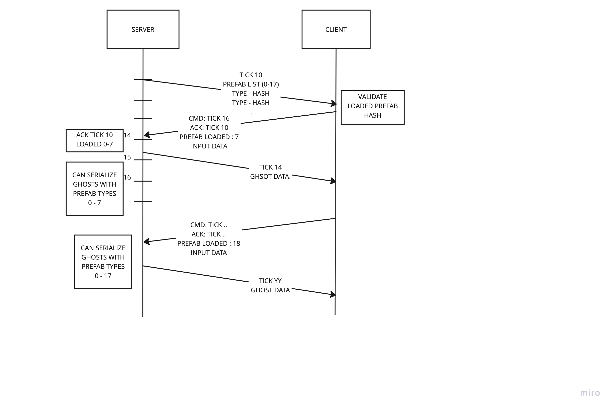

# Snapshot protocol

## Sending the prafab list
First handshake: server send to the client the list of prefabs he need to know and ack.
The client report the number of loaded of prefab, in server order, from the beginning of the list.

> Why this is necessary: to in order for the servet to know the client is able to derialize the data.

The server will replicate to the client only the ghosts for which the client reported he loaded the prefab
information.



> The client is responsible to validate the hash sent by the server and self-disconnect.
> REMARKS: from security perspective this is not the most safe way (would be better for the server to disconnect instead).

### Handle large number of prefabs

The list of prefab is split in chunks of 32 prefab. The list is sent reliably by the server: it keeps re-sending
to the client the same portion of the list until the client ack a packet that contains it.

### Handle loaded prefab dynamically

When new prefabs are detected (i.e loaded into the world), the server will wait until the current block of prefabs
is being acked and then it will create another update containing the remaining prefabs.


## Snapshot Packet Format

- [Header](#header)
- [Prefab List (variable size)](#prefablist)
- Num Despawn: 32 bits
- Num Total Relevant Ghosts: 32 bits
- [Despawn List (variable size)](#despawn-list)
- Num Update: 32bits, packed
- [Ghost  Data (variable size)](#ghost-data)

### Header:
```
Message Type: 8 bits (Snapshot = 2)
Local Time: 32 bits
Return Time: 32 bits
Command Age: 32 bits
SequenceId: 8 bits
Tick: 32 bits
Last Received Cmd: 32 bits
Last Received Cmd Mask: 32 bits (mask of command tick received)
```

### Prefab list
```
New Prefabs: 16 bits
Start Index: 16 bits
For i in New Prefabs:
   Ghost Type : 16 bytes
   Ghost Hash : 4 bytes
```

### Despawn list
```
For ghost in despawn list:
   GhostId : 32 bits
```

### Ghost Data

The ghost data is serialized per chunk. For each chunk a common set of information
(shared among all entities) is serialized first:

```
Ghost Type: 32 bits (index in the GhostCollectionPrefab)
Num Ghosts: 32 bits (relevantGhostCount)
Is Prespawn: 1 bit
```

We then use `run-length` encoding to collect all ghosts that are using the same baselines (for the current chunk)
and writing that information once

```
Baseline0delta: 32bits, packed, in respect the  current packet tick
Baseline1delta: 32bits, packed, in respect the  current packet tick
Baseline2delta: 32bits, packed, in respect the  current packet tick
numGhostsUsingThisBaselines: 32 bits, packed
```

Each entity is then serialized, in chunk order:

```
GhostId: 32 bits, packed
Spawn Tick, 32 bits, packed, only for new spawn (relevancy change) until acked
Data Size: 32 bits, packed
Total Buffer Data Size: 32 bits, packed (delta compressed)
Change Mask Uints: 32 bits, packed. variable size, delta compressed (against last baseline)
Enable Mask Uints: 32 bits, packed. variable size, xor compressed (against 0)
Components And Buffer Data: packed, variable bits size.
```
