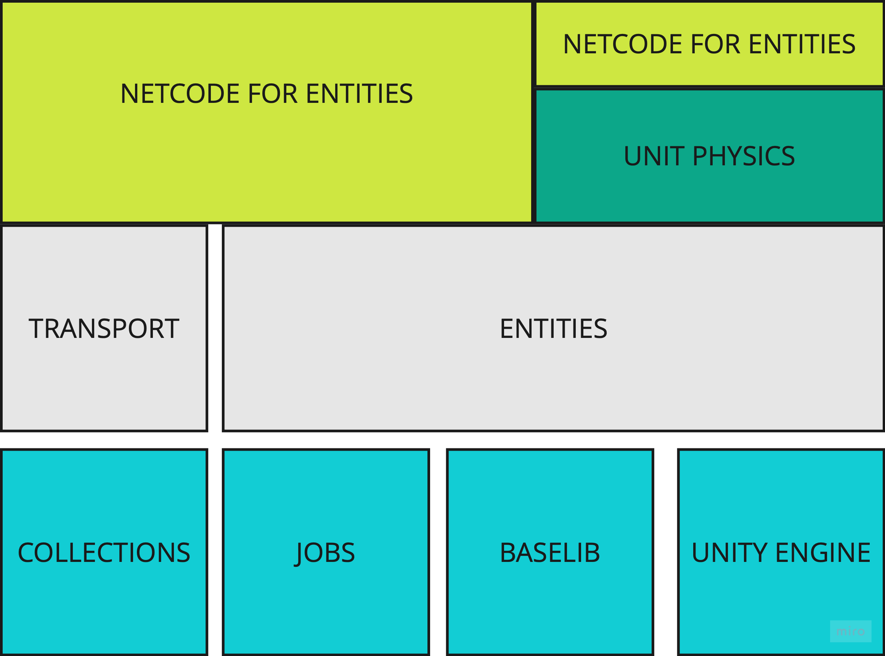
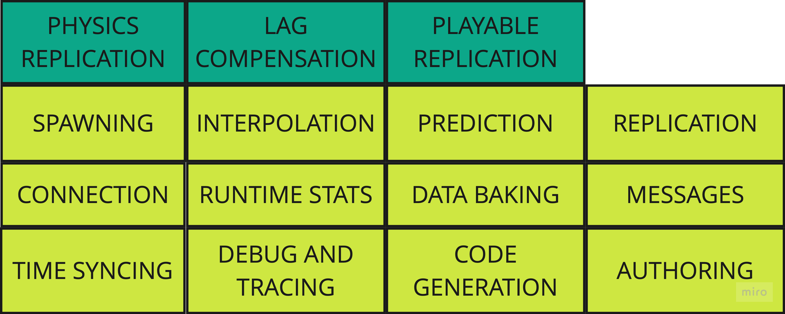

@@ -0,0 +1,734 @@
<!-- TOC -->
<!-- TOC -->

# NETCODE FOR ENTITIES ARCHITECTURE

## What It is the goal of Netcode for Entities

Netcode for Entities is a multipler framework / library designed using DOD (data oriented design) and following/honoring the DOTS Principles.

The primarily goal and focus of Netcode For Entities is simple: **Provide a solid Server Authoritive, client/server solution, with client-side-prediction, that is ideal and mostly designed
for a specific multiplayer genra or sub-genra: FPS or other similar fast-paced multiplayer games.**

## Ared of Focus
- authoring of replicated objects
- objects and data `replication`
- handling and receiving messages (RPCs)
- area of interest management
- prioritization management
- control and ownership of replicated objects spawn/despawn
- solid clien-side prediction loop
- time synchronization

## What Netcode for Entities is not

Netcode for Entities is not a generic, on-size-fit-all multiplayer solution and doesn't provide any higher level logic in relation to following aspects:

- Lobby
- Matchmaking
- Session Management
- Player Management
- Player Identity
- Chat
- Voice Chat (voip)

## HIGH LEVEL ARCHITECTURE

## NETCODE FOR ENTITIES

## FUNDAMENTAL DESIGN PILLARS

Following the DOTS principles, these are some of the fundamental pillars of the Netcode for Entities design:

- No callbacks. We are executing most of the logics in jobs and using multiple threads and core. Callback are not goin to be good here. Furthermore, we also want to avoid any callback-hell like situations, as well as maintaining control over where and how things are processed.
- Multithread by default. We should and must in some cases exploit all the cores available. All systems should use jobs (unless there are reason for not doing it, there are many cases that apply).
- Performance by default. If there are to make choices, performance consideration come first.
- Complete data and logic separation in betwen client and server.
- Multiple clients and servers in the same process.
- All critical path and systems must Burst compatible.
- DOTS Runtime full compatibilty.
- No Reflection at runtime.
- Limited Exception handling (or just partial where possible, because of the aforemention constraints)

Netcode for Entities use Entities, Collections, Mathematics, Jobs and Transport as foundational libraries.

### Lacking or Player Indentity

Netcode for Entities does not provide any logic to identify a given player using some for of unique identifier or identity information. If a game require such data
(i.e from server-to-backend data exchange or other purpose) it is up to the application to implement the logic the way they want.

> Rationale of the design:
> - at the time Netcode for Entities has been designed we want to had a solution agnostic to the identity provider. You should have been able
> to use the package and identity the player the way you wanted, without having you bound to a specific solution.
> - the concept of `Player` and `Connection` where considered the same, as common use case scenario being a single player for each connection. The idea was to extend that in the future (i.e couch-coop)
> or provide sample that showcase how to implement that (and foreseable, changes required by that)

### Limited SinglePlayer > Multiplayer adaptability

Netcode for Entities has been designed with the idea that serious multiplayer project start with multiplayer in mind.

Some of the most common and basic reasons:

- The `PredictionSystemGroup` is unique and present only when Netcode for Entities is installed
- `PredictionSystemGroup` is never added to world that are neither Client or Server worlds.
- Input handling requirement impose a specific design choice.
  - The `ICommand` buffers are only present if Netcode is installed
  - The `GhostInputSystemGroup` is only present if Netcode is installed
  - `IInputComponentData` is only present if Netcode is installed
  - Split input sampling from using the input data is enforced and the only way to make multiplayer game work,
but not necessarily the way you would do that in single player.
- RPC can't be sent if there is no connection (possible but require custom handling)
- Physics is moved into the Prediction loop
- `FixedStepSimulationSystemGroup` still execute and can be used to inject "client-only" physics stuff. But its meaning change in general
- When Netcode for Entities is installed, the default behaviour (create multiple world) usually break the game, requiring as first step to
manually disable the automatic bootstrapping (at least) and to properly convert and move pi
